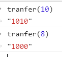

# 栈（stack）

后进先出（LIFO）

新元素靠近栈顶，旧元素靠近栈底

用数组创建栈

## 栈的常见操作

- push:添加元素到栈顶：也就是数组 push 到最后

- peek:获取栈顶元素：索引，`arr[arr.length - 1]`

- pop:删除栈顶元素：pop

- isEmpty:判断栈内是否为空: length

- size: 返回元素个数：length

- clear: 清除所有元素：直接为[]

### 代码

```js
function Stack() {
  let items = []
  this.push = function(element) {
    items.push(element)
  }
  this.pop = function() {
    return items.pop()
  }
  this.peek = function() {
    return items[items.length - 1]
  }
  this.size = function() {
    return items.length
  }

  this.isEmpty = function() {
    return items.length == 0
  }
  this.clear = function() {
    items = []
  }
}
let stack = new Stack()
//给stack新增元素
stack.push(2)
```

### 用 ES6 的 class

```js
class Stack {
  constructor() {
    this.items = []
  }
  push(element) {
    this.element.push(element)
  }
  //其他省略
}
```

### WeakMap 实现数组私有

```js
const items = new WeakMap()
class PrivateStack {
  constructor() {
    items.set(this, [])
  }
  push(element) {
    let arr = items.get(this)
    arr.push(element)
  }
  //其他内容同上，多了一步items.get(this);
}

//最后将上面的代码用IIFE锁定作用域
let PrivateStack = (function() {
  const items = new WeakMap()
  class Stack {
    constructor() {
      items.set(this, [])
    }
    push(element) {
      let arr = items.get(this)
      arr.push(element)
    }
    //其他内容同上，多了一步items.get(this);
  }
  return Stack
})()
var privateStack = new PrivateStack()
```
### 单调栈  
Monotone Stack：一种特殊的栈，要求元素依次递增或递减  
应用：[子数组的最小值之和](../leetcode/907.md)
## 应用

### 十进制转二进制

8 转为 1000

10 转为 1010

也就是把余数放到栈里

```js
function tranfer(number) {
  let stack = new Stack(),
    rem,
    binaryString = ''
  while (number > 0) {
    rem = parseInt(number % 2)
    stack.push(rem)
    number = parseInt(number / 2)
  }
  while (!stack.isEmpty()) {
    binaryString += stack.pop().toString()
  }
  return binaryString
}
```



### 汉诺塔

A 柱子上放着 n 个盘（最底的盘最大，依次往上，最顶的盘最小）

把 n 个盘放到 C 柱子上

问要移多少次

规则：

一次只能移一个；大盘不能放到小盘上

可以借助第三根柱子 B 来；

解法：

也就是要先把 n-1 个盘子放到 B 上，把最后一个放到 C，再把 n-1 个盘子移到 C

以移动三个盘为例

```js
let a = new Stack(),
  c = new Stack(),
  b = new Stack(),
  count = 0
a.push('big')
a.push('middle')
a.push('small')

function move(size, source, dest, helper) {
  if (size > 0) {
    count++
    move(size - 1, source, helper, dest)
    dest.push(source.pop())
    move(size - 1, helper, dest, source)
  }
}
move(a.size(), a, c, b)
console.log(count)
```

## 时间复杂度

插入 push/删除 pop：O(1)

搜索: O(n)
