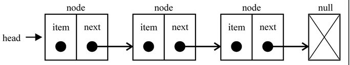

# 链表（Linked list）



- 每一个节点里存到下一个节点的指针。

- 链表是一种线性表，但他存储数据不是按线性的顺序，即在内存中不是连续放置的。

- 要获取链表中的某一个节点，必须从头开始

- 删除或者增加节点不需要移动其他元素。

比如数组中间插入一个值，需要把中间往后的所有都挪位。链表不需要

## 链表常见操作

- append：链表尾部新增

- insert(position, element): 链表指定位置插入，插入成功返回 true

- remove: 删除指定项并返回被删除的项

- removeAt(position): 删除指定位置的项并返回被删除的项

- indexOf: 索引

- isEmpty

- size

- toString：返回节点内容

- getHead: 返回头

### 单向链表代码

```js
class Node {
  constructor(element) {
    this.element = element
    this.next = null
  }
}
//单向链表
class List {
  constructor() {
    this.length = 0
    this.head = null
  }
  indexOf(element) {
    let current = this.head,
      index = -1,
      length = this.length
    for (let i = 0; i < length; i++) {
      if (element === current.element) {
        index = i
        break
      } else {
        current = current.next
      }
    }
    return index
  }
  isEmpty() {
    return this.length === 0
  }
  size() {
    return this.length
  }
  toString() {
    let current = this.head,
      string = ''
    while (current) {
      string += current.element + (current.next ? ', ' : '')
      current = current.next
    }
    return string
  }
  getHead() {
    return this.head
  }
  append(element) {
    let current,
      node = new Node(element)
    if (this.head === null) {
      //如果head为null，说明是第一个节点
      this.head = node
    } else {
      current = this.head
      while (current.next) {
        current = current.next
      }
      //让新增节点成为最后一个
      current.next = node
    }
    this.length++
  }
  insert(position, element) {
    if (position < 0 || position > this.length) {
      return false
    }
    let node = new Node(element),
      current = this.head,
      previous,
      index = 0
    if (position === 0) {
      //如果是做为头插入
      node.next = current
      this.head = node
    } else {
      while (index++ < position) {
        previous = current
        current = current.next
      }
      previous.next = node
      node.next = current
    }
    this.length++
    return true
  }
  removeAt(position) {
    if (position < 0 || position >= this.length) {
      return null
    }
    let current = this.head,
      previous = null,
      index = 0
    if (position === 0) {
      //移除第一个
      this.head = current.next
    } else {
      while (index++ < position) {
        previous = current
        current = current.next
      }
      previous.next = current.next
    }
    this.length--
    return current.element
  }
  remove(element) {
    let index = this.indexOf(element)
    return this.removeAt(index)
  }
}
let list = new List()
list.append('one')
list.append('two')
```

## 双向链表

双向链表比单向多一个指针，指向前一个节点，即

prev element next

### 代码

```js
class DoubleNode {
  constructor(element) {
    this.element = element
    this.next = null
    this.prev = null
  }
}
//双向链表大部分和单向一致，只是多了prev指针
//indexOf, isEmpty, size, getHead, toString, remove继承单向的就行
class DoubleList extends List {
  constructor() {
    super()
    this.head = null
    this.tail = null
    this.length = 0
  }
  append(element) {
    let current,
      node = new DoubleNode(element)
    if (this.head === null) {
      //如果head为null，说明是第一个节点
      this.head = node
    } else {
      //让新增节点成为最后一个
      current = this.tail
      current.next = node
      node.prev = current
    }
    this.tail = node
    this.length++
  }
  insert(position, element) {
    if (position < 0 || position > this.length) {
      return false
    }
    let node = new DoubleNode(element),
      current = this.head,
      previous,
      index = 0
    if (position === 0) {
      //如果是做为头插入
      if (!current) {
        //如果head不存在
        this.append(element)
      } else {
        node.next = current
        this.head.prev = node
        this.head = node
        this.length++
      }
    } else if (position === this.length) {
      //位于最后相当于append
      this.append(element)
    } else {
      while (index++ < position) {
        previous = current
        current = current.next
      }
      previous.next = node
      current.prev = node
      node.next = current
      node.prev = previous
      this.length++
    }
    return true
  }
  removeAt(position) {
    if (position < 0 || position >= this.length) {
      return null
    }
    let current = this.head,
      previous = null,
      index = 0,
      length = this.length
    if (position === 0) {
      //移除第一个
      this.head = current.next
      if (length === 1) {
        //如果本身只剩1项，更新tail
        this.tail = null
      } else {
        this.head.prev = null
      }
    } else if (position === length - 1) {
      //删除最后一项，需要更新tail
      current = this.tail
      this.tail = current.prev
      this.tail.next = null
    } else {
      while (index++ < position) {
        previous = current
        current = current.next
      }
      previous.next = current.next
      current.next.prev = previous
    }
    this.length--
    return current.element
  }
}
let dbList = new DoubleList()
dbList.append('1')
dbList.append('2')
```

## 循环链表

基于单向链表的循环链表：最后一个元素的 next 指向第一个元素 head

双向循环链表/双链表：head.prev 指向 tail, tail.next 指向 head

### 基于单向链表的循环链表代码

```js
class CircleList extends List {
  constructor() {
    super()
  }
  append(element) {
    let current,
      head = this.head,
      node = new Node(element)
    if (this.head === null) {
      //如果head为null，说明是第一个节点
      this.head = node
    } else {
      current = this.head
      while (current && current.next && current.next !== head) {
        current = current.next
      }
      //让新增节点成为最后一个
      current.next = node
    }
    //最后一个元素的next指向第一个元素head
    node.next = head
    this.length++
  }
  insert(position, element) {
    if (position < 0 || position > this.length) {
      return false
    }
    let node = new Node(element),
      current = this.head,
      previous,
      index = 0
    if (position === 0) {
      //如果是做为头插入
      node.next = current
      //更新最后一个值的next
      while (current.next !== this.head) {
        current = current.next
      }
      this.head = node
      current.next = this.head
    } else {
      while (index++ < position) {
        previous = current
        current = current.next
      }
      previous.next = node
      node.next = current
    }
    this.length++
    return true
  }
  removeAt(position) {
    if (position < 0 || position >= this.length) {
      return null
    }
    this.length--
    const head = this.head
    let current = this.head,
      previous = null,
      index = 0
    if (position === 0) {
      //移除第一个
      this.head = this.head.next
      //更新最后一个的next
      while (current.next !== head) {
        current = current.next
      }
      current.next = this.head
      return head.element
    } else {
      while (index++ < position) {
        previous = current
        current = current.next
      }
      previous.next = current.next
      return current.element
    }
  }
  toString() {
    let current = this.head,
      string = current.element
    while (current && current.next !== this.head) {
      current = current.next
      string += ', ' + current.element
    }
    return string
  }
}
let circleList = new CircleList()
circleList.append('√')
circleList.append('○')
```

## 时间复杂度

链表/双向链表插入和删除复杂度都是 O(1)，搜索是 O(n)
