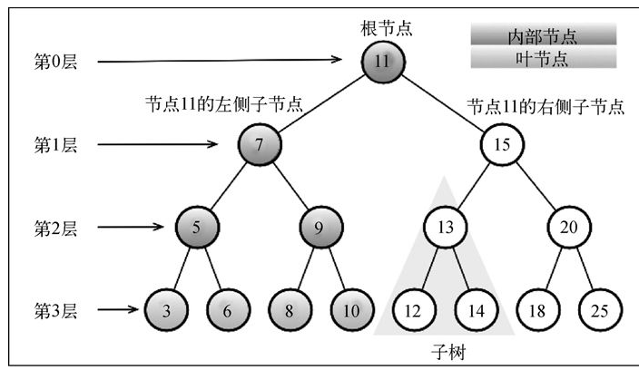
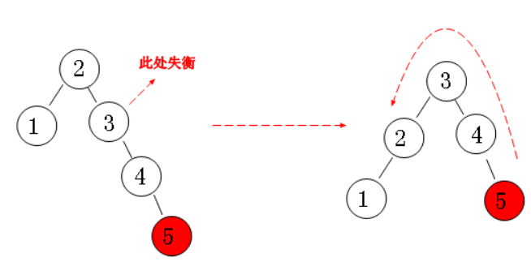
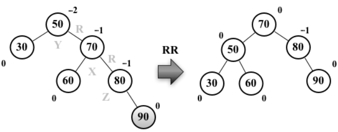
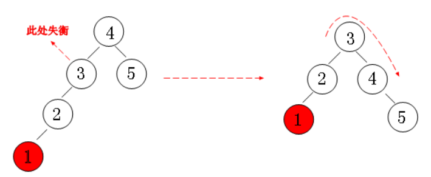
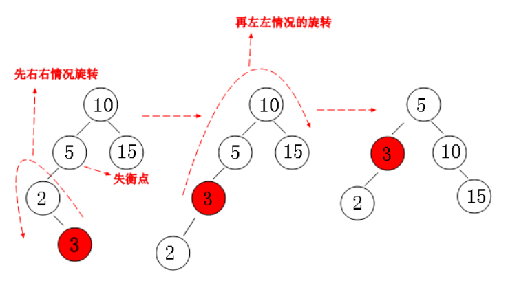
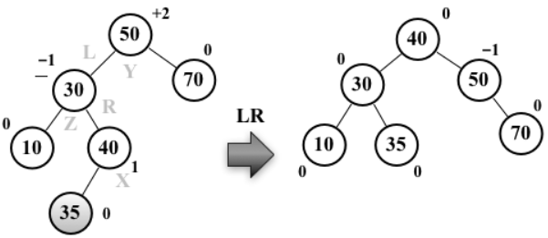
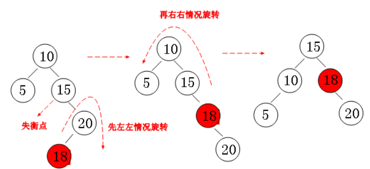
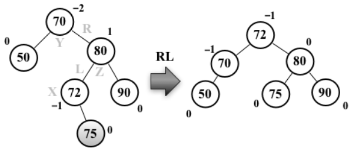

# 非顺序结构：树

## 概念



- 节点/键：树里面的每个元素

- 根节点：树顶部的节点

- 内部节点：有子节点的节点

- 叶节点/外部节点：没有子节点的节点

- 祖先：父节点、祖父节点等等往上

- 深度：祖先的数量，节点 3 的深度是 3（5、7、11）

- 高度：深度的最大值，也就是层数。上图的高度是 3

- 后代：子节点、孙子节点等等往下

## 二叉树

一个节点，最多两个子节点。两个子节点的时候必须一个左，一个右

## 遍历

树的遍历（也称为树的搜索）是图的遍历的一种

### 深度遍历

- inOrderTraverse: 中序遍历，LNR。  
  考察到一个节点后，将其暂存，遍历完左子树后，再输出该节点的值，然后遍历右子树。输出表现为左、根、右
- preOrderTraverse: 先序遍历，NLR  
  考察到一个节点后，即刻输出该节点的值，并继续遍历其左右子树。(根左右)
- postOrderTraverse: 后序遍历，LRN

递归实现: 代码差不多，只不过输出时机（console.log）不一样

```js
preOrderTraverse() {
  this.preOrderTraverseNode(this.root)
}
preOrderTraverseNode(node) {
  // 递归
  if (node != null) {
    console.log(node.key)
    this.preOrderTraverseNode(node.left)
    this.preOrderTraverseNode(node.right)
  }
}
inOrderTraverseNode(node) {
  // 递归
  if (node != null) {
    this.inOrderTraverseNode(node.left)
    console.log(node.key)
    this.inOrderTraverseNode(node.right)
  }
}
postOrderTraverseNode(node) {
  // 递归
  if (node != null) {
    this.postOrderTraverseNode(node.left)
    this.postOrderTraverseNode(node.right)
    console.log(node.key)
  }
}
```

非递归，用栈实现:

```js
stackPreOrder() {
  //非递归的先序遍历，用栈来实现
  let node = this.root;
  if(node !== null) {
    let stack = [];
    stack.push(node);
    while(stack.length) {
      //弹出栈顶元素
      node = stack.pop();
      console.log(node.key);
      //先弹出栈的左节点，再弹右节点，所以先push 右边
      if(node.right) {
        stack.push(node.right)
      }
      if(node.left) {
        stack.push(node.left)
      }
    }
  }
}
```

```js
stackInOrder() {
  //非递归的中序遍历，用栈来实现
  let node = this.root;
  if(node !== null) {
    let stack = [];
    while(stack.length || node) {
      //把左节点推到栈里面
      if(node) {
        stack.push(node)
        node = node.left;
      } else {
        //没有左节点，拿出栈顶元素，输出节点的值
        node = stack.pop()
        console.log(node.key);
        //左、根结束后访问右节点
        node = node.right;
      }
    }
  }
}
```

```js
stackPostOrder() {
  //非递归的后序遍历，用两个栈来实现
  let node = this.root;
  if(node !== null) {
    let tmp = [];
    tmp.push(node);
    let stack = [];
    while(tmp.length) {
      //输出左、右、根
      //栈是后进先出，所以stack入栈顺序应该是根、右、左
      node = tmp.pop();
      stack.push(node);
      //stack要右、左
      //那么tmp.pop的第一个是右，所以先push左
      if(node.left) {
        tmp.push(node.left);
      }
      if(node.right) {
        tmp.push(node.right);
      }
    }
    while(stack.length) {
      console.log(stack.pop().key);
    }
  }
}
```

## 二叉搜索树（Binary Search Tree）

二叉树

如果左子树存在，左子树上所有节点的值均小于根

如果右子顺存在，右子树上所有节点的值均大于根

任意节点的左、右子树也分别为二叉查找树

没有键值相等的节点

### 常用方法

- insert: 插入

- remove：删除节点，返回删除后的树

- min：返回最小的键，对于二叉搜索树来说就是左下角的节点

- max: 返回最大，对于 BST 来说就是右下角

- search: 搜索，存在返回 true

### 代码

```js
class TreeNode {
  constructor(key) {
    this.key = key
    this.left = null
    this.right = null
  }
}
//二叉搜索树
class BinarySearchTree {
  constructor() {
    this.root = null
  }
  insert(key) {
    let node = new TreeNode(key)
    if (this.root == null) {
      //如果是个空树，那么插入的节点做为根节点
      this.root = node
    } else {
      this.insertNode(this.root, node)
    }
  }
  insertNode(node, newNode) {
    //判断key的大小
    let key = node.key,
      currentKey = newNode.key
    if (currentKey < key) {
      if (node.left == null) {
        node.left = newNode
      } else {
        this.insertNode(node.left, newNode)
      }
    } else {
      if (node.right == null) {
        node.right = newNode
      } else {
        this.insertNode(node.right, newNode)
      }
    }
  }
  preOrderTraverse() {
    this.preOrderTraverseNode(this.root)
  }
  preOrderTraverseNode(node) {
    // 递归
    if (node != null) {
      console.log(node.key)
      this.preOrderTraverseNode(node.left)
      this.preOrderTraverseNode(node.right)
    }
  }
  inOrderTraverseNode(node) {
    // 递归
    if (node != null) {
      this.inOrderTraverseNode(node.left)
      console.log(node.key)
      this.inOrderTraverseNode(node.right)
    }
  }
  postOrderTraverseNode(node) {
    // 递归
    if (node != null) {
      this.postOrderTraverseNode(node.left)
      this.postOrderTraverseNode(node.right)
      console.log(node.key)
    }
  }
  min() {
    return this.minNode(this.root)
  }
  minNode(node) {
    if (!node) {
      return null
    }
    while (node && node.left != null) {
      node = node.left
    }
    return node.key
  }
  max() {
    return this.maxNode(this.root)
  }
  maxNode(node) {
    if (!node) {
      return null
    }
    while (node && node.right != null) {
      node = node.right
    }
    return node.key
  }
  search(key) {
    let result = this.searchNode(this.root, key)
    return result
  }
  searchNode(node, key) {
    let isFind = false
    let findNode = (node, key) => {
      if (node === null) {
        return false
      }
      if (key < node.key) {
        findNode(node.left, key)
      } else if (key > node.key) {
        findNode(node.right, key)
      } else {
        isFind = true
      }
    }
    findNode(node, key)
    return isFind
  }
  remove(key) {
    this.removeNode(this.root, key)
  }
  removeNode(node, key) {
    if (node === null) {
      return null
    }
    var findMinNode = function (node) {
      while (node && node.left !== null) {
        node = node.left
      }
      return node
    }
    if (key < node.key) {
      node.left = this.removeNode(node.left, key)
      return node
    } else if (key > node.key) {
      node.right = this.removeNode(node.right, key)
      return node
    } else {
      //node是个叶子
      if (node.left === null && node.right === null) {
        node = null
        return node
      }

      //node只有一个子节点
      if (node.left === null) {
        node = node.right
        return node
      } else if (node.right === null) {
        node = node.left
        return node
      }

      //node包含左右节点
      var aux = findMinNode(node.right)
      node.key = aux.key
      node.right = this.removeNode(node.right, aux.key)
      return node
    }
  }
}
let tree = new BinarySearchTree()
tree.insert(11)
tree.insert(3)
tree.insert(5)
tree.insert(13)
tree.insert(15)
```

### 时间复杂度

插入、删除、搜索都是 O(n)

## 自平衡二叉搜索树/高度平衡树（AVL/Adelson-Velsky and Landis）

二叉搜索树存在的一个问题是可能某一边的节点非常多，导致左右高度相差大。

在 AVL 树中，任一节点对应的两棵子树的最大高度差为 1

AVL 进行增加和删除的时候，为了保持平衡，会对树进行旋转。

平衡因子：节点的左子树高度减右子树的值。也就是对于 AVL，每个节点的平衡因子只可能是 1，0，-1

### 旋转树

旋转后的树仍然要满足二叉搜索树以及平衡树的定义

右-右（RR）：向右边树的右子树插入时，向左的单旋转





左-左（LL）：向右的单旋转



左-右（LR）：向右的双旋转





右-左（RL）：向左的双旋转





### 时间复杂度

插入、删除、搜索都是 O(log(n))

## 普通树遍历

数据结构可能如下

```json
[
  {
    "id": "1",
    "name": "1",
    "chidlren": [
      {
        "id": "1-1",
        "name": "1-1"
      },
      {
        "id": "1-2",
        "name": "1-2"
      }
    ]
  },
  {
    "id": "2",
    "name": "2"
  }
]
```

```js
// 广度优先非递归遍历
function traverseTree(treeNodes) {
  if (!treeNodes || !treeNodes.length) return
  let stack = []
  // 先将第一层节点放入栈
  for (let i = 0, len = treeNodes.length; i < len; i++) {
    stack.push(treeNodes[i])
  }
  let item
  while (stack.length) {
    item = stack.shift()
    // do sth.
    // 如果该节点有子节点，继续添加进入栈尾
    if (item.children && item.children.length) {
      stack = stack.concat(item.children)
    }
  }
}
```

### 过滤

```js
export function mapTree(value: string, arr) {
  const new_arr = []
  arr.forEach((element) => {
    if (element.name.indexOf(value) > -1) {
      // 判断条件
      new_arr.push(element)
    } else if (element.children && element.children.length > 0) {
      const child_data = mapTree(value, element.children)
      if (child_data && child_data.length > 0) {
        const obj = {
          ...element,
          children: child_data,
        }
        new_arr.push(obj)
      }
    }
  })
  return new_arr
}
```

### 转换
``` tsx
interface FlattenData {
  id: number
  pId?: number
}
interface TreeData extends FlattenData {
  children?: TreeData[]
}

/**
 * id，pId 形式的数据转成树结构
 */
function toTree(arr: FlattenData[], rootId: TreeData['pId']) {
  function loop(parentId: TreeData['pId']) {
    const res = [];
    for (let i = 0; i < arr.length; i++) {
      const item: TreeData = arr[i];

      if (item.pId !== parentId) {
        continue;
      }

      item.children = loop(item.id);
      res.push(item);
    }
    return res;
  }
  return loop(rootId);
}
```
 