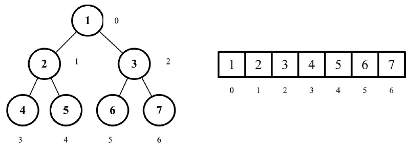

# 堆

特殊的二叉树。

通常用数组存储，索引代表 key（值所在的位置）

## 概念

特性：

- 完全二叉树，每一层都有左右节点，叶子节点从左到右；

- 只可能是最大堆或者最小堆。

如果是最大堆，那么所有节点都大于等于它的叶子节点。

最小堆，节点小于等于它的叶子节点

堆和二叉搜索树不一样；二叉树的子节点比节点一个大一个小，但堆是都比节点小/大



对于给定索引 index 的节点：

父节点所在的索引位置是`(index - 1)/2`;

左子节点是 `2 * index + 1`;

右节点是`2 * index + 2`;

操作：

- insert: 插入新值；

- extract:
  删除节点，当删除节点的数值时，原来的位置就会出现一个孔,填充这个孔的方法就是，把最后的叶子的值赋给该孔并下调到合适位置，最后把该叶子删除

## 实现大根堆

即根节点是最大值。

插入新值：将值放到最后一个叶子节点，然后比较父节点，如果比父节点大，那么调用`shiftup`方法交换

删除根节点：将根节点和最后一个叶子节点交换，然后移除交换后的叶子节点（即原本的根），然后判断新的根节点和子节点，子节点比根大，那么交换。

```js
//堆
class MaxHeap {
  constructor() {
    this.heap = []
  }
  //获取父节点索引
  getParentIndex(index) {
    if (index < 1) {
      return 0
    }
    let result = parseInt((index - 1) / 2)
    return result
  }
  //获取左子节点索引
  getLeftIndex(index) {
    return 2 * index + 1
  }
  //获取右节点
  getRightIndex(index) {
    return 2 * index + 2
  }
  insert(value) {
    if (!value) {
      return false
    }
    this.heap.push(value)
    this.shiftUp(this.size() - 1)
  }
  size() {
    return this.heap.length
  }
  shiftUp(index) {
    //如果节点的值比父节点大，交换节点和父节点
    while (this.heap[index] > this.heap[this.getParentIndex(index)]) {
      let newIndex = this.getParentIndex[index]
      this.swap(index, newIndex)
      index = newIndex
    }
  }
  swap(left, right) {
    const rightValue = this.heap[right]
    this.heap[right] = this.heap[left]
    this.heap[left] = rightValue
  }
  extract() {
    const removedNode = this.heap.shift()
    //调整
    this.shiftDown(0)
    return removedNode
  }
  shiftDown(index) {
    let currentIndex = index,
      leftIndex = this.getLeftIndex(index),
      rightIndex = leftIndex + 1,
      size = this.size()
    if (leftIndex < size && this.heap[currentIndex] < this.heap[leftIndex]) {
      currentIndex = leftIndex
    }
    if (rightIndex < size && this.heap[currentIndex] < this.heap[rightIndex]) {
      currentIndex = rightIndex
    }
    if (index !== currentIndex) {
      this.swap(index, currentIndex)
      this.shiftDown(currentIndex)
    }
  }
}
```
