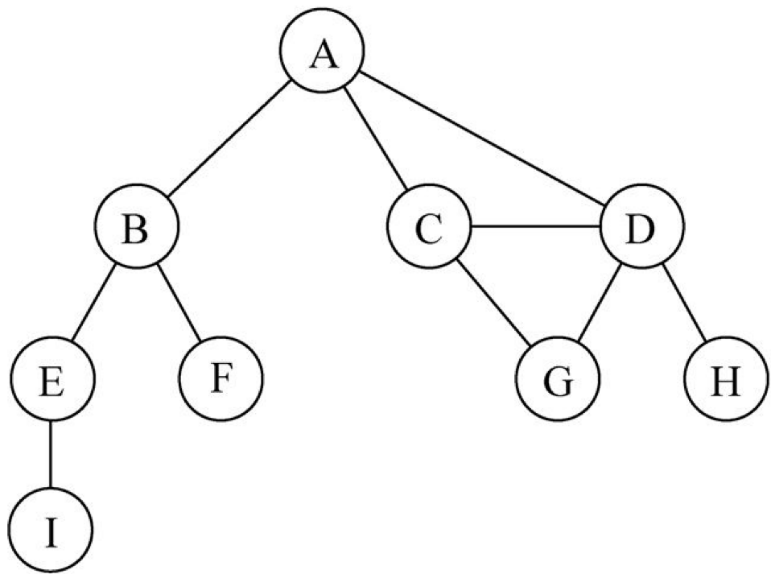
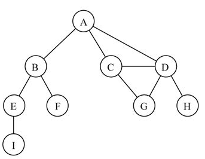
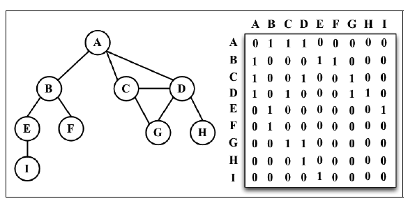
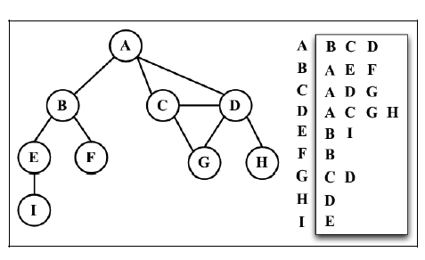
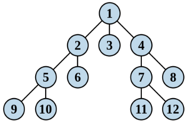
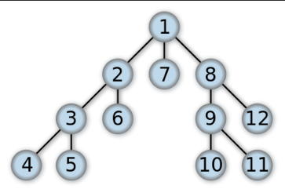

# 图

## 概念

由边和顶点组成

相邻顶点：同一条边的两个顶点

度：相邻顶点的数量，比如 A 的度是 3，B 的度是 2

简单路径：不包含重复顶点的路径，终点和起点可以一致。

比如 A,B,E,I。ACDA

终点和起点一样的叫做环。

如果每两个顶点都存在路径，那么图是连通的

## 图的表示

图的可以用很多类数据结构来表示，根据具体情景来选择合适的数据结构。

矩阵里面存在路径为 1，否则是 0

### 邻接矩阵

常用的一种是邻接矩阵（即二维数组）

如果顶点 x 和 y 相邻，那么`arr[indexX][indexY] = 1`，否则是 0；

弊端：对于不是连通的图，容易浪费空间。

### 邻接表

可以用数组、链表、字典等表示邻接表

## 遍历

### 广度优先搜索算法（Breadth-First-Search，BFS）

先访问同层的全部节点，再访问子节点

1.  创建一个队列，将根放入队列

2.  拿出队列的第一个元素，判断是不是目标

- 是，返回

- 不是，把这个元素没检验过的直接子节点放入队列

3.  如果队列空了还没找到目标，那么结束，返回找不到

4.  重复步骤 2

### 深度优先

1.  创建一个数组，将根放入队列

2.  拿出队列的第一个元素，判断是不是目标

- 是，返回

- 不是，把这个元素没检验过的直接子节点放入队列

3.  重复步骤 2

4.  如果不存在未检测过的直接子节点，将上一级节点加入队列，重复步骤 2

5.  重复步骤 4

6.  没找到就返回找不到

### 最短路径

#### 戴克斯特拉算法：Dijkstra's algorithm

属于贪心算法

已知起始结点，求最短路径

每个顶点 v 保留目前为止所找到的从 s 到 v 的最短路径

#### Floyd-Warshall algorithm（弗洛伊德算法）

属于动态规划算法

任意两点间的最短路径

### 最小生成树（MST）

连接若干个顶点的最短路径

#### Prim 算法（普里姆算法）

贪心算法

#### Kruskal 算法

贪心算法
