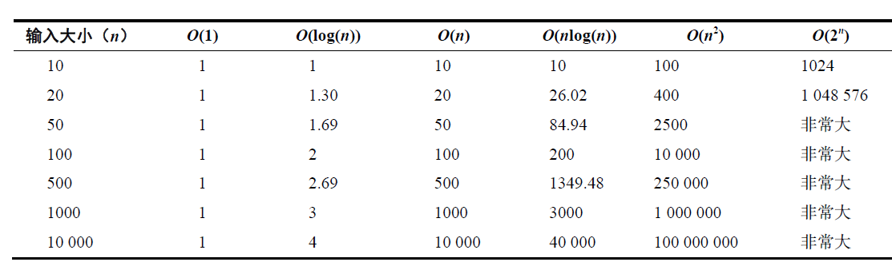
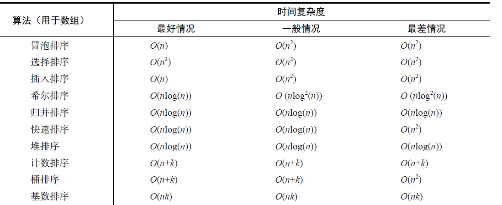
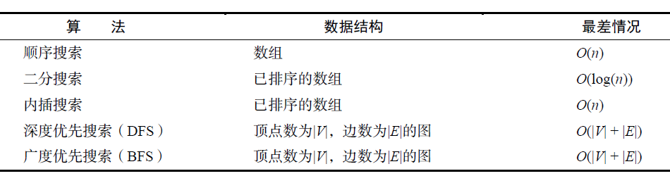

# 时间复杂度

时间复杂度写作 `T(n)`，它给出了算法在处理规模为 n 的输入时所执行的运算次数。也可将算法的时间复杂度视为算法的运行成本  
对于相同的 n 值，算法可以具有不同的`T(n)` 值，通常考虑以下 3 种情况。

- 最好情况：对于任意的输入规模，算法所需的最少运算次数。在排序中，如果输入已完成排序就会出现这种情况。
- 最坏情况：对于任意的输入规模，算法所需的最多运算次数。在许多排序算法中，如果输入以倒序给出就会出现这种情况。
- 平均情况：对于典型的输入规模，算法所需的平均运算次数。在排序中，通常会考虑随机顺序的输入。

大 O 符号用于表示最坏情况下算法成本函数的主项，它是时间复杂度的标准表示法

## O(1)

例如四则运算

```js
function increament(num) {
  return num + 1
}
```

假设传入 num 值为 1 和值为 2，increament 执行的时间都是一样的。也就是程序执行时间与数据量无关，那么这个算法复杂度是 O(1)

## O(n)

比如给定一个数组，要查找数组里的某一项并返回对应的索引

```js
function searArr(arr, num) {
  const length = arr.length
  for (let i = 0; i < length; i++) {
    if (arr[i] === num) {
      return i
    }
  }
}
const tmp = [1, 2, 3, 4, 5, 6]
searArr(tmp, 6)
```

那么最差的情况下，if 语句要判断 arr.length 次。

10 个值 10 次，1000 个值 1000 次，那么算法复杂度是 O(n);

## O(n^2)

n 的平方。比如冒泡排序

```js
for (let i = 0; i < length; i++) {
  for (let j = 0; j < length - 1; j++) {
    if (arrs[j] > arrs[j + 1]) swap(arrs, j, j + 1)
  }
}
```

if 语句最差的情况下要判断 n \* n 次

## 复杂度对比



### 排序复杂度概览



### 查找复杂度概览


