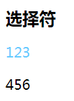
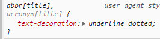
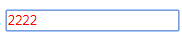
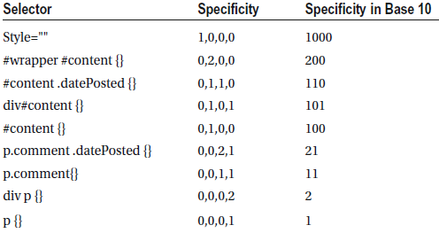

# 选择器

## > 子选择器

选择直接的子元素(不止一个)

## + 相邻选择器

adjacent sibling selector

元素后面的第一个兄弟元素。由于浏览器渲染都是自上向下的，考虑到性能，不会选择向前

## ~ 一般同辈组合子

general sibling combinator

与`>`类似，作用于兄弟节点。会选择所有匹配元素。

```css
h2 + p {
  color: #66ccff;
}
h2 ~ p {
  font-size: 20px;
}
```

```html
  <h2>选择符</h1>
  <p>123</p>
  <p>456</p>
```

效果图



## []属性选择器

input[type="submit"]

- 标签 abbr

abbr 标记一个缩写

```html
The <abbr title="People's Republic of China">PRC</abbr> was founded in 1949.
```




## 伪元素

pseudo elements  
伪元素用于创建一些不在文档树中的元素，并为其添加样式。比如说，我们可以通过`::before` 来在一个元素前增加一些文本，并为这些文本添加样式。虽然用户可以看到这些文本，但是这些文本实际上不在文档树中  
语法：双冒号（旧写法是单冒号，CSS3 规范的要求使用双冒号用于区分。如果要做兼容性处理，还是单冒号）  
更多伪类参考[MDN](https://developer.mozilla.org/zh-CN/docs/Web/CSS/Pseudo-classes)

### ::before/::after

常用在 content 属性设置内容

## 伪类

伪类用于当已有元素处于的某个状态时，为其添加对应的样式，这个状态是根据用户行为而动态变化的  
pseudo classes  
语法：单冒号

### 标签 a/表单元素/按钮具有的伪类

写样式时按照下面的顺序，避免覆盖

1.  :link 未访问

2.  :visited 已访问

3.  :hover 悬浮。触摸屏无法触发，要避免使用

4.  :focus 聚焦

5.  :active 激活

## 结构化伪类

structural pseudo classes

CSS3 增加

### :nth-child

## 表单专用伪类

### :required

`<input type="text" required>`

```css
input:required {
  color: #fa0000;
}
```



## 层叠优先级/权重

[参考网站](https://juejin.im/post/5ce607a7e51d454f6f16eb3d)  
!important 最高

之后

内联 style(权重 1000)，id(权重 100)，类/伪类/属性(权重 10)，其他和(包括伪元素，权重 1)，最后是继承，为 0

除了内联之外，权重都是数量 x 值

id 权重=id 的数量 x100，比如下面第二个，2 个 id


::: warning
注意：十一个 class 选择器的权重仍然低于一个 ID 选择器

低等级的选择器，个数再多也不会超过高等级的优先级
:::
正确规则：

1.  先从高等级进行比较，高等级相同时，再比较低等级的，以此类推；

```css
body#god div.dad span.son {
  width: 200px;
}

body#god span#test {
  width: 250px;
}
```

第二个值有两个 id 选择器，所以第二个的权重高。

并不是因为数值计算相加的总数大。

2.  完全相同的话，就采用后者优先原则

### 特例

宽高有例外

宽高会被 max-width/min-width 覆盖

`width: 100px!important; min-width: 200px;`等价于`width: 200px;`

## 文件引入

推荐 link

`<link type="text/css" href="xxx.css" rel="stylesheet">`
或者`<style>`标签内`@import url("xx/xxx.css")`

- `rel` 属性规定当前文档与被链接文档之间的关系  
  rel 有很多值，但只有 stylesheet 兼容所有浏览器
