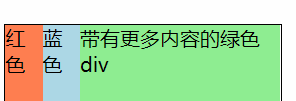

# 盒模型

- background 作用于 content 和 padding

- outline 不影响布局，处于 boder 和 margin 之间。也就不影响盒模型的高度和宽度。设置任意大小就会产生不同的效果。还可以用来去掉聚焦表单元素的默认样式

- width 和 height 指的是 content

设置 box-sizing，默认 content-box，写 border-box，width 就会包括 padding 和 border

(IE6 之前就是 border-box)


## border

当 width（height）本身小于内容的宽度（高度），表现会比较怪异  
例如下面的 div，内容宽度大于 40px。设置了`border-box`后，会先把 border 算进去

```html
<div id="test" class="border">2222222222</div>
<span>1111</span>
```

```css
.border {
  box-sizing: border-box;
  border: 10px solid #000;
  width: 40px;
  height: 40px;
  float: left;
}
```

  
如果不写 box-sizing

```css
.border {
  /* box-sizing: border-box; */
  border: 20px solid #000;
  width: 40px;
  height: 40px;
  float: left;
}
```


## display

- inline:行内元素没有上下的 margin 和 padding，width 和 height 属性无效。修改高度只能通过 line-height 和 padding

- inline-blok: 水平排列，可以设置 width, height, margin-top/padding-bottom

- block: 块级元素之间的间距，取决于两个元素 margin-top/margin-bottom

- display:none 的时候元素不被渲染，position 和 float 无效；

### width 和 height

width 和 height 默认都是 auto

块级元素（block）的 width 是 auto，会去自适应撑满父元素。

和 width 100%略有不同，auto 的情况下如果有 margin，那么实际的宽度是会被缩小的。

因为 HTML 是流体布局：

- width 是个固定值（包括 100%），margin 是 auto，则 margin 会撑满剩下的空间；

- margin 是固定值，width 是 auto，则 width 会撑满剩下的空间

```css
.parent {
  width: 200px;
  height: 30px;
  border: 1px solid red;
  margin-bottom: 50px;
}
.auto {
  width: auto;
  margin: 0 20px;
  border: 1px solid;
}
.fill {
  width: 100%;
  margin: 0 20px;
  border: 1px solid;
}
```

```html
<div class="parent">
  <div class="auto">auto</div>
</div>

<div class="parent">
  <div class="fill">100%</div>
</div>
```


内联元素（除了 block 的都是，比如 inline, inline-block, inline-table,
table-cell）width 是 auto，那么宽度由子元素决定

height 是 auto，所有元素都由子元素的高度决定。

那么父元素 height: auto 会导致子元素 height: 100%百分比失效

### block 的边距叠加

垂直方向上的两个 block 格子，因为[BFC](#bfc)，外边距会叠加，拿较大值。

- 普通文档流的 block。即绝对定位(absolute,
  fixed)、浮动、内联元素(inline/inline-block)不会叠加。 flex 会

- 不管是兄弟还是嵌套的父子。

- 空元素自身的 margin-top 和 margin-botom 合并

- 水平不会叠加

```css
.child {
  margin: 20px;
  border: 1px solid black;
}

.child2 {
  margin: 50px;
  border: 1px solid black;
}
```


### margin 负值

位于正常文档流的情况下(即绝对定位和 float 无效)

inline 元素本身 margin-top/bottom 就无效，left 和 right 就有效了

- 设置 top/left, 元素本身往上/左移

- 设置 bottom/right, 元素的相邻子元素往上/左移动

例如

设置父元素里面的所有子元素左右有间隙

可以让子元素用 margin-left

同时为了避免第一个元素左边有间隙

可以让父元素 margin-left 是一个负值，值跟子元素的一样

### 常见 inline,inline-block 元素

inline-block：img, input, select

inline：label, q, cite, code

### flex box

分为弹性容器(flex container)和弹性元素(flex item)

适用于任何元素。

直接子元素的 float、clear 和 vertical-align 属性将失效。前提：display 为 flex，默认为一个块级元素

如果要设置成行内元素，设置 display: inline-flex


水平的主轴(main axis)和垂直的交叉轴(cross
axis)。主轴的开始位置(与边框的交叉点)叫做 main start，结束位置叫做 main
end；交叉轴的开始位置叫做 cross start，结束位置叫做 cross end。

项目默认沿主轴排列。单个项目占据的主轴空间叫做 main
size，占据的交叉轴空间叫做 cross size

也就是主轴方向替换的话，main size 方向也跟着变

#### 容器的属性

##### flex-direction

决定主轴的方向。

可能的值：

- row 默认值。

- row-reverse 与 row 相同，但是以相反的顺序

- column 灵活的项目将垂直显示，正如一个列一样

- column-reverse 与 column 相同，但是以相反的顺序。

##### flex-wrap


设置内部的在主轴上是否换行，默认不换。

设置换行，并且 wrap-reverse 的话，那么原本 wrap(下图第一张)的时候第一个元素在左上角，reverse 的话第一个元素在左下角


不换行的时候如果内部宽度加起来如果比父容器大，此时内部元素的宽度无效


- align-content

如果 flex-wrap 设置`wrap`了，那么容器可能会出现多条轴线

align-content:  
`stretch`|`center`|`flex-start`|`flex-end`|`space-between`|`space-around`|`initial`|`inherit`;

默认`stretch`

##### justify-content

内部所有元素的位置

项目在主轴上的对齐方式

- flex-start 默认值


- flex-end 项目位于容器的结尾。

- center 项目位于容器的中心。


- space-between 项目位于各行之间留有空白的容器内。

- space-around 项目位于各行之前、之间、之后都留有空白的容器内。

##### align-items

项目内元素的对齐方式

在交叉轴上如何对齐

#### item 属性

##### order

容器的排列顺序，默认为 0。

小的在前面，负数也算

##### flex

`flex-grow`, `flex-shrink` 和 `flex-basis`的简写，默认值为 0 1 auto

flex: 1 的话

让所有弹性盒模型对象的子元素都有相同的长度，忽略它们内部的内容。

比如默认情况下：



flex 为 1 后


- flex-grow

如果所有 item 加起来的 width 比父容器大，那么无效。

定义项目的放大比例，如果兄弟元素为 1，本身为 2，那么本身是占据 2 倍空间

- flex-shrink

在默认宽度之和大于容器的时候才会发生收缩

定义项目的缩小比例。同 flex-grow


- flex-basis

默认 auto，即本身的大小。

item 占据 main axis 的宽度

- align-self

类似 align-items

默认 auto，和 align-items 一致

单独设置 item 主轴的对齐方式

### grid

参考[css-tricks](https://css-tricks.com/snippets/css/complete-guide-grid/)

grid 的存在是为了二维布局(比如跨行/跨列)

类似 flex，分为 grid container 和 grid item(直接子元素)

默认是 grid，行内可以写 inline-grid

下面的 container 是容器，item 是列表项，但是 sub-item 不是列表项

```css
.container {
  display: grid;
}
```

```html
<div class="container">
  <div class="item"></div>
  <div class="item">
    <p class="sub-item"></p>
  </div>
  <div class="item"></div>
</div>
```

## position

绝对定位不需要设宽度

position 是 absolute 或者 fixed，float 无效

### 百分比

元素往往不会声明宽高，通常用内容撑。padding 和 margin 的百分比都是根据最近的父元素的**宽度**来

```css
.parent {
  width: 200px;
  height: 100px;
}

.child {
  width: 100px;
  height: 50px;
  margin-top: 10%; /* 20px */
}
```

设置 postion 不是 static 之后分情况

### relative

只占据原本的空间，会出现遮住其他元素的情况

```css
/* 正常流 */
.sibling {
  width: 200px;
  height: 100px;
  border: 1px solid #000;
}

.child {
  width: 100px;
  height: 50px;
}
```

```html
<div class="child">child</div>
<div class="sibling">sibling</div>
```


```css
/* relative */
.child {
  width: 100px;
  height: 50px;
  position: relative;
  left: 100px;
  top: 100px;
}
```


### absolute

不再占据原本的空间，其他元素当他不存在

此时 margin/padding 的百分比就根据 postion 不是 static 的祖先元素来

如果往上都没有，那就以 body 为准

绝对定位参考位置同理，也是相对于已定位的父元素。  
如果不给 top、left 等偏移量，默认位置在原来的地方

### fixed

特殊的 absolute，父元素始终是 viewport。通常来说是 body，但也有特殊情况

[参考](https://www.cnblogs.com/coco1s/p/7358830.html)

当元素祖先的 transform 属性非 none 时，定位容器由视口改为该祖先

### Stacking Context

- 任何非 none 的 transform 值都会导致一个堆叠上下文(Stacking
  Context)和包含块(Containing Block)的创建。

- 由于堆叠上下文的创建，该元素会影响其子元素的固定定位。设置了 position:fixed
  的子元素将不会基于 viewport 定位，而是基于这个父元素。

堆叠上下文是一个三维概念，生成堆叠上下文的元素会影响自己的层叠关系和位置关系

#### 层叠顺序 z-index

z-index:0 的会创建一个新的层叠上下文而 auto 不会（0 会在 auto 上面）  


1.  形成堆叠上下文环境的元素的**背景与边框**

2.  拥有负 z-index 的子堆叠上下文元素 (负的越高越堆叠层级越低)

3.  正常流式布局，非 inline-block，无 position 定位(static 除外)的子元素

4.  无 position 定位(static 除外)的 float 浮动元素

5.  正常流式布局， inline-block 元素，无 position 定位(static 除外)的子元素(包括
    display:table 和 display:inline )

6.  拥有 z-index:0 的子堆叠上下文元素

7.  拥有正 z-index: 的子堆叠上下文元素(正的越低越堆叠层级越低)

z-index 只针对同级，如果元素 A 的 z-index 比兄弟元素 B 小，那么元素 A 的子元素 z-index 再高也没用，不会盖住 B

#### 形成堆叠上下文的条件

详见[MDN](https://developer.mozilla.org/en-US/docs/Web/CSS/CSS_Positioning/Understanding_z_index/The_stacking_context)

这里只列出最常见的

- 根元素(即\<html\>)

- position 是 absolute 或者 relative，并且 z-index 不是"auto"

- position 是 fixed

- 元素是 flexbox/grid(比如 display 是 flex)，并且元素本身的 z-index 不是"auto"

- 元素有 opacity 并且小于 1

- transform、filter、perspective 不是 none

### 移动端下的坑

不要在 position: fixed 内使用 input / textarea 元素

参见[移动端 web 页面使用 position:fixed 问题总结](https://github.com/maxzhang/maxzhang.github.com/issues/2)

比如:  
`user-select: auto` Safari 下长按复制会闪现;  
点击穿透，导致错位等等

## float

浮动元素 A 旁边如果是正常的文档流元素 B，B 的盒子会当 A 不存在，但 B 内的文本会记住浮动元素的大小，留出相应的空间。

可以说是浮动布局的本意(文本环绕图片)

此时元素 A 的 display 是 block

设置一个元素浮动，必须保证该元素有宽度

### 清除浮动带来的影响

#### clear 属性

正常文档流的元素使用 clear 属性之后，浏览器内部会让这个元素的 magin-top 加足够宽，以便元素下来。导致自定义元素的 margin 是会出现不正常的情况

```css
.wrapper {
  height: 20px;
  width: 20px;
  float: left;
  border: 1px solid black;
}

/* 写margin时top可能不好使 */
.sibling {
  height: 300px;
  margin: 20px;
  clear: both;
}
```


#### 伪元素::after 上加 clear

子元素全都浮动，父元素高度就会是 0

常用做法就是加伪元素让父元素可以包裹子元素

```html
<div class="wrapper">
  <div class="float"></div>
  <div class="float"></div>
</div>
```

```css
.float {
  float: left;
  height: 20px;
  width: 20px;
  border: 1px solid black;
}
.wrapper::after {
  display: block;
  content: ' ';
  clear: both;
  height: 0;
  visibility: hidden;
}
```

::: tip
::after 设置成不在页面上占据高度(即 height 为 0)，不可见(visibility)，但是需要占据空间，所以 display
:::

## Formatting Contexts

格式化上下文。

Boxes in the normal flow belong to a formatting context, which may be block or
inline

元素之间如何影响彼此布局，需要遵循一些规则。格式化上下文是其中一个规则

### BFC

BFC(block formattting
context)就是页面上的一个隔离的独立容器，容器里面的子元素不会影响到外面的元素。

- Box 垂直方向的距离由 margin 决定。属于同一个 BFC 的两个相邻 Box 的 margin 会发生重叠

- 当 BFC 外部存在浮动时，它不应该影响 BFC 内部 Box 的布局，BFC 会通过变窄，而不与浮动有重叠。

- 同样的，当 BFC 内部有浮动时，为了不影响外部元素的布局，BFC 计算高度时会包括浮动的高度

### 块级格式上下文的形成条件

- display 的值是类似块级的(box-like)，比如 inline-block 或者 table-cell

- float 不是 none

- position 是绝对定位的(absolute 或 fixed)

- overflow 不是 visible

## line box

每一行文本都会生成一个行盒子(line box)

这个盒子可能会被分成几个行内盒子(inline
box)，比如\<strong\>元素，链接两个元素之间的匿名盒子(anonymous inline box)

```html
<p>The <strong>Moon</strong></p>
```


文本在中间的，也就是 content area。高度由 font-size 决定

## 居中

### 水平

#### 内联

内联元素包裹在块级元素里面，设置块级元素`text-algin:center`;

#### 块级

`margin:0 auto;`

多个块级可以设置成元素本身是 inline/inline-block，父元素就可以用 text-align:center

另外的就是 flex 布局: [justify-content](#justify-content)

#### 绝对定位+transform

已知元素的宽度，用 margin 为负数，值是宽度的一半

### 垂直居中

#### inline

单行：设置上下 pandding 相等；或者设置 `line-height` 和 `height` 相等

多行：`display: table-cell`; 和 `vertical-align: middle`；或者使用 flex 布局

#### 两个 inline-block 垂直居中

两个都设置成`vertical-align: middle`

#### 绝对定位 + transform

已知高度：子元素使用绝对布局 top: 50%;，再用负的 margin-top
把子元素往上拉一半的高度

未知高度：子元素使用绝对布局 `position: absolute; top: 50%; transform:translateY(-50%);`

固定宽高，可以用 margin 为 auto 的特性：垂直方向的 margin 能实现垂直居中，需要元素在垂直方向具有自动填充特性，而这个特性可以利用 position 实现

```css
position: absolute;
left: 0;
right: 0;
top: 0;
bottom: 0;
width: 200px;
height: 200px;
margin: auto;
```
