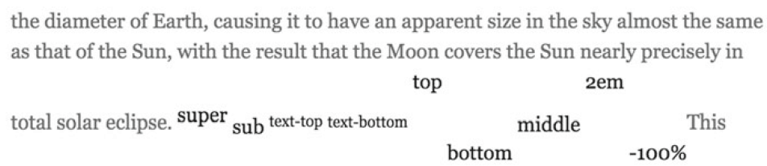
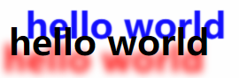

# 文本和字体

## color

## font-family

优先级从左到右，建议每个值都加引号

## line-height

line-height 也只作用于盒模型的 content。

line-height: 1.5 指当前元素 font-size 的 1.5 倍

一般行高设置在 1.2\~1.5 之间

line-height 可以给 px, 百分比, em 值

### 对于 block 元素

line-height 决定了行框盒子的最小高度。

### 对于 inline 元素

内联元素的行框盒子的高度完全由 line-height 决定，不受其他任何属性的影响

### 本质

是实现了行距。

`行距 = line-height — font-size`

行距具有上下等分的机制：文字上下的行距是一样的，各占一半，这也是 line-height 能让内联元素垂直居中的原因

## vertical-align

作用于 inline box, inline blocks, img

默认是 baseline，也就是子元素的基线和父元素的基线对齐

值是 top 或者 bottom 的时候会增大该行的高度



## font-weight

给数字时需要是 100 的整数倍，最大 900

normal 对应 400, bold 对应 700

## font-style

font-style: italic

斜体

## text-transform

大小写设置

`text-transform: lowercase` 全部小写

`uppercase`全部大写

`capitalize` 首字母大写

`none`默认

## word-spacing/letter-spacing

word:控制单词之间的间距

letter 控制字母和字母之间

## text-align

## white-space

pre 可能会导致:after 伪类变形

## Web 字体

嵌入服务器上的字体

### @font-face 规则

指定了 font-family 是以下字体时，下载 url 的字体格式

url 可以多个，以便兼容不同浏览器

font-family 和 src 都是必填的，另外的 font-style 和 font-weight 可以省略，默认都是 normal

```css
@font-face {
  font-family: 'Times New Roman', Times, serif;
  src: url('xxx.woff') format('woff'), url('xxx.woff2') format('woff2');
}
```

## 文本特效

### text-shadow

适用于短文本或者标题

绘制阴影的开销比较大

`text-shadow: x轴偏移量 y轴偏移量 模糊距离 颜色, x轴偏移量 y轴偏移量 模糊距离 颜色`

模糊距离为 0 表示完全不模糊，很大(比如 100px)几乎看不清

```css
text-shadow: -5px 15px 8px red, 15px -15px 1px blue;
```


