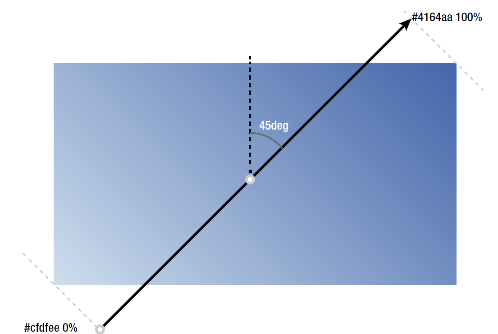

# 背景

## 颜色

### 十六进制

`#`加 6 个十六进制数字

由 3 组数字组成，每组两个，每个的值在 0~9, A~F

3 组数字分别代表 RGB 通道的值，每个颜色有 256 种可能(0~255)

也就是每组两个原因：16x16=256

如果每组的两个数字相同，可以简写成 3 位，`#aabbcc`变成`#abc`

### rgb()函数

每个值可以是 0~255 之间的数，也可以是 0~100%的百分比

#### rgba()

a 是 alpha, 值在 0~1, 1 为默认，完全不透明

### hsl()函数

hue-saturation-lightness:
hsl(角度, 饱和度, 亮度)

角度/色调：数字，只在 0~360 之间，0/360 表示红色，120 绿色，240 蓝色

饱和度：百分比，0~100%

亮度：百分比，0~100%

最终表现和 rgb 一样，只是写法不同

#### hsla()

a 也是 alpha

### alpha 与 opacity

opacity 会让子元素也同样透明，也包括本身的 content

alpha 只影响本身

## background

可以简写，多个用逗号分隔

### background-image

url 可以是地址，也可以是 base64 的 URI

可以有多个，多个会同时存在

url(xxx.jpg), url(xxx.png);

先声明的在最上面(类似 z-index 的最前面)

### background-repeat

默认 repeat

`repeat-x` | `repeat-y` | `no-repeat`

也可以两个值一起用，分别表示 x 和 y 轴

### background-size

设置成百分比的时候是相对于容器大小，而不是图片本身

要保持宽高比例，最好的做法是一个维度给百分比，另一个给 auto

### background-position

可以用保留字(left, center 等等)也可以用数值，比如 px, em,百分比

### background-clip

裁剪

## calc()函数

只要能计算的地方都可以用

+和-前后要加空格，用于和负号区分

## 渐变 linear-gradient()函数

只能用在 background 中

### 线性渐变

默认是 to bottom

以元素中心为原点，用 deg，角度为正，按顺时针旋转

```css
background: linear-gradient(45deg, #cfdfee, #4164aa);
```



### 放射渐变

有关键字 circle 或者 ellipse(椭圆)

```css
background: radial-gradient(circle closest-corner at 20% 30%, #cfdfee, #2c56a1);
```


### 重复渐变

线性：repeating-linear-gradient()函数

放射：repeating-radial-gradient()

```css
background: repeating-radial-gradient(#cfdfee, #2c56a1 10px);
```


