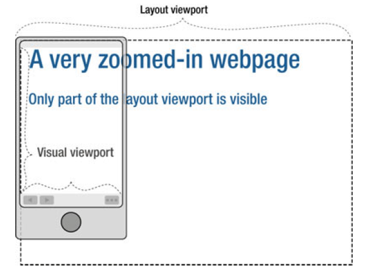

# 响应式

移动优先

## viewport

### CSS 像素(css pixels)

和屏幕像素(physical pixels)不是一回事，但存在对应关系

css 单位是 px，默认和屏幕是 1:1 的关系

当手动缩放浏览器到 200%时，文字也跟着放大，此时 px 跟屏幕像素是 1:2

又或者 windows 的 125%文本放大，那么默认 px 和屏幕是 1:1.25

### 默认、理想、可见视口

- 默认视口是模拟的，为了那些没适配的 PC 端网站可以完整显示在手机上

比如浏览器切换成桌面版看知乎，整体页面缩小了，但是仍然能看完整，不会溢出屏幕。

- 理想视口接近于设备本身尺寸的。PC 端理想=默认，移动端需要指定[meta](#meta)

- 可见(visual)视口：显示网页的区域，减去菜单栏、滚动条

- 布局(layout)视口: 包含整个网页的区域



### meta

用来指定理想视口

```html
<meta name="viewport" content="width=device-width, initial-scale=1.0" />
```

禁止缩放

```html
<meta
  content="width=device-width,initial-scale=1.0,maximum-scale=1.0,user-scalable=no"
  name="viewport"
/>
```

## @media

不会影响选择器的权重。也就是哪怕放后面，优先级低的话会被前面的覆盖

`@media screen`

应用于屏幕显示

```css
@media screen and (min-width: 728px) and (max-width: 1200px);
```

### 常用断点

768，1024，1216，1408

### 分辨率切换背景图

像素宽高比

safari 用 device-pixel-ratio(无单位)，其他用 resolution(dppx: device-pixels per
pixel, 每像素的设备像素)

兼容写法

```css
@media (-webkit-min-device-pixel-ratio: 1.5), (min-resolution: 1.5dppx) {
}
```

### respond.js

让 IE6-IE8 支持媒体查询。大致原理：

1.  把 head 中所有`<link rel="sheetstyle" href="xx"/>`的 css 路径取出来放入数组

2.  然后遍历数组一个个发 ajax 请求

3.  ajax 回调后仅分析 response 中的 media
    query 的 min-width 和 max-width 语法，分析出 viewport 变化区间对应相应的 css 块

4.  页面初始化时和 window.resize 时，根据当前 viewport 使用相应的 css 块

## &lt;img&gt;

### srcset

满足比例时加载 srcset 的内容

比例指 physical pixels/css pixels

```html

```

### sizes

指定显示的图片尺寸

## 字体大小/font-size

### em

用在 font-size 的时候基于继承下来的大小，先找本身，没有就往上找父元素

用在宽高等涉及到盒模型的时候，基于本身的 font-size

### rem(root element em)

始终基于根元素`<html>`

### 视口单位 vw, vh

vw 指视口宽度，vh 为高度, 值 1 代表 1%

比如 5vw, 假设设备宽度是 400px, 那么`5 * 1% * 400px = 20px`

### 只考虑移动端

#### vw+rem

vw 修改 body 的字体大小。同时为了避免视口过小或过大，配合媒体查询给的最大最小值 px

其他都用 rem，继承 body

### dp

[参考](https://segmentfault.com/a/1190000018850370)  
总体思路：  
`dp`属于自定义单位，类似 px2rem，在 js 中对 css 内值是`dp`的所有内容全部按照特定规则转成`px`  
像素密度 PPI：指每英寸包含的像素(Px)个数  
当屏幕的 PPI 为 160 时，1DP=1PX；例：Iphone4，Iphone5，Iphone6PPI 为 326，在这些屏幕之下 1DP=2PX  
DP=(PX\*160)/PPI

PX=DP\*(PPI/160)
