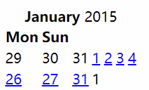

# table

写入完整标签

\<caption\>: 标题

\<thead\>: 表头

\<tbody\>

\<tfoot\>

\<colgroup\>表示列组，里面只有\<col\>

\<col\>表示一列：本身不包含内容

\<tr\>为行

## 简单日历

```html
<table class="cal">
  <caption>
    <strong>January</strong>
    2015
  </caption>
  <colgroup>
    <col class="cal-mon" />
    <!-- ...and so on -->
    <col class="cal-sat cal-weekend" />
    <col class="cal-sun cal-weekend" />
  </colgroup>
  <thead>
    <tr>
      <th scope="col">Mon</th>
      <!-- ...and so on one per day.-->
      <th scope="col">Sun</th>
    </tr>
  </thead>
  <tbody></tbody>
  <tbody>
    <tr>
      <td class="cal-inactive">29</td>
      <td class="cal-inactive">30</td>
      <td class="cal-inactive">31</td>
      <td><a href="#">1</a></td>
      <td><a href="#">2</a></td>
      <td><a href="#">3</a></td>
      <td><a href="#">4</a></td>
    </tr>
    <!-- ...and so on, one row per week... -->
    <tr>
      <td><a href="#">26</a></td>
      <td class="cal-current"><a href="#">27</a></td>
      <!-- ...and so on -->
      <td><a href="#">31</a></td>
      <td class="cal-inactive">1</td>
    </tr>
  </tbody>
</table>
```



## border-collapse

单元格的边是否合并, 值为 collapse 合并
