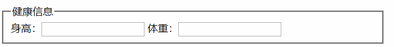

# form

```html
<form>
  <fieldset>
    <legend>健康信息</legend>
    <label>身高：<input type="text" /></label>
    <label for="weight">体重：</label><input type="text" id="weight" />
  </fieldset>
</form>
```

## fieldset, legend

fieldset 用来分组, legend 表示分组的标题



## label

表单元素的描述，点击 label 会自动聚焦在表单元素上

可以把 input 元素直接嵌套，也可以用 for 属性=对应 id

## input

### type 属性

常见的有 text, password, checkbox, radio, url, email, file

会影响软键盘的显示

浏览器在提交的时候，会自动校验 email, url

## 提交

input 设置 type="button"或者 submit，也可以手动 `form.submit()`

button 设置 type="submit"，放在 form 内才能提交，在 form 内是默认 type 是 submit

建议用 button，方便放入其他 html

可以用 form.addEventListener 监听 "submit" 事件，通过 preventDefault 阻止提交。但 `form.submit()` 时不会触发

## 重置

设置 type="reset" 或者 `form.reset()`，reset 方法会触发 reset 事件

## name 属性

name 相同的时候只能选一个，比如 radio 来回切换

## input 的 placeholder

input 的 placeholder 会出现文本位置偏上的情况：

PC 设置 height 和 line-height 一样

移动端设置 line-height: normal

## document.forms

获取页面上所有的表单元素

## 选择文本

- select() 方法，会触发 select 事件
- setSelectionRange：选中部分文本
