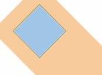
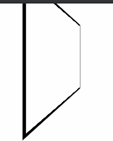
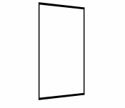

# 变换 transform

多个变换一起使用

```css
transform: translate(0, 100px) rotate(45deg);
```

::: warning
只能作用在块级元素内
:::

## 原点 transform-origin

默认以元素的中心为基准。svg 是以左上角为基准

给值分别是 x, y, z

只给一个值，其他值是 center

## 旋转 rotate

整个都会旋转，包括 margin。但还是在原本的位置，不会影响到其他元素(也就是可能会盖住相邻元素)

border: 1px solid black;

transform: rotate(45deg);

margin:20px;



## 平移 translate

也可以拆成 translateX 和 translateY

百分比相对于元素本身

## 缩放 scale

也可以拆成 scaleX 和 scaleY

只给一个值表示 x 和 y 一样

1 表示原本，大于 1 放大

下面三种写法等价

```css
transform: scale(2);

transform: scale(2, 2);

transform: scaleX(2) scaleY(2);
```

## matrix

transform 本质上都是操作变换矩阵

上面的函数相当于 matrix 的快捷方式

一共 6 个值

## 性能

修改字体大小等，如果直接改 font-size，会导致周围元素全部重新计算位置

尽可能用 transform 代替，因为他不影响周围元素，所以性能较好

但会产生[堆叠上下文](./03_boxModel.md#fixed)，影响 fixed, z-index

## 三维变换

### 透视 perspective

二维只涉及 x,
y 轴，三维涉及到 z 轴，z 轴表示用户到屏幕的方向，为负值表示远离用户，内容看起来应该比较小

```css
body {
  perspective: 100px;
}

.box {
  margin: auto;
  border: 2px solid;
  width: 100px;
  height: 100px;
  transform: rotateY(60deg);
}
```



```css
body {
  perspective: 800px;
}
```



#### perspective-origin

透视原点, 类似 transfrom-origin

### 相关函数/属性

- perspective(): 设置元素本身的 perspective 值，就不需要额外在父元素上设

transform: perspective(800px) rotateY(60deg);

- 属性 transform-style:
  父元素设置三维，默认会让子元素的三维失效，设置成 preserve-3d，让子元素和父元素处于一个三维空间

- rotate3d()

- matrix3d()
