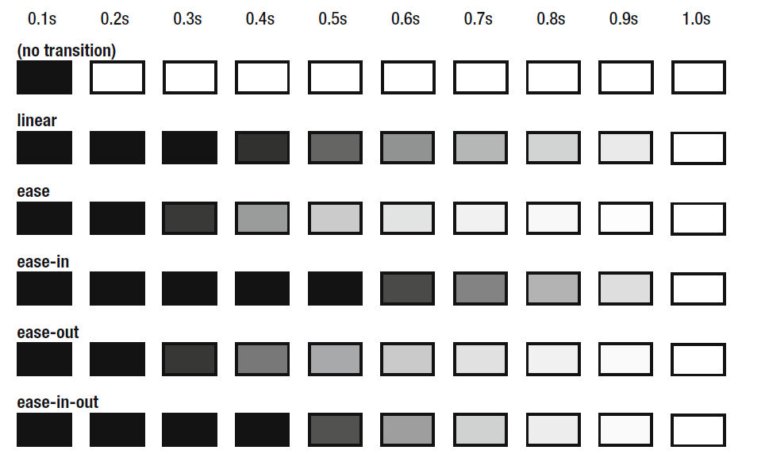

# 过渡 transition

出于用户体验，时间尽可能控制在 0.3 秒内

可以拆成

- transition-property

- transition-duration

- transition-timing-function: 默认是 ease

```css
transition:
  box-shadow 0.15s,
  transform 0.15s;
```

等价于

```css
transition-property: transform, box-shadow;
transition-duration: 0.15s;
```

## transition-timing-function

过渡计时函数：设置过渡的变化速度

ease-in 先慢后快

ease-out 先快后慢

ease-in-out 两边慢中间快

假设 1s 内由黑变白，每 0.1s 的情况：



### cubic-bezier()

控制速度本质上是通过三次贝塞尔函数(cubic Bézier function)来的

关键字如 ease 是快捷方式

## 适用场景

长度和颜色都可以，比如 border, background, width, height, color

但必须明确数值。height 是 auto 不行
