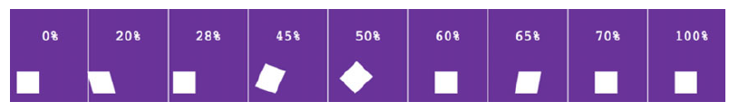

# 关键帧动画

- \@keyframes 规则定义动画

关键字 from 表示 0%, to 表示 100%

- 在 animation-\*内连接各个规则。可以简写为 animation

animation-name 对应\@keyframes 定义的动画名字

animation-duration 设置持续时间

animation-delay 设置开始动画前的等待时间

animation-timing-function 动画速度，与 transtion 类似

animation-iteration-count 动画重复的次数

## demo



```css
@keyframes roll {
  from {
    transform: translateX(-100%);
    animation-timing-function: ease-in-out;
  }
  20% {
    transform: translateX(-100%) skewX(15deg);
  }
  28% {
    transform: translateX(-100%) skewX(0deg);
    animation-timing-function: ease-out;
  }
  45% {
    transform: translateX(-100%) skewX(-5deg) rotate(20deg) scaleY(1.1);
    animation-timing-function: ease-in-out;
  }
  50% {
    transform: translateX(-100%) rotate(45deg) scaleY(1.1);
    animation-timing-function: ease-in;
  }
  60% {
    transform: translateX(-100%) rotate(90deg);
  }
  65% {
    transform: translateX(-100%) rotate(90deg) skewY(10deg);
  }
  70% {
    transform: translateX(-100%) rotate(90deg) skewY(0deg);
  }
  to {
    transform: translateX(-100%) rotate(90deg);
  }
}
body {
  background-color: #663399;
  margin: 2em;
}
.logo {
  color: #fff;
  font-family: Helvetica Neue, Arial, sans-serif;
  font-size: 2em;
  margin: 1em 0;
}
.box-outer {
  display: inline-block;
}
.box-inner {
  display: inline-block;
  width: 0.74em;
  height: 0.74em;
  background-color: #fff;
  animation-name: roll;
  animation-duration: 1.5s;
  animation-delay: 1s;
  animation-iteration-count: 3;
  animation-timing-function: linear;
  transform-origin: bottom right;
}
```

```html
<body>
  <h1 class="logo">
    <!-- This is the box we are animating -->
    <span class="box-outer"><span class="box-inner"></span></span>
    <span class="logo-box">Box</span><span class="logo-model">model</span>
  </h1>
</body>
```

其中 animation 可以简写成

`animation: roll 1.5s 1s 3 linear;`
