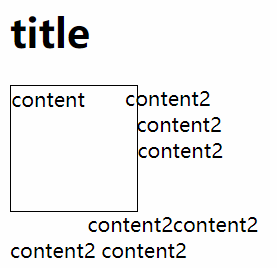
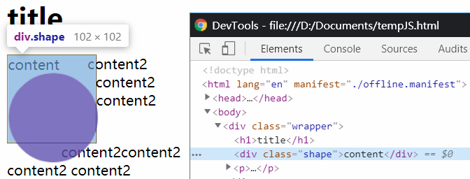

# 高级特效

## Shapes

设置盒子的形状。

盒子本身就是矩形的

属性有`shape-outside`, `shape-image-threshold`(shape-outside 是图片时用到),
`shape-margin`(给 shape-outside 增加 margin)

### shape-outside

只能用在浮动元素(float)

不改变本身的形状，影响周围的排版

常用的值有 circle()/圆, ellipse()/椭圆, polygon()/多边形, inset()/默认

也可以是图片 url("xxx.png")

函数内也可以写参数，比如圆有半径、圆心

```css
.wrapper {
  width: 200px;
}
.shape {
  float: left;
  width: 100px;
  height: 100px;
  border: 1px solid black;
  shape-outside: circle();
}
```

```html
<div class="wrapper">
  <h1>title</h1>
  <div class="shape">content</div>
  <p>
    content2 content2 content2 content2content2 content2 content2
    content2content2 content2 content2 content2content2 content2 content2
    content2
  </p>
</div>
```





## 剪贴 clip-path/蒙版 mask

蒙版的属性有 mask-image, mask-size

## 混合 mix-blend-mode

## 滤镜 fliter

另外也有背景滤镜 background-filter
