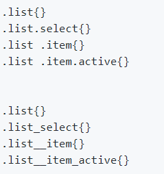

# 结构命名

## OOCSS

object oriented CSS

## SMACSS

scalable and modular architeture for CSS

## BEM(block, element, modifier)

代表"块(block), 元素(element), 修饰符(modifier)"

在选择器中，由以下三种符号来表示扩展的关系：

\- 中划线：仅作为连字符使用，表示某个块或者某个子元素的多单词之间的连接记号。

\_\_ 双下划线：双下划线用来连接块和块的子元素

\_ 单下划线：单下划线用来描述一个块或者块的子元素的一种状态

type-block\_\_element_modifier

