# Sass

分 sass 和 scss 后缀

以后缀为 scss 的文件为主。有括号包裹

## 在 vue 中

vue-cli 生成的项目结构：

webpack.base.conf.js

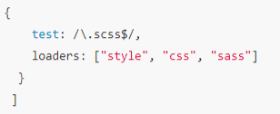

单文件 vue 中：

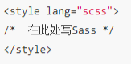

## 导入和编译（import）

- 只导入普通文件，\@import “normal.css”，编译时不做合并

- 导入后缀是 scss 的文件，可以省略后缀

`@imort “base”`

编译后合并所有 scss（比如 all.scss 导入其他 scss，最终只生产 all.css）

- 导入后缀是 scss 的文件时，如果文件名开头是”\_”，比如”\_basic.scss”

导入的时候也可以省略

`@imort “basic”`

## 注释和编译

/\*\*/双行注释会被编译

//单行注释不会编译

## 变量\$

### 普通变量

### 默认变量!default

变量值没有单独设定，那么就用添加默认值的变量值。

若设定了，那么就用重新设定的变量值

值后面加!default

### 特殊变量\#{\$variables}

变量作为属性

\#{\$variables}

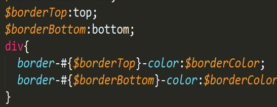

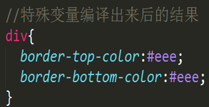

### 多值变量

变量的值有多个。分 list 和 map 类型

list: 可以用逗号或者空格或者括号分隔，nth(\$var, \$index)取值

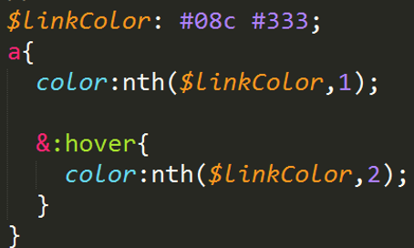

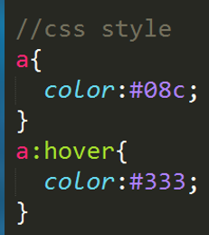

map：以对象的形式存在。{key: value}

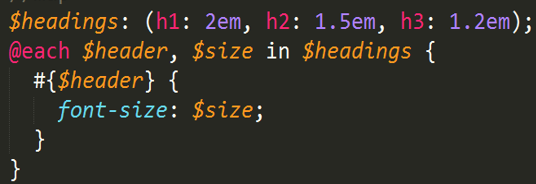

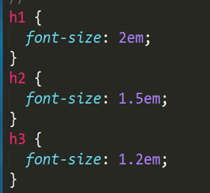

### 全局变量!global

跟 var 作用域一样

## 嵌套

### &

&表示父元素选择器

### @at-root

跳出嵌套

默认：\@at-root(without:rule)

但他不会跳出[\@media](#media冒泡)和\@support

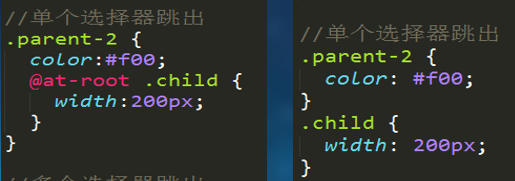

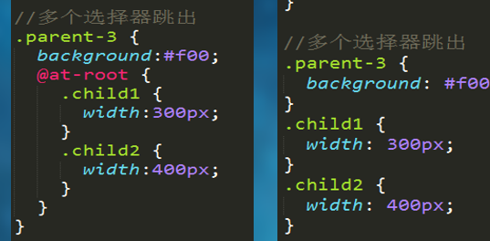

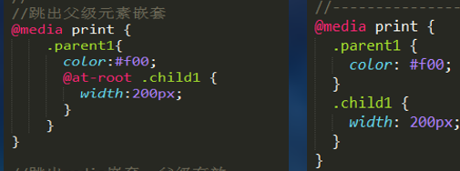

### without

值：`all`/`media`/`support`/`rule`

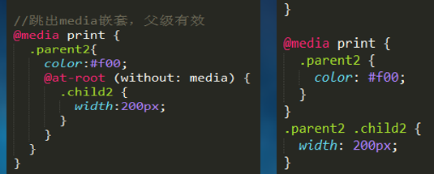

## @media 冒泡

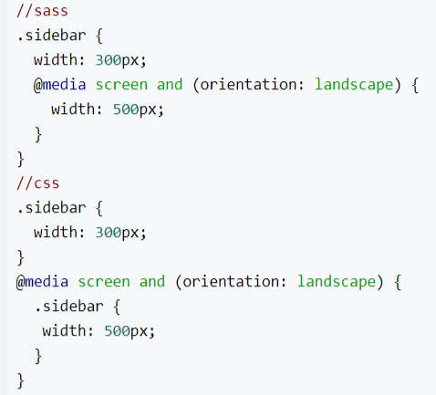

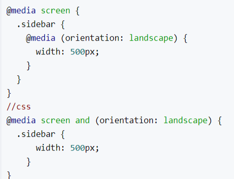

## @mixin 和@include

类似 ES6 的 function

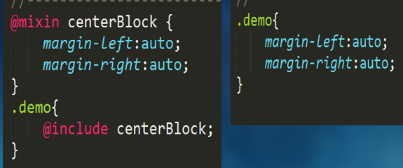

可以事先赋好默认值

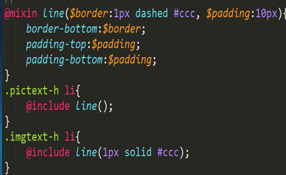

## 自定义方法@function

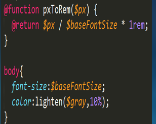
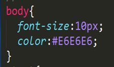

darken, lighten 属于 sass 内置函数

## if else

if 不要小括号

可以在 function 内用，也可以单独用

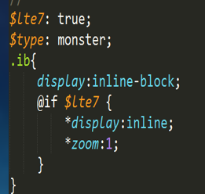

## 循环

### for

`for $var from start to end`

`for $var from start through end`

to 不包括 end, through 包括 end

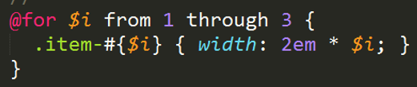

### @each

\@each key in list/map

list:

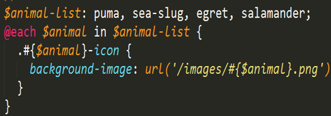

list:

map:

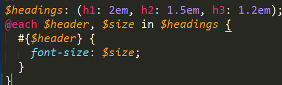

## 编译

安装好路径以后，直接进入到文件夹，敲命令

sass xxx.scss css/xxx.css

实时编译：

`sass --watch<要编译的Sass文件路径>/style.scss:<要输出CSS文件路径>/style.css`

比如

`sass --watch all-14.scss:./css/all.css`

sass 也可以多文件编译。

sass
sass/:css/（表示“sass”文件夹中所有的".scss"文件编译成".css"文件，并且将这些 css 文件放到“css”文件夹中）
