# 命令

## git init

初始化现有项目

将创建一个名为 .git 的子目录，这个子目录含有你初始化的 Git 仓库中所有的必须文件

## git clone url myProjectname

```bash
git clone https://github.com/libgit2/libgit2
```

拷贝的是远程项目的所有内容，包含了每一个文件的每一个版本

也会创建.git 文件夹

重命名 libgit2

```bash
git clone https://github.com/libgit2/libgit2 mylibgit
```

## git add

添加内容到下一次提交：

比如将 untracked 的文件转为可追踪的文件，或者把已追踪的文件放到暂存区，或者把冲突文件标记为已解决

### git add –A/git add -all

提交所有文件，包括 untracked

## git commit

将 add 之后，也就是 staged 的文件提交

### git commit –m "message"

提交注释

### git commit –a

跳过 git add，将所有 tracked 的文件一起提交

### git commit –amend

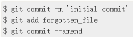

提交后发现忘记了暂存某些需要的修改，运行命令后最终只会有一个提交 -
第二次提交将代替第一次提交的结果

- 经常用来修改提交信息

`git commit --amend -m 'xxxxxxx'`

- 单个提交，可以修改用户名

`git commit --amend --author "New Authorname \<authoremail\@mydomain.com\>"`

- 一个提交(commit)里移除一个文件

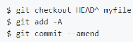

### git commit --no-verify
跳过 pre-commit    
`git commit --no-verify -m "lint"`  

## git diff

unstaged 和 staging area 比较

## git rm

从已跟踪的文件清单移除，并且从项目内删除文件

git rm PROJECTS.md

### git rm –cached

只是将文件变为 untracked，但不会删除文件

\$ git rm --cached README

## git mv

重命名或者移动文件、文件夹

git mv README.md README

等价于下面三条命令

```bash
$ mv README.md README
$ git rm README.md
$ git add README
```

## git reset HEAD filename

撤销操作，变成 unstaged

```bash
git reset HEAD CONTRIBUTING.md
```

## git checkout

### git checkout branchname

```bash
git checkout testing
```

切换到 testing 分支

### git checkout -- file

撤掉操作并还原到之前的 staged 状态，也就是 revert

```bash
git checkout -- CONTRIBUTING.md
```

### git checkout -b branchname

```bash
git checkout -b iss53
```

相当于两条命令

```bash
$ git branch iss53
$ git checkout iss53
```

## git merge branchname

合并某个分支到当前分支

### fast-forward

如果 hostfix 分支是在 master 基础上创建的，那么 merge 的时候就是 fast-forward；

区别于 iss53 和 hotfix，都是 master 基础上，但属于不同分支

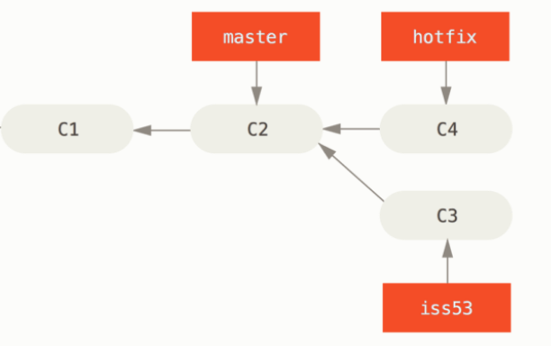

## git rebase

功能与 merge 相似。merge 只是合并另外一个分支的内容，rebase 也合并另外一个分支的内容，但是会把本分支的 commits 顶到最顶端.

merge 一般只需要解决一次冲突，rebase 把分支推到最前面，可能会反复需要解决冲突

另一个区别是 rebase 会改写提交历史，merge 不会

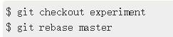

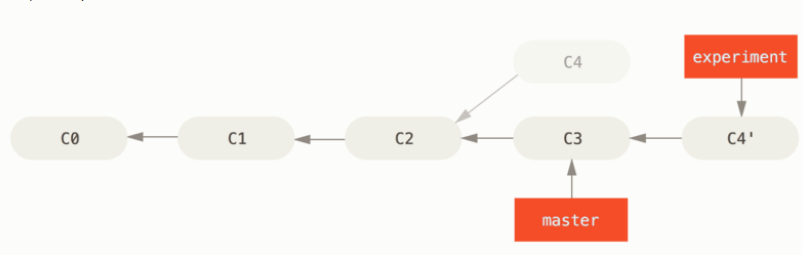

## git remote

查看远程仓库，默认叫"origin"

### git remote add name url

```bash
git remote add pb https://github.com/paulboone/ticgit
```

添加一个新的远程 Git 仓库，并添加一个仓库名（pb）

### git remote rename oldname newname

重命名远程分支

```bash
git remote rename pb paul
```

pb 重命名为 paul

### git remote rm projectname

删除远程分支

```bash
git remote rm paul
```

### git remote set-url origin

修改源地址

```bash
git remote set-url origin git@github.com:ForlornLily/fe-notes.git
```

## git fetch

```bash
git fetch pb
```

pb 代替了上面的 url，fetch 表示获取到远程仓库的所有内容，需要手动合并

## git pull

pull 表示获取到远程仓库全部内容并和本地进行合并

## git push remote-name branch-name

```bash
git push origin master
```

将 master 分支推送到 origin 服务器

### git push --delete

```bash
git push origin --delete serverfix
```

删除远程分支 serverfix

## git branch

列举当前所有分支

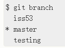

\*表示 HEAD 所指的分支

### git branch newbranchname

```bash
git branch testing
```

创建一个 testing 分支

### git branch –d branchname

删除分支。比如 hotfix 已经被合并到 master，那么之后直接在 master 上改就行，hotfix 不需要了，可以删掉

### git branch --merged

查看已经合并到 HEAD 分支的分支

比如 iss53 已经被合并到 master

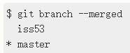

通常合并后就可以删除了

### git branch --no-merged

没合并到 HEAD 的分支

## git tag

显示所有标签

## git status

查看文件状态

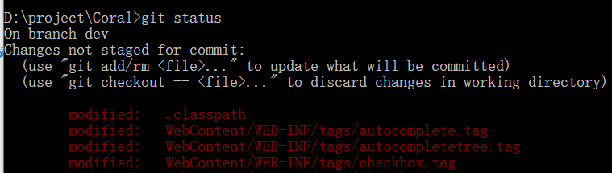

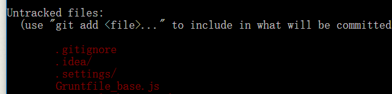

### git status –s /git status –short

将内容简短展示

M 表示 modified

??表示 untracked

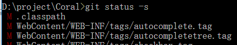

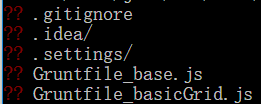

## git config

### 显示配置信息

所有

```bash
git config –list
```

单个

```bash
git config user.name
```

### 配置用户信息 user

#### 全局

```bash
git config --global user.name "John Doe"
git config --global user.email johndoe@example.com
```

#### 项目

去掉--global，会覆盖掉全局

### 命令别名

```bash
git config --global alias.ci commit
```

要输入 git commit 时，只需要输入`git ci`

## git log

查看提交历史，最近的更新放在最上面
