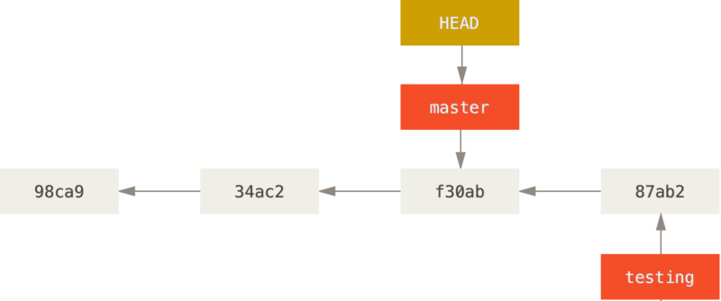

# 分支

进行提交操作时，Git 会保存一个提交对象（commit object）。

该提交对象会包含一个指向暂存内容快照的指针，作者的姓名和邮箱、提交时输入的信息以及指向它的父对象的指针

由多个分支合并产生的提交对象有多个父对象

比如第一次提交三个文件

git 里面会包含：

内容快照（三个 blob 对象内容，右边图，比如 5b1d3），一个树对象（包含目录结构和 blob 对象索引，中间图），一个提交对象


当修改文件内容后提交，会包含上次的提交对象的指针


## HEAD

创建分支的时候，git 会创建一个可移动的指针，比如

```bash
git branch testing
```

会创建一个新指针，指向 testing


同时又有一个特别的 HEAD 指针，指向当前所在的本地分支。

比如创建 testing 的时候没有切换，所以 HEAD 指向 master

如果切换到 testing，那么 HEAD 指向 testing。

如果在切换到 testing 的情况下，对文件进行了修改，HEAD 跟随 testing 进行移动


如果修改之后又切回 Master，那么 HEAD 又指向 Master


