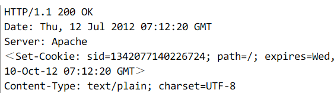
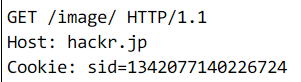

# 无状态协议

不会记录之前的请求或者响应信息（比如用户获得一张网页之后关闭浏览器，然后再一次启动浏览器，再登录该网站，但是服务器并不知道客户关闭了一次浏览器）

有新的请求，就会有新的响应。

后来为了方便，加入了 cookie

## cookie

在请求和响应中写入 cookie 来控制客户端的状态

1.  服务端发送 Set-Cookie 通知客户端保存

2.  之后再次发送请求，客户端就会自动加入刚才的 cookie 发送出去

3.  服务端接收后进行处理。
