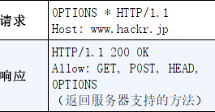

# 请求的方法

## get

一般用来请求资源

服务端返回资源，如果内容没有更新，返回 304

## post

一般用来提交

服务端返回提交后的处理结果

## put/delete

传输文件/删除文件。因为没有校验功能，通常都是配合 REST 标准使用

服务器一般会返回[204](#xx-正常处理)，表示已经存在或者删除

## head

确认资源的有效性和更新时间。

服务器返回响应首部，不会返回资源本体

## options

确认服务端支持的请求方式

服务端返回支持的方法

## trace

不怎么用

用来追踪请求怎样被加工修改

## connect

与代理服务器建立隧道，在隧道内进行 TCP 通信。

主要用 SSL(Secure Sockets Layer 安全套接层)和 TLS(Transport Layer
Security 传输层安全)进行加密
