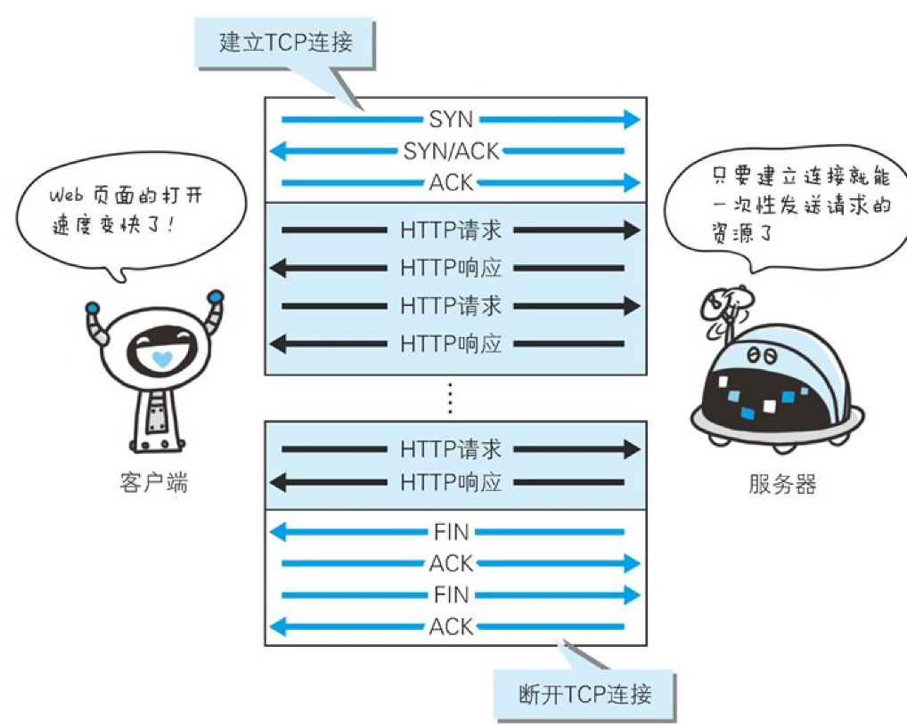
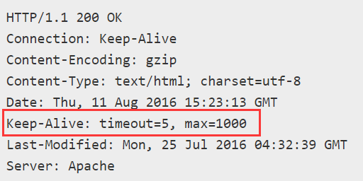

# 持久连接 keep-alive

HTTP1.0 初期，进行一次 HTTP 通信就要断开一次 TCP

比如请求包含多张图片的 HTML，HTML 请求三次握手，断开，请求第一张图片三次握手，断开…

keep-alive 指持久连接，只要一端没有明确断开，就保持 TCP 的连接状态

HTTP1.1 默认就是持久连接

Keep-Alive: timeout=秒, max=最大连接数

- timeout

- max

比如 Response 上的头

## 管线化/请求并行

比如一个页面的 10 张图片是同时请求的
