# 报文

用于协议交互的信息叫报文

报文是 HTTP 通信的基本单位，本身是字符串

客户端为请求报文

服务端是响应报文

大致分为两部分：首部和主体

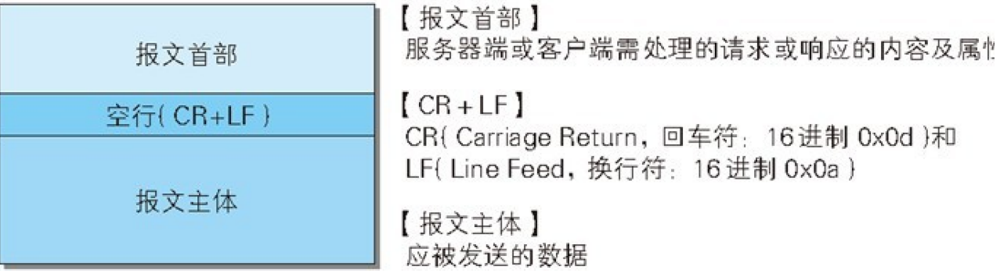

## 请求报文

请求行：方法和 HTTP 版本

首部字段：通用、请求和实体

其他：cookie 等

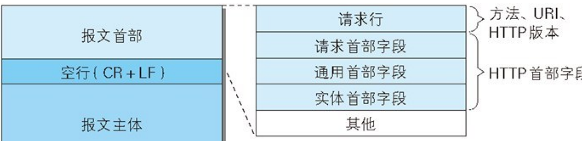

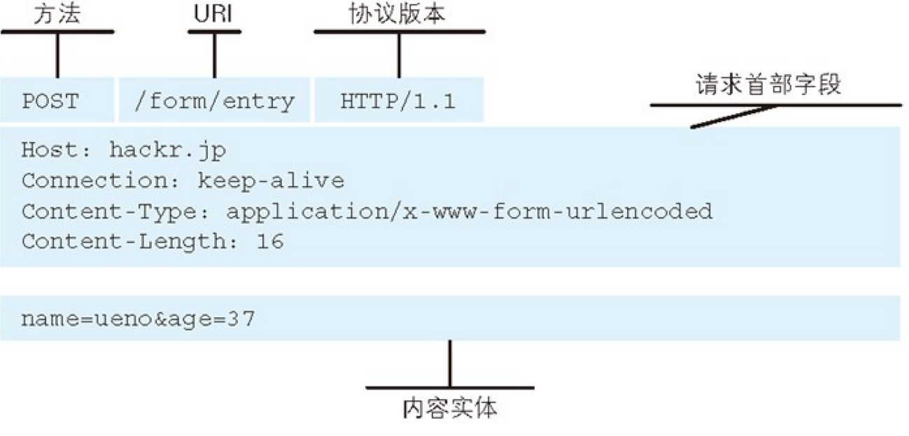

## 响应报文

状态行：响应结果的状态码，简短说明（比如 ok）和 HTTP 版本

首部字段：响应、通用和实体

其他：cookie 等

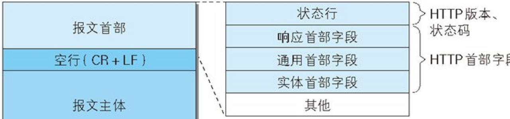

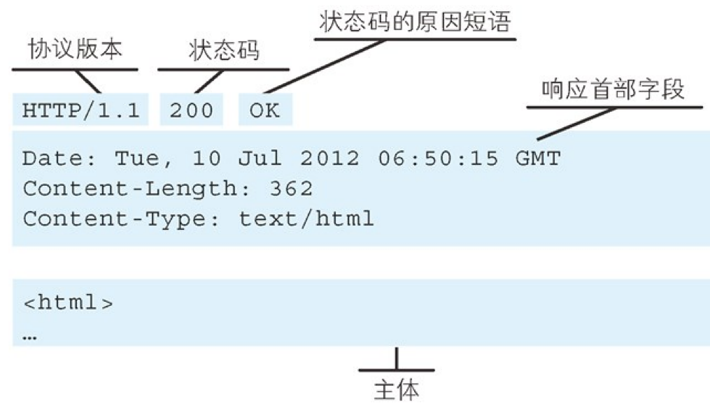

## 首部字段

提供报文主体大小、使用语言、信息认证等

组成

首部字段名：字段值 1, 字段值 2,…

比如 Content-Type: text/html

Keep-Alive: timeout=15, max=100

### 类型

通用首部字段、请求首部字段、响应首部字段、实体首部字段。

为 cookie 服务的首部字段

所有类型看《图解 HTTP》6.2

以下省略

### 通用首部

请求和响应都会用到的

- Cache-Control：缓存相关。

比如请求的时候值是 no-cache 不缓存过期的资源，代理服务器必须转发给服务器。

如果响应的时候值是 no-cache，代理服务器不允许缓存

如果 no-cache=xxx，那么客户端接受到之后这个指定参数不再用缓存，如果没有指定参数，单纯 no-cache，那么客户端可以缓存

- Date：创建报文的日期

### 请求首部

请求报文中存在

q=xxx 表示权重，范围在 0\~1。值大的优先级高。默认 q=1.0

- accept：客户端能处理的媒体类型

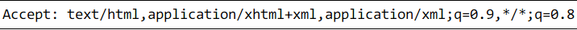

- accept-charset：支持的字符集。用于[服务器驱动协商](#内容协商)

- accepte-encoding：[编码](#编码)

- accept-language：服务器支持的自然语言集

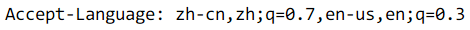

- authorization：认证信息。

- host：[区分域名](#服务器)

- Range： [范围请求](#范围请求)

- User-Agent：浏览器类型

### 响应首部

服务端响应用

- Accept-Ranges: bytes 或者 none。none 表示不支持范围请求，bytes 表示支持

- [WWW-authenticate](#xx-客户端错误)

### 实体首部

请求和响应报文内的实体

Content-xxx

### cookie

两个：

- set-cookie: 响应首部中

> 服务器一旦发送就不能删除，只能覆盖

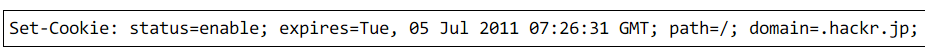

- NAME=VALUE。cookie 的名字和值，必须

- expires= Date cookie 有效期，不指定默认浏览器关闭后过期

- path=PATH。服务器目录做为 cookie 适用的对象

- domain=域名。适用的域名。不指定默认为创建 cookid 的服务器的域名

> 指定后结尾匹配即可。比如指定 example.com。那么 www.example.com 也可以发送

- Secure。HTTPS 安全中才能发送

- HttpOnly 限制。不允许 JS 访问

- cookie:请求首部中

> cookie: status=enable

## 编码

传输过程中消耗更多的 CPU，有效处理大量访问请求

### 实体

作为请求或响应的有效载荷数据（补充项）被传输，其内容由实体首部和实体主体组成。

通常报文的主体跟实体的主体一致

编码时，实体的主体发生变化，导致和报文主体产生差异

### 压缩

在实体上进行编码，保持实体的原样进行压缩，由客户端进行解码。

常见的有：

- Gzip

- compress

- deflate

- identity（不编码）

### 分块传输编码

编码实体资源没有完全完成传输之前，浏览器无法显示请求页面。

大容量的时候，通过把数据分块（chunk），让浏览器逐步显示

以最后一个大小为 0 的块为结束

## 发送多种类型

类似邮件，可以发送文字、图片 或者附件

HTTP 发送的一个报文，主体也可以包含多类型实体

### Content-type

发送多类型实体时的首部要加上该字段用来生命

#### multipart/ form- data

表单上传的时候用

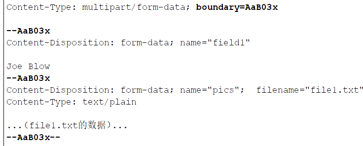

#### multipart/ byteranges

用于范围请求

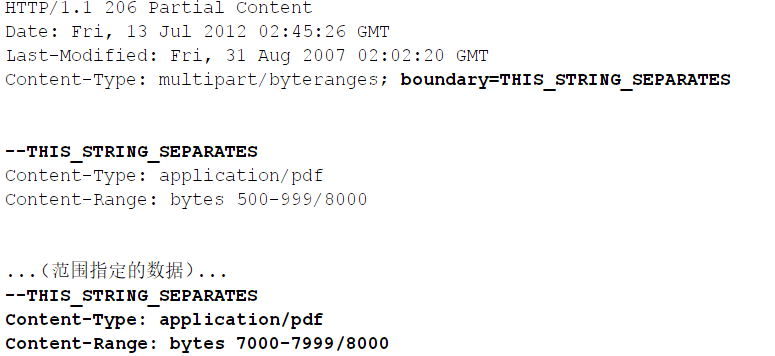

### boundary

划分各类实体

boundary:xxx

\--xxx 表示开头，--xxx—表示整个报文结束

## 范围请求

避免下载过程中异常时还要重新开始

可以指定请求范围

响应报文返回[206](./05_status_code)

如果服务器不支持范围请求，返回 200

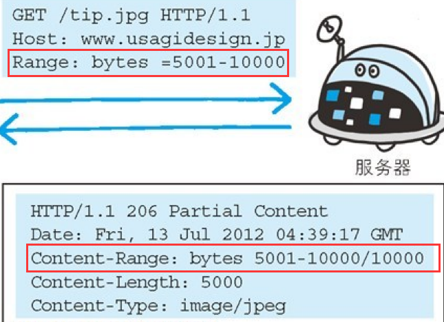

### Range

- 指定 5001\~10000:

Range: bytes=5001-10000

- 指定 5001 以后

Range: bytes=5001-

- 指定多重范围，比如开始\~3000，5001\~10000

Range: bytes=-3000, 5001-10000

多重范围的时候，响应报文还会返回 Content-type: multipart/byteranges

## 内容协商

指客户端和服务端就响应的内容进行交涉，服务端返回最合适的资源

比如同一个网站可能公用相同内容的页面，但是语言不同

内容协商的判断基准：根据报文的首部字段来，常用有

- Accept

- Accept- Charset

- Accept- Encoding

- Accept- Language

- Content- Language

| 请求头字段      | 说明                       | 响应头字段       |
| --------------- | -------------------------- | ---------------- |
| Accept          | 告知服务器发送何种媒体类型 | Content-Type     |
| Accept-Language | 告知服务器发送何种语言     | Content-Language |
| Accept-Charset  | 告知服务器发送何种字符集   | Content-Type     |
| Accept-Encoding | 告知服务器采用何种压缩方式 | Content-Encoding |

### demo

例如客户端发送以下请求头：

Accept:\*/\*

Accept-Encoding:gzip,deflate,sdch

Accept-Language:zh-CN,en-US;q=0.8,en;q=0.6

表示它可以接受任何 MIME 类型的资源；支持采用 gzip、deflate 或 sdch
压缩过的资源；可以接受 zh-CN、en-US 和 en 三种语言，并且 zh-CN 的权重最高，

服务端应该优先返回语言等于 zh-CN 的版本

浏览器的响应头可能是这样的：

Content-Type: text/javascript

Content-Encoding: gzip

表示这个文档确切的 MIME 类型是 text/javascript；文档内容进行了 gzip
压缩；响应头没有 Content-Language 字段，通常说明返回版本的语言正好是请求头
Accept-Language 中权重最高的那个

### Vary

如果服务端提供的内容取决于 User-Agent 这样「常规 Accept
协商字段之外」的请求头字段，那么响应头中必须包含 Vary 字段，且 Vary
的内容必须包含 User-Agent

比如服务端同时使用请求头中 User-Agent 和 Cookie 这两个字段来生成内容，响应中的
Vary 字段看上去应该是这样的

Vary: User-Agent, Cookie

### 类型

协商的技术有 3 种

服务器驱动协商：以请求的首部字段为参考，由服务器自动处理

客户端驱动协商：由客户端处理。比如用户手动选择语言列表或者用 JS 进行判断，根据浏览器或者操作系统，显示 PC 版还是手机版

透明协商：服务器和客户端驱动结合
