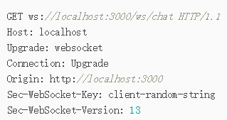
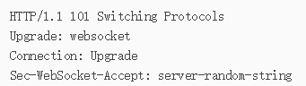

# websocket

只需要一次握手，没有同源策略的限制，即可以跨域

允许服务端主动向客户端推送数据

使用 ws 或 wss 的统一资源标志符，类似于 HTTPS，其中 wss 表示在 TLS 之上的 Websocket

ws 默认 80，wss 默认 443，和 HTTP 一样

Connection 必须设置 Upgrade，表示客户端希望连接升级。

Upgrade 字段必须设置 Websocket，表示希望升级到 Websocket 协议

## 创建

```js
var host = 'ws://' + href + ':6800'
socket = new WebSocket(host)
socket.onmessage = function() {}
```

## 客户端请求头

GET 请求的地址不是类似/path/，而是以 ws://开头的地址；

请求头

- Upgrade: websocket 和 Connection:
  Upgrade 表示这个连接将要被转换为 WebSocket 连接；

- Sec-WebSocket-Key 是用于标识这个连接，并非用于加密数据；

- Sec-WebSocket-Version 指定了 WebSocket 的协议版本



## 服务端

响应代码 101 表示本次连接的 HTTP 协议即将被更改，更改后的协议就是 Upgrade:
websocket 指定的 WebSocket 协议



## 事件

socket.onopen/ onmessage / onclose

## 方法

send/close
