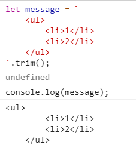

# String

0 或者多个 16 位 Unicode 字符组成

```js
var txt = "a \u03a3" //"a Σ"
txt.length //3
"我".length //1
```

字符串是不可变的（immutable）。

如果定义一个变量，之后又用新的字符串赋值。那会销毁原本的字符串，再用新字符串填充这个变量

```js
var lang = "Java"
lang = lang + "Script"
```

先创建一个可以容纳 10 个字符的新字符串，然后填充 Java 和 Script，最后销毁原本的 Java 和 Script 两个字符串

## 字符字面量

用于表示非打印字符或有其他用途的字。更多内容见[正则](./030_regexp.md)

- `\n` 换行
- `\t` 制表
- `\b` 退格
- `\r` 回车
- `\f` 换页
- `\\` 反斜杠

## 转义

如果不是特殊含义的[转义字符](./030_regexp.md#常用的转义（非打印字符）)，比如`\#`, 和"#"是等价的;  
因为`\`不算字符串本身的内容

`var test = 'hello \'`值是 "hello "

## toString(基数)

`Number`、`Boolean`、`Object`、`String`、`Symbol`、`BigInt`都有该方法。null 和 undefined 没有

可以指定转换后的进制。

执行结果一般和`String()`一样

默认就以 10 进制的方式输出。也就只有 Number/BigInt 会有差别

```js
12.toString() // Uncaught SyntaxError: Invalid or unexpected token

var num = 12
num.toString() // '12'

num.toString("2") // '1100'
```

## 显式类型转换 String()

将所有类型转成字符串。如果类型本身有 toString()方法，返回 toString 的值。

null 返回`"null"`, undefined 返回`"undefined"`

## 模板字面量: 反引号`

Template Literals：会包含空格，可能导致 length 变多

### 插值

即 `${}`，使用 toString() 强制转型为字符

### 标签函数

```js
let a = 1
let b = 2

function testFunction(data, ...restParams) {
  console.log("data", data) // ['', ', ', '', raw: Array(3)]
  console.log(...restParams) // 1 2
}
const result = testFunction`${a}, ${b}`
console.log("result", result) // result undefined
```

### raw

```js
console.log(`\u00A9`) // ©
console.log(String.raw`\u00A9`) // \u00A9
```

### trim()方法

去除空格，不去换行



## 识别子字符串

区分大小写，都返回布尔值

第二个参数设置索引。

### includes(string, position)

position 不写默认是 0;

```js
"hello world".includes("world", 4) //true
```

- ES5 实现

```js
function includes(str, start) {
  start = Number(start)
  if (isNaN(start) || start < 0) {
    start = 0
  }
  if (start + str.length > this.length) {
    return false
  }
  return this.indexOf(str, start) > -1
}
includes.apply("hello world", ["world", 4])
```

### startsWith

- ES5 实现

```js
function startsWith(str, start) {
  start = Number(start)
  if (isNaN(start) || start < 0) {
    start = 0
  }
  if (start + str.length > this.length) {
    return false
  }
  return this.substring(start, start + str.length) == str
}
startsWith.apply("hello world", ["ello", "1"]) //true
```

### endsWith(string, length)

- ES5 实现

```js
function endsWidth(str, length) {
  length = Number(length)
  if (isNaN(length) || length < 0 || length > this.length) {
    length = this.length
  }
  return this.substring(length - str.length, length) == str
}
endsWidth.apply("hello world", ["world"])
```

## repeat()

将字符串重复指定次数。比如格式化的时候重复空格

```js
var test = "hello".repeat(2) //"hellohello"
```

## padStart

`str.padStart(targetLength [, padString])`: 用 padString 填充 str 的开头

- 不传 padString，用空格填充
- targetLength 等于 str.length + padingString.length，那么会有以下表现：
  - targetLength 小于 0 无效
  - 如果 targetLength 小于 str 的长度，则忽略
  - 如果 padString 本身的长度大于 str.length + targetLength, 则忽略溢出的部分

```js
var test = "abc"
test.padStart(6) //"   abc"
test.padStart(1, "d") //"abc"
test.padStart(-6, "d") // "abc"
test.padStart(6, "d") //"dddabc"
test.padStart(6, "defg") //"defabc"，忽略了"g"
```

## padEnd

`str.padEnd(targetLength [, padString])`: 用 padString 填充 str 的结尾  
和 padStart 类似

```js
var test = "abc"
test.padEnd(6) //"abc   "
test.padEnd(1, "d") //"abc"
test.padEnd(-6, "d") // "abc"
test.padEnd(6, "d") //"abcddd"
test.padEnd(6, "defg") //"abcdef"，忽略了"g"
```
