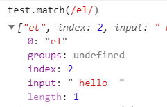
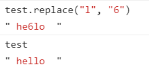

# 基本包装类型

primitive wrapper types  
对于`number`, `string`, `boolean`，为了方便基本操作，每创建一个基本类型，后台就会创建一个对应的基本包装类型的对象

所以 string 可以调用对象的方法

但不要自己去显式地 new 一个
::: warning
Number, String, Boolean 是构造函数，但 Symbol 和 BigInt 不是，不能`new`
:::
比如

```js
var s1 = "emma"
var s2 = s1.substring(2)

var s3 = new String("Noman")
typeof s3 //"object"

var test2 = new Symbol("1") //报错，Symbol不是构造函数
var test3 = new BigInt("10") //报错，BigInt is not a constructor
```

实际上调用`s1.substring`的后台会经过以下步骤

1. 创建 String 的一个实例
2. 调用方法
3. 销毁该实例。  
   上面的 `substring` 等价于

```js
var s4 = new String("emma")
var s2 = s1.substring(2)
s4 = null
```

## Number 包装类型的方法

### toFixed()

返回指定小数位的字符串

```js
var num = 10
num.toFixed(2) //"10.00"
var num2 = 10.103
num2.toFixed(2) //"10.10"
```

### 返回指数

- toExponential()： 返回指数
- toPrecision: 可能返回 toFixed, 也可能返回 toExponential

## String 包装类型

### 属性 length

返回字符串的长度

### 字符方法 charAt, chatCodeAt, 方括号

返回指定位置的字符，或者编码

```js
var test = "hello"
test.charAt(2) //"l"
test.charCodeAt(2) //108
test[4] //"o"
```

### 字符操作：concat

因为字符串本身就是不可以被修改的，就像字符`"1"`，不可能修改"1"本身  
所以任意字符操作总是返回一个**新字符串**

concat 拼接字符串。更多的时候还是用`+`比较方便

`str += "one" + "two"`

做了四件事情：

1. 创建一个临时字符串
2. 连接后的"onetwo"赋值给临时字符串
3. 临时字符串和 str 的值连接
4. 结果赋值给 str

可以改成: `str = str + "one" + "two"`

基础字符串放最左边，如果换成"one" +str，那么就会创建临时字符串

### 字符操作：slice, substring, substr

`slice(start, end)`

`substring(start, end)`

`substr(start, amount)`

传负数的时候,slice 和 substring 会不同

```js
var test = "hello"
test.slice(1, 3) //"el"
test.substring(1, 3) //"el"
test.substr(1, 3) //"ell"
```

### 位置 indexOf, lasetIndexOf

与 Array 类似

### trim()

```js
function trim(str) {
  return str.replace(/(^\s*)|(\s*$)/g, "")
}
```

### 大小写转换

toLowerCase /toUpperCase

toLocaleLowerCase/ toLocaleUpperCase

### 正则相关: match, search, replace, split

match 和 exec()一样, search 返回的是第一个匹配的索引

```js
var test = "hello"
test.search(/l/) //2
```



replace 用于替换，默认只替换第一个匹配。第二个参数可以是一个函数



```js
function htmlEscape(text) {
  return text.replace(/[<>"&]/g, (match, pos, originText) => {
    switch (match) {
      case "<":
        return "&lt;"
      case '"':
        return "&quot;"
      default:
        return originText[pos]
    }
  })
}
let result = htmlEscape('<p class="greeting">Hello world!</p>')
/* 结果：
"&lt;p class=&quot;greeting&quot;>Hello world!&lt;/p>" */
```

::: tip
split 参数也可以是正则
:::

## 基本包装类型和复杂类型的区别

差别在于生命周期。

基本包装类型在一行代码执行完毕之后就被销毁

所以基本类型上加属性是获取不到的

```js
var s1 = "hello"
s1.color = "red"
alert(s1.color) //undefined
```

过程：

1. s1.color 的时候创建了一个 String 实例，随即被销毁

2. alert 的时候又创建了一个 String 实例，此时新实例是没有 color 的

所以虽然不会报错，但无法加属性

不建议显式地 new 基本包装类型

```js
var value = "16"
var number = Number(value)
typeof number //"number"
var obj = new Number(value)
typeof obj //"object"
```
