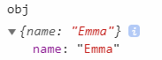

# 复杂类型/引用类型

complex data  
可以把对象看作是从字符串到值的映射。类似的数据结构还有很多叫法，比如"散列(hash)", "散列表(hash table)","字典(dictionary)"

对象是引用类型的一个实例。都是通过构造函数（new）创造出来的

构造函数本身也是一个函数

## Object

对象不能存在同名的属性名(key);

```js
var foo = new Object() //通过构造函数创建

var test = {} //通过对象字面量创建（推荐）

//等价于
var test = Object.create(Object.prototype)
```

优先用点表示法

点或者方括号的层次越多，也就是嵌套的内容越多，寻找的时候消耗性能越大
每个 Object 实例都有如下属性和方法。

- [constructor](#constructor)：用于创建当前对象的函数
- [hasOwnProperty](#hasownproperty)：用于判断当前对象实例（不是原型）上是否存在给定的属
  性
- [isPrototypeOf](#isprototypeof)：用于判断当前对象是否为另一个对象的原型
- [propertyIsEnumerable](#propertyisenumerable)：用于判断给定的属性是否可以使用
- toLocaleString()：返回对象的字符串表示，该字符串反映对象所在的本地化执行环境。
- toString()：返回对象的字符串表示。
- valueOf()：返回对象对应的字符串、数值或布尔值表示。通常与 toString() 的返回值相同。
  除了名字和值外，每个属性还有一些与之相关的特性(attribute)：可写 writable, 可枚举 enumerable, 可配置 configurable，见[面向对象](./021_oop.md)

### 原型

原型的应用见[函数](./012_function.md)和[面向对象](./021_oop.md)

每一个对象（除了`null`）都会和另一个对象关联。  
"另一个对象"就是原型，每个对象从原型继承属性

通过对象字面量创建的对象都具有同一个原型对象;

通过`new`关键字创建的对象，原型对象就是对应构造函数的 prototype, 比如 new Array()的原型对象是 Array.prototype, 也就是该对象继承 Array.prototype 的属性;

构造函数本身都具有一个继承自 `Object.prototype` 的原型。所以 new Array()创造的对象，同时继承自 Array.prototype 和 Object.prototype。  
这就是原型链

`Object.prototype` 是根对象，即所有对象的起源。

## constructor

创建当前对象的函数

```js
var foo = new Object()
foo.constructor === Object //true
var test = {}
test.constructor === Object //true
```

## in 关键字

in 关键字会包含继承的属性，同样`!==`也会包含继承的属性

```js
var foo2 = {}

foo2.bar2 = "hello"
"bar2" in foo2 //true

foo2.toString !== undefined // true
```

### for...in

`for key in object`，不包括`enumerable`为 false（不可枚举），包括继承

for 循环的时候 key 并不是顺序的，如果要按顺序，可以事先自己写个 key 的数组

也可以单独使用 `key in object`，包括 enumerable 为 false

## hasOwnproperty

hasOwnproperty(key)：key 是个字符串，判断 key 是否存在当前属性，不包括继承

```js
var test = {}
test.hello = "word"
test.hasOwnProperty("hello") //true
```

## propertyIsEnumerable

propertyIsEnumerable(key)：可以看成是 hasOwnproperty 的增强版:  
只有是自有属性并且可枚举，才会返回 true

```js
test.propertyIsEnumerable("hello")
```

## isPrototypeOf

isPrototypeOf(object)：对象是否存在于另一个对象的原型链上

如果实例内部的`[[Prototype]]`指向调用 isPrototypeOf 的对象，那么为 true

实例的`[[Prototype]]`指向原型对象

构造函数的 prototype 指向原型对象

```js
var test = {}
Object.isPrototypeOf(test) //false
Object.prototype.isPrototypeOf(test) //true
```

## toLocaleString()/toString()/valueOf()

- toLocaleString 会做一些本地化处理，比如国家不同显示不同的日期

- toString 返回字符串

- valueOf 返回原本对应的 string, number, boolean

```js
var str = "123"
str.toString() //"123"
str.toLocaleString() //"123"
str.valueOf() //"123"
var date = new Date()
date.toString() //"Thu Oct 10 2019 15:10:43 GMT+0800 (中国标准时间)"
date.toLocaleString() //"2019/10/10 下午3:10:43"
date.valueOf() //1570691443220
```

## 对象转原始类型规则

对象在转换类型的时候，会调用内置的 `[[ToPrimitive]]`函数，对于该函数来说，算法逻辑一般来说如下：

- 如果已经是原始类型了，那就不需要转换了

- 转成字符串，先调用 toString 再调用 valueOf。

调用后如果返回值是基本类型，那么将基本类型转为对应的字符串（可以看[转换规则总结](./019_transrule.md)第一张图）

- 否则先 valueOf 再 toString，规则同上

- 如果都没有返回原始类型，就会报错

```js
let a = {
  valueOf() {
    return 0
  },
  toString() {
    return "1"
  },
  [Symbol.toPrimitive]() {
    return 2
  },
}
1 + a //3
```

### toString

- 单纯的一个对象返回的是"[object object]"

  ```js
  var x = { hello: "world" }
  x.toString() //"[object Object]"
  ```

- 数组：将每一项调用 toString()，然后用逗号分隔拼接
  ```js
  var y = [1, 2, 3]
  y.toString() //"1,2,3"
  var z = [{ a: 1 }, 2]
  z.toString() //"[object Object],2"
  ```
- 函数：返回定义函数的表达式
- Date/RegExp: 返回字符串

### valueOf

返回对象本身

Date 返回毫秒数

```js
var arr = [1, 2]
arr.valueOf() //[1, 2]
```

## 遍历

### Object.keys(对象)

返回对象可枚举的 key，不包括继承，不包括 constructor

### Object.values/Object.entries

和[可迭代对象](./030_iterators.md)的用法类似

## Object.fromEntries

`Object.fromEntries(iterable);`: 把键值对列表转成对象  
类似数组的 from，或者说`Object.entries`的反转

```js
const arr = [
  ["0", "a"],
  ["1", "b"],
  ["2", "c"],
]
Object.fromEntries(arr) // {0: 'a', 1: 'b', 2: 'c'}
```

## 比较：Object.is(key1, key2)

进行===比较，不会出现类型转换

```js
Object.is(1, "1") //false
```

和===不同的地方有两处：

\+0 和-0，NaN 和 NaN

```js
;+0 === -0 //true

Object.is(+0, -0) //false

NaN === NaN //false

Object.is(NaN, NaN) //true
```

## 合并：Object.assign()

浅拷贝。如果是对象，只是拷贝引用。合并时只要 key 存在就会覆盖，哪怕是个 undefined

```js
let a = {
  name: undefined,
}
b = Object.assign({}, a) // {name: undefined}
```

## 解构

```js
let servant = {
  saber: "Altria",
  lancer: "",
}
let { saber, archer = "Emiya" } = servant
console.log(saber) //"Altria"
console.log(archer) //"Emiya"
```

### 赋值给非同名

```js
let { saber: Saber, archer: Arhcer = "Emiya" } = servant
console.log(Saber) //"Altria"
console.log(Arhcer) // "Emiya"
console.log(saber) //报错: saber is not defined
```

## instanceof 操作符

基本类型都会返回 false,因为他们都不是对象

```js
1 instanceof Number //false
var test = {}
test instanceof Object //true
```

### 手写

```js
function myInstanceOf(left, right) {
  const rightProto = right.prototype
  let leftProto = left.__proto__
  if (leftProto === null) {
    return false
  }
  while (leftProto) {
    if (leftProto === rightProto) {
      return true
    }
    leftProto = leftProto.__proto__
  }
  return false
}
```

## 防止篡改对象

严格模式下，设置防篡改后再修改都会报错  
都只针对自有属性，如果新增对象的原型属性，那么原型上的新属性仍然可以继承

### 不可扩展 Object.preventExtensions

无法再新增属性，但是可以删除或者修改原有

```js
let obj = {
  name: "Emma",
}
Object.preventExtensions(obj)
obj.value = "hi"
```



#### 判断是否能扩展 Object.isExtensible(obj)

设置 preventExtensions 后返回 false

### 密封对象 Object.seal

无法再新增/删除属性，但是可以修改原有

#### 判断是否密封 Object.isSealed

设置 seal 以后返回 true，同时也成为不可扩展，isExtensible 返回 false

### 冻结对象 Object.freeze

不能修改、新增、删除

#### 判断是否冻结 Object.isFrozen

freeze 后返回 true，同时 isSealed 返回 true, isExtensible 返回 false

## 对象字面量语法扩展

### 属性初始化器

key 和 value 变量名一样时，可以省略简写

{name: name}变成{name}

### 方法简写

省略冒号和 function 关键字

方法简写能使用`super` ，而非简写的方法则不能

## 序列化对象

对象序列化(serialization)是指把对象的转态转成字符串，可以把字符串转对象  
其实就是`JSON.stringify()`和`JSON.parse()`

### 限制

JSON 并不能序列化所有值。

- undefined 不能序列化和还原

```js
var test = {
  a: undefined,
  b: null,
}
JSON.parse(JSON.stringify(test))
/* 
  结果
  {
    b: null
  } 
*/
```

- Number：`NaN`, `Infinity`和`-Infinity`序列化结果是`null`

```js
var test = {
  a: NaN,
  b: 0,
}
JSON.parse(JSON.stringify(test)) //{a: null, b: 0}
```

- symbol: 不能序列化和还原

```js
var test = {
  a: Symbol("1"),
}
JSON.parse(JSON.stringify(test)) //{}
```

- BigInt 不能：TypeError: Do not know how to serialize a BigInt
- Date 类型,JSON.parse() 仍然是字符串，不会还原成原本的日期对象

```js
var date = new Date()
JSON.stringify(date) // "2019-09-29T08:42:13.409Z"
JSON.parse(JSON.stringify(date)) //"2019-09-29T08:42:13.409Z"
```

- 只能序列化和还原普通对象，Set、Map、RegExp、Error 等构造函数的实例都变成`{}`，函数不能序列化和还原

```js
var test = {
  a: new Set([1, 2]),
  b: function () {
    console.log("1")
  },
  c: new Error("error"),
}
console.log(JSON.parse(JSON.stringify(test)))
/* 
  {
    a: {}
    c: {}
  } 
*/
```

- JSON.stringify 只能序列化**可枚举的自有属性**
- 会抛弃对象的 constructor。也就是深拷贝之后，不管这个对象原来的构造函数是什么，在深拷贝之后都会变成 Object
- 不能解决循环引用

相关内容[深浅拷贝](./020_scope.md#变量复制)
