# 操作符

## 一元操作符(unary operator)

操作数是 1 个

### 递增和递减: i++, --i

前置时：先修改本身的值，再进行后续运算

```js
var age = 10
var result = --age + 10 //19

var age2 = 10
var result2 = age2-- + 10 //20
```

#### 转换规则

根据 Number 规则可以转正常数字的，同数字。否则 NaN

## 一元+和-：表示正数和负数

### 转换规则

根据 Number 规则可以转正常数字的，同数字。否则 NaN

## 位操作符（Bitwise Operators）

::: warning
前提：操作数都是整数
:::
ECMAScript 内所有数字都根据 IEEE-754 64 位格式存储

但位操作符会将 64 位转成 32 位的整数再进行操作，操作结束后转回 64。

也就是理解 32 位如何工作即可。

符号位会占 1 位，也就是 31 位数字+1 位符号位

存储方式也就是补码。

### 补码

整数全部翻译成 2 进制后，要考虑负数问题  
如果单纯用 0 表示正，1 为负。那么做为数字值的 0 就会混淆  
`[0000 0000]原`和`[1000 0000]原`两个编码表示 0  
所以用补码来表示：

- 正数的补码就是其本身  
  `[+1] = [00000001]原 = [00000001]反 = [00000001]补`
- 负数的补码是在其原码的基础上, 符号位不变, 其余各位取反, 最后+1  
  `[-1] = [10000001]原 = [11111110]反 = [11111111]补`  
  负数补码变原码一样也是取反+1  
  范围仍然是 2 的 7 次方（符号位+值）

### 按位非 NOT ~

取反码，等价于对数值取反并减 1  
位操作的速度快得多。因为位操作是在数值的底层表示上完成的。

```js
let num1 = 25 // 二进制00000000000000000000000000011001
let num2 = ~num1 // 二进制11111111111111111111111111100110
console.log(num2) // -26
```

```js
let num1 = 25
let num2 = -num1 - 1
console.log(num2)
```

### 按位与 AND &

两个数的二进制，位置对齐，相与。都是 1，为 1，否则为 0

然后把值变成 10 进制

```js
25 & 3 // 1
```

```
25 = 0000 0000 0000 0000 0000 0000 0001 1001
 3 = 0000 0000 0000 0000 0000 0000 0000 0011
---------------------------------------------
AND = 0000 0000 0000 0000 0000 0000 0000 0001
```

### 按位或 OR |

两个数的二进制，位置对齐，相与。有一个是 1，为 1，否则为 0

然后把值变成 10 进制

### 按位异或（XOR）^

```
 25 = 0000 0000 0000 0000 0000 0000 0001 1001
  3 = 0000 0000 0000 0000 0000 0000 0000 0011
---------------------------------------------
XOR = 0000 0000 0000 0000 0000 0000 0001 1010
```

相同为 0，不同位 1  
0 异或其他值，值为本身，也就是异或同一个数两次，值不变  
异或的应用: leetcode [136. 只出现一次的数字](../leetcode/136.md)

### 左移&lt;&lt; 有符号右移&gt;&gt; 无符号右移&gt;&gt;&gt;

```js
2 << 5 //64
```

向左移动 5 位，后面补 0

不影响符号位

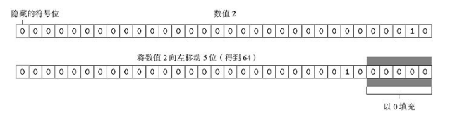

```js
64 >> 5 //2
```

于左移正好相反

空位用符号位填充。负数按照补码规则转换

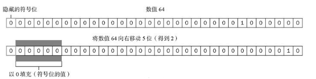
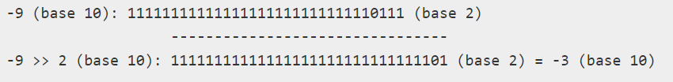

```js
64 >>> 5 // 2
```

用 0 填充

正数结果与`>>`一致

负数时因为开头是 0，认为是正数，就以正数的编码形式转换

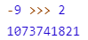

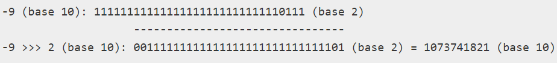

### 转换规则

NaN 和 Infinity 会被当做 0 来处理

非 Number 类先根据 Number()规则转换

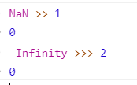

## 布尔操作符

### 逻辑非 NOT !

!{} 对象返回 false

!“"返回 true, !“ "返回 false

!0 返回 true，其他 Number 是 false

!null, !NaN, !undefined 是 true.

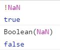

!!和 Boolean 结果一致

### 逻辑与 AND &&

短路操作，只要第一个是 false，就会返回 false

- false && 其他: 返回`false`

- 对象 1&& 其他: 返回其他

- 其他&& 对象: 其他为 true 才返回对象

- 对象 1 && 对象 2: 返回对象 2

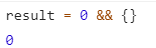
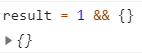

- null && 其他 返回`null`

- NaN && 其他 返回`NaN`

- undefined && 其他 返回`undefined`

### 逻辑或 OR ||

短路操作，只要第一个是 true，就会返回 true

返回值

- true \|\| 其他: 返回 true

- 对象 \|\| 其他: 返回对象

- false \|\| 其他: 返回其他

- 对象 1 \|\| 对象 2: 返回对象 1

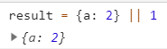

- null \|\| null 返回 null，

- NaN, undefined 同理

## 算术运算

### 转换规则概览

`+`和关系运算符（`==`, `<`, `>`, `<=`, `>=`, `!=`）的隐式转换都是变字符串的过程

其他都是变数字（比如减法）的过程

### 乘法

数值按常规计算。

超出范围，负数是-Infinity, 正数是 Infinity

有一个 NaN，返回 NaN

Infinity 和 0，返回 NaN

Infinity 和不是 0，返回 Infinity，符号看非 0 数值的符号

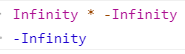
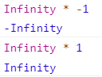

不是数值，先根据 Number 规则进行转换，再遵循上述规则

### 除法

0/0，返回 NaN

非 0/0，返回 Infinity，符号位看非 0

其他和乘法一致

### 求模（取余）%

无穷大% 有限值, 返回 NaN

有限值%无穷大，返回有限值

有限值%0, 返回 NaN

Infinity%Infinity ,返回 NaN

不是数值，先根据 Number 规则进行转换，再遵循上述规则

### 指数

Math.pow() 或者 操作符\*\*

```js
2 ** 3 // 8
let squared = 3
squared **= 2 // 9
```

### 加法

有一个 NaN，返回 NaN

Infinity 见下方

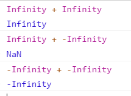
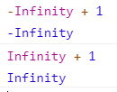
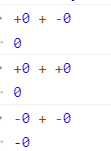

如果有一个字符串，进行字符串拼接

拼接规则：

- 对象, Number, Boolean 调用 toString()

- Symbol 直接报错

- undefined 变成`"undefined"`,null 变成`"null"`

### 减法

如果有字符串/Boolean/null/undefined，根据 Number()规则转成数字再进行运算

如果是对象，先调 valueOf，如果返回的不是 String, Boolean, Number，再调 toString()

数字运算与加法一样

### 比较

- 比较：大于，小于，大于等于，小于等于

有一个数值，按 Number()都变成数值

两个都是字符串，比较编码值。左边起先比第一个，一样再比第二个

```js
"hello" > "H" // true
```

对象: 对象的比较都是引用的比较。先调 valueOf，再调 toString

布尔也转数值

### 等于

`==`进行转换

`===`不转

#### 双等号

- 布尔值，先转成数字 0 或者 1

- 有一个数值，都变数值

- null == undefined// true

- null 和 undefined 不会转换

- 有一个 NaN，返回 false

```js
NaN === NaN // false
NaN == NaN // false
```

- 一个是对象，另一个不是对象。这个对象先调 valueOf 返回基本类型

- 都是对象，比较两个对象是否指向同一个对象。否则为 false

#### 三等号

数据类型不同就是 false

## delete 运算符

delete 只能删除自有属性，不能删除继承属性

## 逗号

逗号也可以赋值。取最后一项

```js
var num = (1, 2, 3)
console.log(num) // 3
```

## 空值合并运算符

Nullish coalescing operator：即双问号 `??`  
不是 null 或 undefined 时取当前值，否则取后者

```js
const test = 0 ?? 1 // 0
```

## 优先级

各类运算符的优先级可以看[MDN](https://developer.mozilla.org/zh-CN/docs/Web/JavaScript/Reference/Operators/Operator_Precedence)
