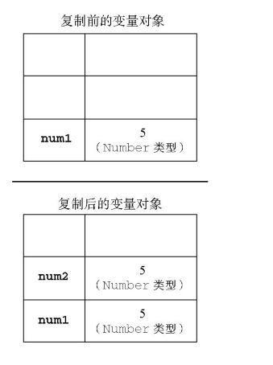
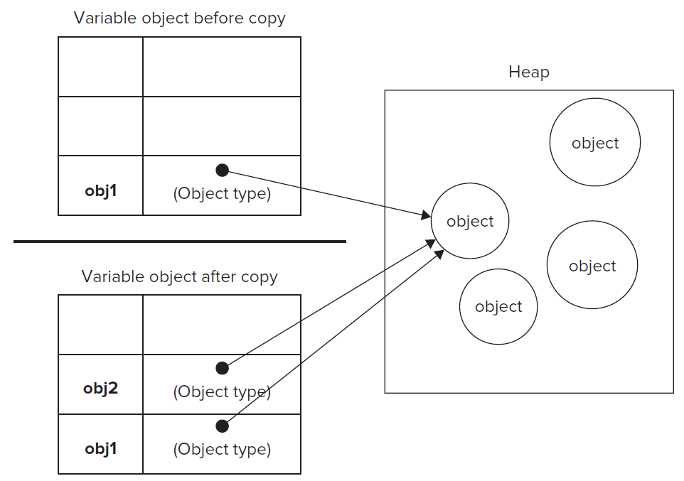
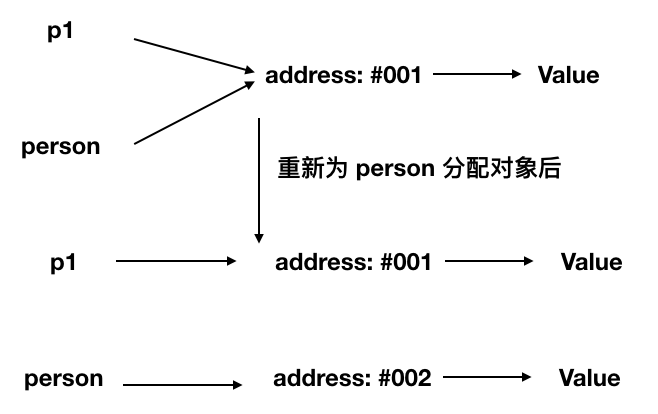
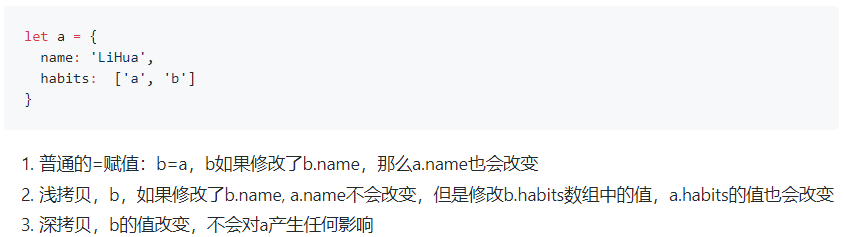
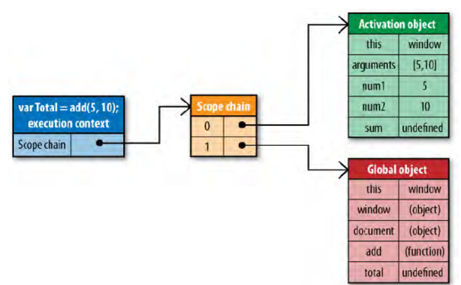
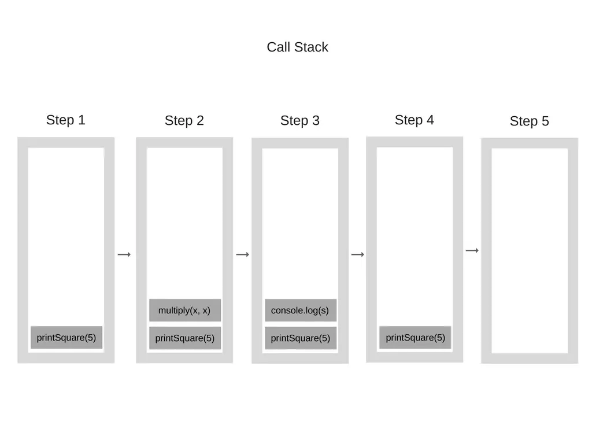
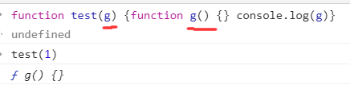
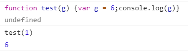

# 变量和作用域

## 词法作用域(lexical scope)

函数的作用域在函数定义的时候就决定了。  
为了实现这种词法作用域，函数对象的内部状态不仅包含了代码逻辑，还包含了当前的[作用域链](#作用域链)

与词法作用域相对的是动态作用域，函数的作用域是在函数调用的时候才决定的

## 函数优先

函数声明是在普通变量之前被提升的

```js
foo() // 1
var foo
function foo() {
  console.log(1)
}
foo() //1
foo = function () {
  console.log(2)
}
foo() //2
```

如果变量被赋值，那赋值会覆盖掉声明

```js
test() // 1
var test = 2
function test() {
  console.log(1)
}
test() //TypeError: test is not a function
```

## 函数表达式

- 以`function`开头的是函数声明，必须要给函数名

- 否则就是函数表达式，可以不写函数名

`(function foo(){ .. })` 作为一个表达式意味着标识符 foo 仅能在`..`
代表的作用域中被找到，而不是在外部作用域中。将名称 foo
隐藏在它自己内部意味着它不会没必要地污染外围作用域

下面的函数会报错。表达式的名称标识符在外围作用域中也是不可用

```js
bar() //报错， ReferenceError
var foo = function bar() {
  // ...
}
bar() //还是报错， ReferenceError
```

### IIFEs

immediately-invoked function expressions: 立即调用函数表达式

最常见的形式是一个匿名函数表达式。

```js
;(function () {
  var a = 3
  console.log(a) // 3
})()
```

#### 写法

- 第一部分是包围在圆括号运算符()里的一个匿名函数，这个匿名函数拥有独立的词法作用域。这不仅避免了外界访问此
  IIFE 中的变量，而且又不会污染全局作用域。

- 第二部分再一次使用 () 创建了一个立即执行函数表达式，JavaScript
  引擎到此将直接执行函数。()可以传参给第一部分

`(function(){/*函数体*/})();`与`(function(){/*函数体*/}());`都可以

箭头函数只能`(() => {/*函数体*/})();`

#### 传入参数

```js
var a = 2
;(function IIFE(global, param) {
  //传入window对象，命名为global
  var a = 3
  console.log(a) // 3
  console.log(global.a) // 2
  console.log(param) //2
})(window, a)
console.log(a) // 2
```

```js
let params = (function () {
  params = {
    a: 1,
  }
  return params
})()
console.log(params.a) //ReferenceError: Cannot access 'params' before initialization
```

## 变量复制

- 简单数据类型：在变量对象上建一个新值，并把值复制，分配到新变量上



- 引用类型：引用类型的值是保存在内存中的对象。JS 不允许直接访问内存，操作的是对象的引用，而不是实际对象的值

`const a = []`

假设`[]`所在的地址是`#001`, 那么 a 存储的是`#001`这个地址，地址指向的值是`[]`

const b = a

此时 b 复制的是地址`#001`



```js
function test(person) {
  person.age = 26
  person = {
    name: "yyy",
    age: 30,
  }
  return person
}
const p1 = {
  name: "xxx",
  age: 25,
}
const p2 = test(p1) // {name: 'yyy', age: 30}
console.log(p1) //{name: 'xxx', age: 26}
```



### 浅复制，深复制

[参考](https://github.com/wengjq/Blog/issues/3)

值类型：浅拷贝和深拷贝都是互不影响的；

引用类型：浅复制是对象地址的复制，并没有开辟新的栈，也就是复制的结果是两个对象指向同一个地址，修改其中一个对象的属性，则另一个对象的属性也会改变。

而深复制则是开辟新的栈，两个对象对应两个不同的地址，修改一个对象的属性，不会改变另一个对象的属性。

比如 jQuery.extend()



### 浅复制

- [for...in](./014_statement.md#for-in)
- Object.assign
- 展开运算符

#### Object.assign()

不包括`prototype`上的值

```js
Object.prototype.b = 2
var test = {
  a: "1",
}
let tmp = {}
Object.assign(tmp, test)
console.log(tmp) // {a: '1'}
```

#### 展开运算符

不包括`prototype`上的值

```js
Object.prototype.b = 2
var test = {
  a: "1",
}
let tmp = { ...test }
console.log(tmp) //{a: '1'}
```

#### slice 和 concat

数组专用

### 深拷贝

#### JSON.parse 和 stringify

能够处理 JSON 格式能表示的所有数据类型。性能最高

缺点见[JSON](./006_complex_data.md#限制)

#### 手写

完整实现可以参考[loadhash.cloneDeep](https://github.com/lodash/lodash)，loadhash 也不支持复制 `Proxy`

```ts
const deepCopy = {
  types: [
    "Number",
    "String",
    "Boolean",
    "Null",
    "Undefined",
    "Symbol",
    "Object",
    "Array",
    "Function",
    "Date",
    "RegExp",
    "Set",
    "Map",
    "BigInt",
  ], //Object.prototype.toString返回的所有类型
  type(obj: any) {
    return Object.prototype.toString.call(obj).slice(8, -1)
  },
  createType() {
    const types = this.types
    let i = types.length - 1
    do {
      this["is" + types[i]] = function (elem: unknown) {
        return this.type.call(elem) == types[i]
      }
    } while (--i >= 0)
  },
  copy(obj: any) {
    if (!this.isFunction) {
      this.createType() //如果还没有调用过createType
      return this.copy(obj)
    }
    if (this.isFunction(obj)) {
      return new Function("return " + obj.toString())()
    }
    if (obj === null || typeof obj !== "object") {
      return obj
    }
    let target: any = this.isArray(obj) ? [] : {},
      value
    for (let key in obj) {
      value = obj[key]
      if (value === obj) {
        //避免循环引用
        /*  例如
         var obj = {
           value: {}
         };
         obj.value.value = obj; */
        continue
      }
      if (this.isArray(value) || this.isObject(value)) {
        target[key] = this.copy(value)
      } else if (this.isFunction(value)) {
        target[key] = new Function("return " + value.toString())()
      } else {
        target[key] = value
      }
    }
    return target
  },
}
```

不考虑 proxy 的 ES6 版本

```ts
enum CloneType {
  /** 基本类型 */
  PRIMITIVE,
  /** null */
  NULL,
  /** 函数 */
  FUNCTION,
  /** 数组 */
  ARRAY,
  /** 普通对象 */
  OBJECT,
  /** 非普通对象，比如 Date */
  UNKNOWN,
}
/** 基本类型，不含 null */
const PRIMITIVE_TYPE = [
  "number",
  "bigint",
  "string",
  "boolean",
  "undefined",
  "symbol",
]

function getToStringType(target: any) {
  return Object.prototype.toString.call(target).slice(8, -1)
}

function isNormalObjectType(target: any) {
  const result = getToStringType(target)
  return result === "Object"
}

/**
 * 获取需要特殊处理的类型
 */
export function getType(target: any): CloneType {
  const type = typeof target
  if (PRIMITIVE_TYPE.includes(type)) {
    return CloneType.PRIMITIVE
  }
  if (type === "function") {
    return CloneType.FUNCTION
  }
  if (type === null) {
    return CloneType.NULL
  }
  if (Array.isArray(target)) {
    return CloneType.ARRAY
  }
  return isNormalObjectType(target) ? CloneType.OBJECT : CloneType.UNKNOWN
}

function createFunction(target: Function): Function {
  return new Function("return " + target.toString())()
}

function copyDeep(target: any, cache = new Map()) {
  //避免循环引用
  /*  例如
  var obj = {
    value: {}
  };
  obj.value.value = obj; */
  if (cache.has(target)) {
    return cache.get(target)
  }
  const type = getType(target)
  if ([CloneType.NULL, CloneType.PRIMITIVE, CloneType.UNKNOWN].includes(type)) {
    cache.set(target, target)
    return target
  }
  if (type === CloneType.FUNCTION) {
    const functionResult = createFunction(target)
    cache.set(target, functionResult)
    return functionResult
  }
  const result: any = type === CloneType.ARRAY ? [] : {}
  cache.set(target, result)
  for (const key in target) {
    // 递归不考虑继承
    if (target.hasOwnProperty(key)) {
      result[key] = copyDeep(target[key], cache)
    } else {
      result[key] = target[key]
    }
  }
  return result
}
```

## 参数传递

按值传递：参数是一个临时变量，调用函数时的变量，被复制到了这个临时变量

```js
function setName(obj) {
  // obj 是个临时变量
  obj.name = "Nicholas"
  obj = {}
  obj.name = "Greg"
}
let person = {}
setName(person)
console.log(person.name) // Nicholas
```

## 函数作用域

在函数体的任意地方用 var 声明的变量，在这个函数以及内部嵌套的其他函数，都是有定义的（不代表始终有值）。

但只有执行到赋值语句时，才会有值。

```js
var test = "world"
function f() {
  console.log(test) //undefined
  var test = "hello"
  console.log(test) // "hello"
}
```

也就是[变量提升](./003_syntax.md#var-变量提升)

## 执行上下文与作用域

概述：  
变量或函数的上下文决定了它们可以访问哪些数据  
每个上下文都有一个关联的变量对象（variable object），而这个上下文中定义的所有变量和函数都存在于这个对象上。  
上下文在代码执行后正常应该被销毁  
每个函数被调用时都有自己的上下文：执行时函数的上下文会被推到一个栈里；执行结束后出栈，将控制权返回给之前的执行上下文

## 执行环境(execution context)

变量或者函数的执行环境定义了他们有权访问的数据。每个环境都有一个对应的变量对象（variable
object），环境中定义的所有变量和函数都会存在这个 VO 里。JS 解释器会在处理数据的时候使用 VO

最外围的是全局全局执行环境，浏览器内就是 window 对象。也就是所有全局变量和函数都是做为 window 的属性和方法创建的

执行函数的时候会创建执行环境。环境都是独一无二的。

同一个函数调用多次，就会创建多个执行环境。函数执行完毕后被销毁

每个执行环境内都有作用域链。保证有权访问的变量和函数有序

作用域链实际上是保存变量对象的指针，只是引用但不保存实际 VO

当执行环境被创建时，按照出现在函数中的顺序，创建了一个活动对象（activation
object）

活动对象包括函数内部的所有局部变量, this, arguments

执行环境被销毁，那么活动对象也被销毁（闭包不会）



函数执行的时候，每遇到一个变量，就会先搜索活动对象。没有则寻找下一个，直到找到。如果没找到，被标记成 undefined

变量所在的位置越深，读写速度越慢。

## 作用域链

每一段 JS 代码（全局代码或者函数）都有与之相关的作用域链(scope chain)，把作用域看做一个链表对象  
这个对象定义了这段代码"作用域"中的变量

当 JS 要查找某个变量 x(这个过程也就是`变量解析`(variable resolution))，会从链的第一个对象开始查找;  
有名为 x 的属性，则返回对应的值;  
没有就继续往下，如果到最后都没有，就认为变量不存在，抛出一个`ReferenceError`

- 在最顶层代码（也就是不包含任何函数定义的代码），作用域链由一个全局对象组成;
- 在不包含嵌套的函数内，作用域是两个对象组成，第一个是定义函数参数和局部变量的对象，第二个是全局对象;
- 包含嵌套的函数内，作用域链至少是三个对象

### 创建规则

定义一个函数时，会保存一个作用域链 A。  
**调用**这个函数的时候，会创建一个新的对象保存局部变量，同时把这个对象保存到作用域链 A 上  
对于嵌套函数来说，每次调用外部函数的时候，作用域链都是不同的

### 本质是栈

[参考](https://github.com/mqyqingfeng/Blog/issues/4)  
后进先出

JS 引擎通过栈的结构去处理上下文

```js
function multiply(x, y) {
  return x * y
}
function printSquare(x) {
  var s = multiply(x, x)
  console.log(s)
}
printSquare(5)
```


假设全局代码叫 globalContext，执行函数的时候创建的执行上下文叫 ECStack

那么执行 fun1 的时候，最开始解释的的肯定是全局代码

```js
function fun3() {
  console.log("fun3")
}
function fun2() {
  fun3()
}
function fun1() {
  fun2()
}
fun1()
```

执行 fun1 的时候其实

```js
// 伪代码
// fun1()
ECStack.push(<fun1> functionContext);
// fun1中竟然调用了fun2，还要创建fun2的执行上下文
ECStack.push(<fun2> functionContext);
// 擦，fun2还调用了fun3！
ECStack.push(<fun3> functionContext);
// fun3执行完毕
ECStack.pop();
// fun2执行完毕
ECStack.pop();
// fun1执行完毕
ECStack.pop();
// javascript接着执行下面的代码，但是ECStack底层永远有个globalContext
```

### 变量对象

创建执行上下文之后会产生三个重要属性：

- 变量对象(Variable Object, VO)

- 作用域链

- this

变量对象存储了执行上下文里面定义的变量和函数声明

- 未进入执行阶段之前，变量对象(VO)中的属性都不能访问

- 但是进入执行阶段之后，变量对象(VO)转变为了活动对象(AO)，里面的属性都能被访问了

此时的 AO 包括形参、函数声明和变量声明。并且函数声明优先级大于变量声明，函数内容会替换掉对应的变量（包括形参）



- 然后开始进行执行阶段的操作。

执行阶段，会顺序执行代码，根据代码，修改变量对象的值



它们其实都是同一个对象，只是处于执行上下文的不同生命周期。

AO = VO + function parameters + arguments

```js
function foo(a) {
  var b = 2
  function c() {}
  var d = function () {}
  b = 3
}
foo(1)
```

进入 foo 的时候

```
AO = {
    arguments: {
        0: 1,
        length: 1
    },
    a: 1,
    b: undefined,
    c: reference to function c(){},
    d: undefined
}
```

执行的时候

```
AO = {
    arguments: {
        0: 1,
        length: 1
    },
    a: 1,
    b: 3,
    c: reference to function c(){},
    d: reference to FunctionExpression "d"
}
```

### 垃圾收集

按照固定的时间间隔，周期地执行垃圾收集。

主要就是找出不再继续使用的变量，打上标记，然后释放占用的内存

#### 标记清除

变量进入环境的时候，标记为“进入环境”。离开环境后标记为“离开环境”

垃圾回收算法主要依赖于引用的概念

::: tip
引用

一个对象如果有访问另一个对象的权限，叫做一个对象引用另一个对象。比如一个 Javascript 对象具有对它原型的引用（隐式引用）和对它属性的引用（显式引用）。
:::
垃圾收集器会在运行的时候给所有变量加上标记。

其中全局变量，闭包以及全局变量引用的对象会被去除

那么剩下被标记的变量就是要被删除的。

最后垃圾收集器完成内存清除工作，销毁被标记的值并进行内存释放

#### 代码技巧

当不再使用函数或者变量时主动设置为 null。

让值脱离执行环境，方便下次的垃圾回收

## 闭包(closure)

闭包是依赖于词法作用域编写代码而产生的结果

闭包是一个函数，这个函数有权访问另一个函数作用域中的变量  
或者说自由变量：在函数中使用的，但既不是函数参数也不是函数的局部变量的变量  
或者说可以让外部作用域访问内部作用域的局部变量

### 定义

- 从理论角度：所有的函数。因为它们都在创建的时候就将上层上下文的数据保存起来了。哪怕是简单的全局变量也是如此，因为函数中访问全局变量就相当于是在访问自由变量，这个时候使用最外层的作用域。

- 从实践角度：以下函数才算是闭包：

  - 即使创建它的上下文已经销毁，它仍然存在（比如，内部函数从父函数中返回）

  - 在代码中引用了自由变量

```js
class A {
  say() {
    console.log(A)
  }
}

var B = A
A = null

var a = new B()
a.say()
/* 
  结果
  class A {
    say() {
      console.log(A);
    };
  } 
*/
```

### 变量的生存周期

正常情况下，一个局部变量，当它所在的函数被调用后，就销毁了。  
但闭包会产生例外

```js
function test() {
  var a = 1
  return function () {
    a++
    console.log(a)
  }
}
var fun = test()
fun() // 2
fun() // 3
```

上面的 fun 是一个匿名函数，可以访问 test() 被调用时产生的环境  
局部变量 `a` 一直在这个环境里面，为了保证可以被访问，局部变量就不会被销毁

### 按值传递

闭包保存的是整个变量对象，而不是单个变量

for 循环里面的函数，作用域链保存的是 anno 的活动对象，都引用同一个 i

当 anno 返回 arr 的时候，i 是 3

```js
function anno() {
  var arr = []
  for (var i = 0; i < 3; i++) {
    arr[i] = () => {
      return i
    }
  }
  return arr
}
var result = anno()
console.log(result[0]()) //3
console.log(result[1]()) //3
```

如果 var 改为 let，那么就会输出对应的 0，1，2

## 性能

避免全局查找，尽可能用局部变量。

用局部变量把全局存下来
