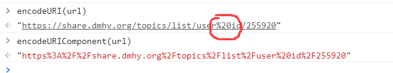

# Global

所有全局作用域定义的属性和函数，都是 global 对象的属性

比如

属性 undefined

函数 parseInt()

构造函数 Number, String, Boolean, Object, Array, Function, Date, RegExp，ReferenceError

对象 Math, JSON

## URI 编码：encodeURI, encodeURIComponent, decodeURI, decodeURIComponent

`const url = "https://share.dmhy.org/topics/list/user id/255920"`



- enocdeURI: 处理非法的 URI，比如 URI 不能包含空格。一般用于整个 url 。用 decodeURI 解码

- encodeURIComponent：对所有特殊字符都进行转码，一般用在 url 的部分字符上

## eval

尽量不用。

像是一个完整的 JS 解析器，参数是 JS 代码的字符串。因为是字符串，所以内部不会有变量提升。

可以在结尾加上 `sourceURL` 指向一个名字，会在控制台的 Sources 内生成一个同名文件

```js
eval(
  `function test() {console.log("hello")}; test() //# sourceURL=www.baidu.com`
)
```

同样也可以指定 `sourceMappingURL`
