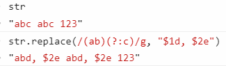
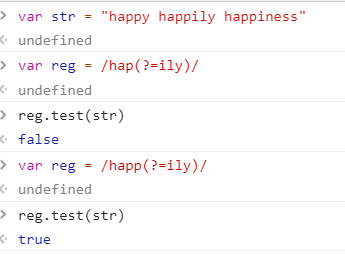

# RegExp

Regular expression  
`/正则表达式/匹配模式`，第二条斜线后面可以跟一个或多个字母，修饰匹配模式的含义

test 方法：返回 true/false

exec: 返回匹配的数组

- 如果**配置了 g 标记**，每次调用 exec()都会在字符串中向前搜索下一个匹配项

```js
let text = "cat, bat, sat, fat"
let pattern = /.at/g
let matches = pattern.exec(text)
console.log(matches.index) // 0
console.log(matches[0]) // cat
console.log(pattern.lastIndex) // 3

matches = pattern.exec(text)
console.log(matches.index) //5
console.log(matches[0]) // bat
console.log(pattern.lastIndex) // 8

matches = pattern.exec(text)
console.log(matches.index) // 10
console.log(matches[0]) // sat
console.log(pattern.lastIndex) // 13
```

## 基本组成

参考掘金[正则表达式不要背](https://juejin.im/post/5cdcd42551882568651554e6)

分为字符和元字符。

- 字符通常是数字、字母

- 元字符通常就是特殊字符，比如\^(非),
  \|(或)。如果要匹配特殊字符本身，用反斜杠进行转义

比如上面匹配字符 cat，直接`/cat/`

## 常用的转义（非打印字符）

换行\\n: new line

换页\\f: from feed

回车\\r: return

空白\\s: space

制表\\t: tab

垂直制表\\v: vertical tab

回退\\b: backspace

## 多个字符

### 集合[]

`[]`表示集合，比如`[123]`，表示匹配 123 里面的任意一个数字

```js
var reg = /[123]/
reg.test("1") //true
reg.test(1) //true
```

### 范围-

`-`表示范围，比如`[0-9]`，表示匹配 0\~9 里面的任意一个数字, [a-z]匹配小写字母

```js
var reg = /[1-3]/
reg.test(1) //true
```

### 任意字符.

`.` 任意字符，除了换行和回车

```js
var reg = /./
reg.test(123) //true
```

### 数字\d

`\d` 单个数字，等价于[0-9]: digit

`\D` 非数字，等价于[\^0-9]: not digit

### 字符\w

`\w` 包括下划线在内的单个字符，等价于`[A-Za-z0-9_]` word

`\W` 非单字字符，等价于`[^A-Za-z0-9_]` not word，比如%

### 空白字符\s

`\s` 匹配空白字符，正则内的空白包括换行、换页、空格、tab

`\S` 非空白

## 循环与重复

同时匹配多个字符，比如 color 和 colour 要同时匹配，可以用?

- `?`表示同时匹配 0 或者一个，匹配上面 color 可以用`[colou?r]`

  - `u?`表示 u 要么没有，要么只有 1 个，两个就不通过。

```js
var reg = /col(ou?)r/ //等价于reg = /colou?r/
reg.test("colr") //false
reg.test("color") //true
reg.test("colour") //true
reg.test("colouur") //false
```

- `*`表示 0 或者无数个。u 可以`>=`0 个

```js
var reg = /colou*r/
reg.test("color") //true
reg.test("colouur") //true
```

- `+`表示至少一个

```js
var reg = /colou+r/
reg.test("color") //false
reg.test("colour") //true
```

### 指定次数{}

比如匹配字符"a" 3 次，可以用`/a{3}/`

`{x}`: x 次

```js
var reg = /r{2}/
reg.test("Archer") //false
reg.test("Arrcher") //true
```

`{min, max}`： 介于 min 次到 max 次之间

`{min, }`: 至少 min 次

```js
var reg = /r{2,}/
reg.test("Arrcher") //true
reg.test("Arrrcher") //true
```

`{0, max}`： 至多 max 次

## 边界

`\b` 单词边界

`^x` 以 x 为开头。注意\^在集合[]的含义是非

```js
var reg = /(^sa)b?/
reg.test("sber") //false
reg.test("saber") //true
reg.test("saer") //true
```

`x$` 以 x 结尾

```js
var reg = /(^sa).?(er$)/
reg.test("saer") //true
reg.test("saber") //true
reg.test("sabber") //false
```

## 匹配模式 m i g

g: global，全局模式，表示查找字符串的全部内容，而不是找到第一个匹配的内容就结束。  
i: ignoreCase，不区分大小写，表示在查找匹配时忽略 pattern 和字符串的大小写。  
m: 多行模式，表示查找到一行文本末尾时会继续查找。  
y: sticky，粘附模式，表示只查找从 lastIndex 开始及之后的字符串。

```js
let text = "cat, bat, sat, fat"
let pattern = /.at/y
let matches = pattern.exec(text)
console.log(matches.index)
console.log(matches[0])
console.log(pattern.lastIndex)

// 以索引3对应的字符开头找不到匹配项，因此exec()返回 null。exec()没找到匹配项，于是将lastIndex设置为0
matches = pattern.exec(text)
console.log(matches) // null
console.log(pattern.lastIndex) // 0

// 向前设置lastIndex可以让粘附的模式通过exec()找到下一个匹配项:
pattern.lastIndex = 5
matches = pattern.exec(text)
console.log(matches.index) // 5
console.log(matches[0]) // bat
console.log(pattern.lastIndex) // 8
```

u: unicode，Unicode 模式，启用 Unicode 匹配。  
s: dotAll 模式，表示元字符.匹配任何字符(包括\n 或\r)。

## 分组()

(表达式)，每个()内的内容做为一个表达式

## 回溯引用\number

`\1`表示引用第一个分组内的表达式，\\2 表示引用第二个

`\0`表示引用整个

### 替换\$number

比如将字符串 ab 都替换成 abcd

```js
str.replace(/(ab)/g, "$1cd") //这里的\$1等于ab
```

将字符串 abc 替换成 abd

```js
str.replace(/(ab)c/g, "$1d")
```

### 分组不被引用(?:regex)

可以避免内存浪费。分组仍然有效，但不会进行引用

下面`$2`不再引用分组(c)，所以直接被替换成`$2e`



### 前向查找(?=regex)

限制后缀，比如以"happ"开头，查找后面是 ily 的字符串

如果是过滤，可以用`?!regex`，表示后面不是 ily 的字符串



## 逻辑处理或和非

非：`[^regex]`和`!`

或：`|`

## 常用正则

- 只能输入正整数（不包括 0）

`/(^[1-9]\d*$)/.test(value)`

- 只能输入不超过两位小数的正实数（不包括 0）：

`/^(([1-9][0-9]*)|(([0]\.\d{1,2}|[1-9][0-9]*\.\d{1,2})))$/.test(value)`

- 删除'?x-oss-process=image/format,webp'

`value.replace(/\?x-oss.*?(webp)/, "");`

- 获取 img 的 src

```js
const imgReg = /|\/>)/gi
const arr = txt.match(imgReg)
if (arr == null) {
  return false
}
const srcReg = /src=[\'\"]?([^\'\"]*)[\'\"]?/i,
  length = arr.length
for (let i = 0; i < length; i++) {
  let src = arr[i].match(srcReg)
  if (src[0]) {
    let url = src[0].substr(4)
    const reg = new RegExp('"', "g")
    return url.replace(reg, "")
  }
}
```

- 替换 img 的 src 为自定义内容  
  例如替换 src 为 data-url 的值

```html
<p>
  
  test test
  
</p>
```

```js
value = value.replace(
  /]*data-url=['"]([^'"]+)[^>]*>/gi,
  function (match, capture) {
    return match.replace(/src=[\'\"]?([^\'\"]*)[\'\"]?/i, `src="${capture}"`) //替换src为data-url里面的值
  }
)
return value
```

- 截取匹配的开头结尾

```js
// 比如全局匹配，以"%"开头，以"%"结尾的内容
//const match_reg = /(?<=%).*?(?=%)/g;  // 此种写法会出现浏览器不兼容，改为创建一个正则实例
const match_reg = new RegExp("(?<=%).*?(?=%)", "g")
const matched_arr = "1111%123%456".match(match_reg) // ["123"]
```

- 校验是否为 url

```js
const validUrl = () => {
  const regex = /([\w-]+\.)+[\w-]+(\/[\w- .\/?#%&=]*)?$/i
  if (!regex.test(url)) {
    return false
  }
  return true
}
```
