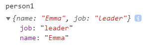
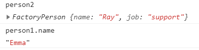
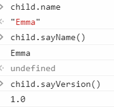
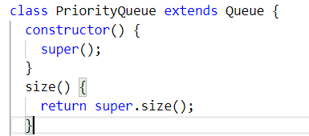

# 面向对象

面向对象（OOP）的三大特性：封装、继承、多态

- 封装（Encapsulation）：将对数据的操作细节隐藏起来，只暴露对外的接口。外界调用端不需要（也不可能）知道细节，就能通过对外提供的接口来访问该对象，同时也保证了外界无法任意更改对象内部的数据

- 继承（Inheritance）：子类继承父类，子类除了拥有父类的所有特性外，还有一些更具体的特性

- 多态（Polymorphism）：由继承而产生了相关的不同的类，对同一个方法可以有不同的响应。比如
  Cat 和 Dog 都继承自 Animal，但是分别实现了自己的 eat
  方法。此时针对某一个实例，我们无需了解它是 Cat 还是 Dog，就可以直接调用 eat
  方法，程序会自动判断出来应该如何执行 eat

## 对象的属性类型

ES5 定义了一些内部属性，用于 JavaScript 引擎解析。在 JS 中并不能访问，为了表示这些内部特性，用两对方括号进行区分，比如[[Enumerable]]

ECMAScript 有两种属性：数据属性和访问器属性

### Object.defineProperty(obj, key, options)

定义多个属性

```js
Object.definedProperties({
  key1: {
    value: "xxx",
  },
  key2: {},
})
```

### 数据属性

下面的特性，通过`对象字面量创建`的都是 true，通过`defineProperty`的都是 false, value 默认 undefined

- `[[configurable]]` 为 true
  时，该属性描述符才能够被改变，同时该属性也能从对应的对象上被删除。也就是默认情况下不能重复定义，除了修改 writable 以外的其他属性都会报错。包括修改 value 也会报错

```js
const obj = { name: 123 }
delete obj.name // true
obj // {}
```

```js
const obj2 = { name: 123 }
Object.defineProperty(obj2, "name", { value: 1, configurable: false }) // {name: 1}
delete obj2.name // false
obj2 // {name: 1}
```

- `[[Enumerable]]` 能否在 for-in 循环中出现

- `[[writable]]` 是否可以修改属性的值

- `[[Value]]` 属性的值

### 访问器属性

属性的值可以由一个或者两个方法代替，这两个方法就是`getter`和`setter`  
由 getter 和 setter 定义的属性叫`存储器属性/访问器属性`(accessor property);

存储器属性不具有值(value)特性和可写性。它们的可写性是由 setter 存在与否决定的  
如果想要新建/修改的**自有属性**具有某种特性，需要通过 Object.defineProperty()定义。继承属性无法修改

- `[[configurable]]`

- `[[Enumerable]]`

- `[[Get]]`: 读取属性时调用的函数
- `[[Set]]`: 写入属性时调用的函数

```js
let num2 = {
  num: 123,
}
Object.defineProperty(num2, "num", {
  get() {
    return 456
  },
  set(value) {
    console.log("value: " + value)
  },
})

num2.num // 456

num2.num = 1 // value: 1

num2.num // 456
```

set 内不要对这个属性赋值，每次赋值都会进 set，会进入死循环

### Object.getOwnPropertyDescriptor(obj, prop)

获取自身属性的描述符，不包括原型链

```js
var o = {}
Object.defineProperty(o, "hello", {
  value: "2",
  configurable: true,
  enumerable: true,
  writable: true,
})
console.log(Object.getOwnPropertyDescriptor(o, "hello"))
/* {
  configurable: true
  enumerable: true
  value: "2"
  writable: true
} */
console.log(Object.getOwnPropertyDescriptor(o)) //undefined
```

### Object.getOwnPropertyDescriptors(obj)

获取所有属性的集合，不包括原型链

```js
var o = {}
console.log(Object.getOwnPropertyDescriptors(o)) // {}
var test = {}
Object.defineProperty(test, "hello", {
  value: "2",
  configurable: true,
  enumerable: true,
  writable: true,
})
console.log(Object.getOwnPropertyDescriptors(test))
/* 
hello: {
  configurable: true
  enumerable: true
  value: "2"
  writable: true
} */
```

## 创建对象

### 工厂模式

写一个通用函数，传入各自的参数。

```js
function factoryPerson(name, job) {
  let o = {
    name: name,
    job: job,
  }
  return o
}
let person1 = factoryPerson("Emma", "leader")
let person2 = factoryPerson("Ray", "support")
```



缺点：无法知道对象的细分类型

### 构造函数

```js
function FactoryPerson(name, job) {
  this.name = name
  this.job = job
}
let person1 = new FactoryPerson("Emma", "leader")
let person2 = new FactoryPerson("Ray", "support")
```



缺点：写在构造函数内部的话，每个方法都需要重新创建一次

### `new` 操作符

使用 new 操作符后，构造函数默认返回的是这个实例对象

所以 instanceof 有效

如果构造函数内部自己 return 了别的内容，那么 instanceof 是个 false

```js
const obj = new MyClass()
```

new 做了 4 件事情：

1.  生成一个对象

2.  链接到原型: `obj.__proto__ = MyClass.prototype`

3.  绑定 this: `MyClass.call(obj)`

4.  返回新对象

`function method(){}`其实 function 就是 new Function 的语法糖

`let a= {key: value}` 也是，但是不推荐 new Object()

new 需要找原型链，但是直接变量定义不需要

#### 手写 new

```js
function myNew(func) {
  let obj = {}
  obj.__proto__ = func.prototype
  const arr = [...arguments].slice(1)
  func.call(obj, ...arr)
  return obj
}
function Person(name, age) {
  this.name = name
  this.age = age
}
const people = myNew(Person, "Emma", "12")
```

### 更好地创建一个构造函数

避免不是通过 new 调用函数，而是直接调用了，导致 this 指向 window

比如上面的`let person1 = FactoryPerson("Emma", "leader");`

在构造函数内判断 this 是不是构造函数的实例，如果不是，内部调用 new 创建

```js
function FactoryPerson(name, job) {
  if (this instanceof FactoryPerson) {
    this.name = name
    this.job = job
  } else {
    return new FactoryPerson(name, job)
  }
}
let person1 = new FactoryPerson("Emma", "leader")
let person2 = FactoryPerson("Emma", "leader") //person2就仍然是FactoryPerson的实例
```

### 原型模式

[原型](./012_complex_data.md#原型)  
`prototype`上的属性和方法可以让所有实例共享

可以先创建实例，再设置构造函数的属性。

实例也可以拿到，因为他们之间只是单纯的引用地址

```js
function FactoryPerson(name, job) {
  this.name = name
  this.job = job
}
FactoryPerson.prototype.sayName = function () {
  console.log(this.name)
}
let person1 = new FactoryPerson("Emma", "leader")
let person2 = new FactoryPerson("Ray", "support")
```

如果用对象字面量的方式，那么`person1.__proto__` 不等于`FactoryPerson.prototype`

```js
FactoryPerson.prototype
function FactoryPerson() {}
let person1 = new FactoryPerson()
FactoryPerson.prototype = {
  constructor: FactoryPerson,
  name: "Emma",
  sayName() {
    console.log(this.name)
  },
}
```

缺点：修改构造函数 prototype 内的属性，会影响到所有实例

### 构造函数和原型模式结合使用

构造函数定义不共用，原型定义通用

```js
function FactoryPerson(name, age) {
  this.name = name
  this.age = age
}
FactoryPerson.prototype = {
  constructor: FactoryPerson,
  sayName() {
    console.log(this.name)
  },
}
let person1 = new FactoryPerson("Emma", "11")
```

### 动态原型模式

把原型也封装到构造函数里面

```js
function FactoryPerson(name, age) {
  this.name = name
  this.age = age
  if (typeof this.sayName != "function") {
    FactoryPerson.prototype.sayName = function () {
      console.log(this.name)
    }
  }
}
let person1 = new FactoryPerson("Emma", "11")
```

### 寄生构造函数模式

实际上就是一个普通函数，函数内部封装了一个构造函数，最后 return 出这个构造函数的实例

```js
function FactoryPerson(name, age) {
  var obj = new Object()
  obj.name = name
  obj.sayName = function () {
    console.log(this.name)
  }
  return obj
}
let person1 = new FactoryPerson("Emma", "11")
```

适用场景：修改原生对象的方法。比如 Array 的 push，但肯定不能修改整个 Array 的 push，那么就创造一个 Array 的实例，为这个实例创建一个自定义方法

此时 person1 虽然是 new 出来的，但是函数返回值已经被改变。也就是

`person1 instanceof FactoryPerson`是个 false

### 稳妥构造函数模式

稳妥对象（durable objects）: 没有公共属性，也不引用 this。

和寄生构造函数类似，但是不引用 this，也不 new 构造函数创建实例

此时 name 只能通过 sayName 方法获得

```js
function FactoryPerson(name, age) {
  var obj = new Object()
  obj.sayName = function () {
    console.log(name)
  }
  return obj
}
let person1 = FactoryPerson("Emma", "11")
```

## 继承

目的是为了让对象 a 借用对象 b 的能力

JavaScript 本身不像 Java ，是没有真正的类式继承的，而是通过对象和对象之间的委托实现

### 原型链

继承主要是通过原型链来的

让函数的 prototype 是另一个函数的实例

不写默认是 Object

```js
function XPS() {}
XPS.prototype.getVerstion = function () {
  console.log(this.year)
}
function Xps15(year) {
  this.year = year
}
Xps15.prototype = new XPS()
var xps_7590 = new Xps15("2019")
```

缺点：在构造函数内自定义的属性，会被所有实例共享。导致一个实例改变这个属性，所有实例都会有影响

### 借用构造函数实现继承

即借用另一个函数来实现需要的功能  
实际上就是在一个函数里面调用另一个函数，并用 call 或者 apply，使 this 指向当前实例

```js
function Dell(name) {
  this.version = name
  this.getVersion = function () {
    console.log(this.version)
  }
}
function XPS(name) {
  Dell.call(this, name)
}
const xps_2019 = new XPS("2019")
```

比如借用数组的 `push`

```js
var test = {}
Array.prototype.push.call(test, "hello")
console.log(test[0]) // "hello"
console.log(test.length) // 1
```

### 组合继承

原型链+构造函数的结合体：原型链实现公用，构造函数实现实例

比较常用，但是会调用两次 Dell，一次 new, 一次 call

```js
function Dell(version) {
  this.version = version
}
Dell.prototype.getVersion = function () {
  console.log(this.version)
}
function XPS(version, year) {
  Dell.call(this, version)
  this.year = year
}
XPS.prototype = new Dell() //XPS.prototype.__proto__等于Dell.prototype
var xps_new = new XPS("7590", "2019")
```

### 原型式继承

临时创建一个函数，让函数的 prototype 指向一个对象

返回这个函数的实例，那么实例和对象就存在关系

```js
var mama = {
  name: "Isabella",
  job: "sister",
}
function factory(o) {
  function plant() {}
  plant.prototype = o
  return new plant()
}
var base = factory(mama)
```

缺点：对象(mama)改变了会影响所有基于他创建的对象(base)  
比如创建 base 后修改`mama.name`为"Krone", `base.name`也变成了为"Krone"

#### Object.create(base, options)

本质上就是这种思想。

一个对象以另一个对象为基础

`var base2 = Object.create(mama);`

传递额外的参数，可以覆盖原本的属性。写法用 Object.defineproperties 一样，可以传多个

```js
var base2 = Object.create(mama, {
  name: {
    value: "Krone",
  },
})
```

::: tip
`Object.create(null)`会创建一个没有原型的新对象。也就无法使用`Object`的基础方法，比如`toString()`
:::

```js
var obj = Object.create(null)

console.log(obj + "") //报错，TypeError: Cannot convert object to primitive value
console.log(String(obj)) //报错，理由同上
console.log(Number(obj)) //同上
console.log(obj.__proto__ === Object.prototype) // false，没有原型
```

### 寄生式继承

在原型式继承的基础上再封装一个函数。用来自定义实例自己的属性和方法

```js
var mama = {
  name: "Isabella",
  job: "sister",
}
function factory(o) {
  function plant() {}
  plant.prototype = o
  return new plant()
}
function buildNew(object) {
  let newPlant = factory(object)
  newPlant.sayName = function () {
    console.log(this.name)
  }
  return newPlant
}
var base = buildNew(mama)
```

缺点：函数不能复用

### 寄生组合式继承

解决组合继承两次调用父函数

组合继承上思想就是让 XPS.prototype 可以访问 Dell.prototype

那么可以用原型式继承，准备一个对象做桥梁

```js
//XPS.prototype = new Dell();
function another() {}
another.prototype = Dell.prototype
XPS.prototype = new another()
//封装
function factory(o) {
  function plant() {}
  plant.prototype = o
  return new plant()
}
function buildNew(XPS, Dell) {
  var proto = factory(Dell.prototype) //another.prototype = Dell.prototype;
  XPS.constructor = XPS //因为factory是new了一个新对象，要手动改写constructor，保持原本
  XPS.prototype = proto //XPS.prototype = new another();
}
buildNew(XPS, Dell)
```

### 获取原型 Object.getPrototypeOf

```js
function FactoryPerson() {}
FactoryPerson.prototype = {
  name: "Emma",
  sayName() {
    console.log(this.name)
  },
}
let person1 = new FactoryPerson()
Object.getPrototypeOf(person1) == FactoryPerson.prototype //true
```

### 修改原型：Object.setPrototypeOf

`Object.setPrototypeOf(obj, prototype)`  
prototype: 该对象的新原型

```js
var obj = {
  a: 1,
  b: 2,
}
var test = {
  c: 3,
}
Object.setPrototypeOf(obj, test)
console.log(obj.__proto__ === test) //true

console.log(Object.keys(obj)) //["a", "b"], 不包括继承
console.log(JSON.stringify(obj)) //{"a":1,"b":2}, 不包括继承

var keys1 = []
for (let key in obj) keys1.push(key)
console.log(keys1) // ["a", "b", "c"]包括继承

var keys2 = []
for (let key in Object.assign({}, obj)) keys2.push(key)
console.log(keys2) //["a", "b"] 浅拷贝，不包括继承。
```

### super

```js
let dell = {
  getVersion() {
    return "hello"
  },
}
let xps = {
  getVersion() {
    //有super的地方只能简写
    return super.getVersion() + " world"
  },
}
Object.setPrototypeOf(xps, dell) //让xps的原型是dell
let instance = Object.create(xps)
xps.getVersion() // "hello world"
xps.getVersion() // "hello world"
dell.getVersion() // "hello"
```

```js
class A {
  say() {
    console.log("It's A#say.")
  }
}
class B extends A {
  say() {
    console.log("It's B#say.")
  }
  run() {
    this.say()
    super.say()
  }
}

var b = new B()
b.run() //b.run即调用this.say,也就是B内部的say()，而super是继承了A的
/* 
  结果
  It's B#say.
  It's A#say.
*/
b.run.call({
  say() {
    console.log("call")
  },
})
/* 
  结果
  call
  It's A#say 
*/
```

解释：因为 call 的时候第一个参数是`this`的值，也就是

```js
var temp = {
  say() {
    console.log("call")
  },
}
```

即`this`指向 tmp,所以 temp.say()是`"call"`，而 super 是来自继承的，即 A

```js
var obj = {
  say() {
    console.log("It's obj.say.")
  },
  run() {
    this.say()
    super.say()
  },
}

Object.setPrototypeOf(obj, {
  say() {
    console.log("It's proto.say.")
  },
})

obj.run()
/* 
  结果
  It's obj.say.
  It's proto.say 
*/
```

## 类

typeof 返回 'function'

```
class 类名 {
	constructor() {}
	method() {}
}
```

```js
function FactoryPerson(name, job) {
  this.name = name
  this.job = job
}
FactoryPerson.prototype.sayName = function () {
  console.log(this.name)
}
let person1 = new FactoryPerson("Emma", "leader")
//等价于
class Factory {
  constructor(name, job) {
    this.name = name
    this.job = job
  }
  sayName() {
    console.log(this.name)
  }
}
let person = new Factory("Emma", "leader")
```

### 特征

内部不能加逗号，内部只能是方法，不能是普通的 key: value

- 只能通过 new 进行调用

- 存在暂时性死区，跟普通函数不同，不会有变量提升

- 自动进入严格模式

- 内部的方法都是不可枚举的，无法遍历

- 在内部改写类名会报错。比如在 sayName 里面给 Factory 重新赋值会报错

### 构造函数

`constructor`：使用 [new](#new-操作符) 关键字创建实例时调用的函数

### 访问器

即 getter 和 setter

```js
class Person {
  set name(newName) {
    this.innerName = newName
  }
  get name() {
    return this.innerName
  }
}
const test = new Person()
test.name = "hello"
test.name // "hello"
```

### static 标注

static 标注的方法，内部数据不依赖类

直接通过类来调用

```js
class Factory {
  constructor(name, job) {
    this.name = name
    this.job = job
  }
  sayName() {
    console.log(this.name)
  }
  static sayJob() {
    console.log(this.job)
    return new Factory("hello", "world").job
  }
}
```

```js
Factory.sayName // undefined
Factory.sayJob // 有值
```

### 继承 extends & super

extends 后可以接任意的表达式。但是给 null 或者生成器是无效的，会报错（因为没有[[Construct]]）

派生类：继承了父类的类。

super 只能在 extends 内的派生类使用

super 初始化了 this。也就是使用 this 之前**必须**调用 super

派生类的方法如果和父类重名，派生类覆盖父类

```js
class Factory {
  constructor(name) {
    this.name = name
  }
  sayName() {
    console.log(this.name)
  }
}
class Plant extends Factory {
  constructor(version, name) {
    // 不要在调用 super()之前引用 this，new 的时候会报错
    super(name) //要用 this 就必须super
    this.version = version
  }
  sayVersion() {
    console.log(this.version)
  }
}
let child = new Plant("1.0", "Emma")
```



- 继承属性用 super(key)

- 继承方法用 super.method



### extends 混入继承

```js
let nameObj = {
  getName() {
    console.log(this.name)
  },
}
let typeObj = {
  getType() {
    console.log(this.type)
  },
}
function mixin(...params) {
  let base = function () {}
  Object.assign(base.prototype, ...params)
  return base
}
class getAll extends mixin(nameObj, typeObj) {
  constructor(name) {
    super()
    this.name = name
  }
}
const instance = new getAll("hello")
```

### ES7 中

ES6 中实例的属性只能通过构造函数中的 this.xxx 来定义

ES7 提案中可以直接在类里面定义

```js
class Factory {
  welcom = "hello"
  constructor(name) {
    this.name = name
  }
}
let person = new Factory("world")
console.log(person.welcom) //hello
person.welcom = "another"
console.log(person.welcom) //another
```

还可以使用 `static` 定义一个静态属性，静态属性可以直接通过类来调用

```js
class Factory {
  static welcom = "hello"
  constructor(name) {
    this.name = name
  }
}
let person = new Factory("world")
console.log(person.welcom) //hello
person.welcom = "another" //another
console.log(Factory.welcom) //hello
```
