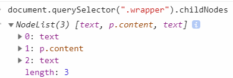
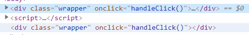
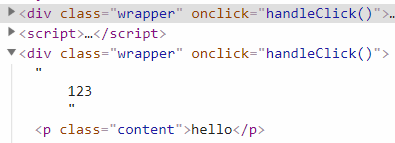
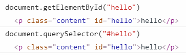
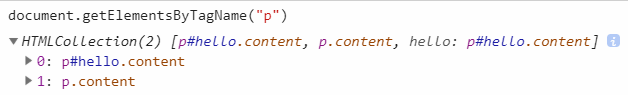
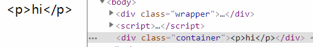
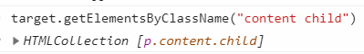
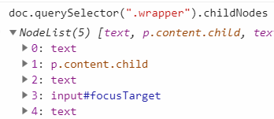
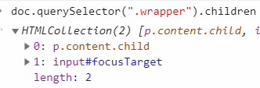
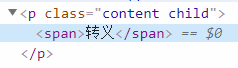

# DOM

是一个 API

Chrome 渲染页面 DOM 使用 Webkit 的 WebCore，但 JS 引擎是 V8

就像两座岛屿，中间是收费的桥梁，JS（ECMAScript）每一次操作 DOM 就要经过这座桥梁

## node 类型

比如 Node.ELEMENT_NODE，指元素

### nodeType

只读

有些被废弃，以[MDN](https://developer.mozilla.org/en-US/docs/Web/API/Node/nodeType)为准

元素(element)=1，文本(text)=3，注释(comment)=8，DocumentFragment=11

```html
<div class="wrapper">
  <p class="content">hello, world</p>
</div>
```

```js
document.querySelector(".wrapper").nodeType; // 1, 等于Node.ELEMENT_NODE
```

### nodeName

nodeType 等于 1 的时候，nodeName 是元素的标签名

```js
document.querySelector(".wrapper").nodeName; // 'DIV'
```

### childNodes

每个 node 都有的属性。返回一个 NodeList，有 length 属性，可以方括号访问里面的项，但他不是 Array 的实例

并且随着元素的变化会实时更新（比如遍历地 append 一个个节点，不先存 NodeList 的长度，在循环量直接 NodeList.length，会进死循环）



### parentNode

父节点

document.querySelector(".content").parentNode

### nextSibling/previousSibling

兄弟节点，不存在则为 null

### firstChild/lastChild

```js
document.querySelector(".wrapper").firstChild; // #text
```

### hasChildNodes()

是否有子节点

::: tip
节点都是唯一的，一个文档内不可能存在多个完全一样的节点
:::

### ownerDocument

```js
document.querySelector(".wrapper").ownerDocument; // #document
```

### appendChild/removeChild(目标节点)

append 放到父节点的最后。如果本身就有节点，那么相当于移动，将原有节点删除，放到最后

remove 删除目标节点

```js
var newEle = document.createElement("div");
newEle.innerHTML = "hello";
document.querySelector(".wrapper").append(newEle);
```

### insertBefore(新节点，目标节点)

放在目标节点之前

```html
<div class="wrapper">
  <p class="content">hello</p>
  <p id="world" class="content">world</p>
</div>
```

```js
var newEle = document.createElement("div"),
  target = document.querySelector("#world");
newEle.innerHTML = "Neverland";
document.querySelector(".wrapper").insertBefore(newEle, target);
```

### replaceChild（新节点，目标节点）

代替目标节点

用法和 insertBefore 一样

### cloneNode(flag)

flag 为 true，会复制该节点的所有子节点。但不包括 JS 逻辑（比如事件）

```html
<div class="wrapper" onclick="handleClick()">
  123
  <p class="content">hello</p>
</div>
```

```js
function handleClick() {
  console.log("hello");
}
const doc = document;
const clones = doc.querySelector(".wrapper").cloneNode();
doc.body.appendChild(clones);
```



cloneNode(true)的时候:



### normalize

处理文本节点，调用后不会存在空的文本，或者相邻的文本。见 [MDN](https://developer.mozilla.org/en-US/docs/Web/API/Node/normalize)

### splitText

和 normalize 相反

## Document 类型

document.nodeName 为`"#document"`, nodeType 是 9

document.documentElement 指 HTML，document.body 指 body

document.title 获取\<title\>的值，可以对其修改

document.URL：地址栏完整的值，修改无效

### domain

获取域名 `document.domain`  
可以修改，但是仅限子域名相同的值

```js
document.domain; // 'www.baidu.com'
document.domain = "pan.baidu.com"; // Uncaught DOMException: Failed to set the 'domain' property on 'Document': 'pan.baidu.com' is not a suffix of 'www.baidu.com'.
```

### getElementById

返回第一个匹配，只有 document 有这个方法

```html
<div class="wrapper">
  123
  <p class="content" id="hello">hello</p>
  <p class="content">word</p>
</div>
```



### getElementsByTagName

与 NodeList 类似，也不是 Array 实例，并随 DOM 更新而更新

Element 类型也可以使用



### createElement(标签名)

创建元素，要添加到 DOM 里面，还需要调用操作方法(比如`appendChild`)

### createTextNode(内容)

创建 Text 类型节点，内容会被转义（即不会包含 HTML）

```js
const doc = document;
var newEl = doc.createElement("div");
newEl.className = "container";
var newTxt = doc.createTextNode("<p>hi</p>");
newEl.appendChild(newTxt);
doc.body.appendChild(newEl);
```



## Element 类型

nodeType 是 1,

nodeName 是标签名，和 tagName 一样。值始终大写

```js
document.getElementById("hello").tagName; // 'P'
```

### 常用属性

id, title, className

```html
<p class="content custom" id="hello">hello</p>
```

```js
document.getElementById("hello").className; // 'content custom'
```

### 属性方法 getAttribute/setAttribute/removeAttribute

写在标签上的都可以 get，哪怕是自定义的比如 data-options

获取到的是字符串，比如 onclick, style。

所以一般都用来获取自定义的属性。其他都通过 `.属性名` 直接拿

```html
<p class="content custom" id="hello" onclick="alert('1')">hello</p>
```

```js
document.getElementById("hello").getAttribute("onclick"); // "alert('1')"

document.getElementById("hello").onclick; // 返回函数
```

### property 和 attribute

- property 是 DOM 中的属性，是 JavaScript 里的对象；一般是固有属性

比如 nodeName, nodeType。

比如 checkbox 的 checked

- attribute 是 HTML 标签上的特性，它的值只能够是字符串。比如在标签上自定义属性名

也就是 boolean 型的不行

### 元素遍历

IE9 之前的版本不会把元素间的空格当成空白节点，而其他浏览器则会。这样就导致了 childNodes 和 firstChild 等属性上的差异。  
提供新的属性获取只包含 Element 类型的节点

- childElementCount
- firstElementChild / lastElementChild
- previousElementSibling / nextElementSibling

## DocumentFragment 类型

用`createDocumentFragment()` 或者 `new DocumentFragment()` 创建，通常当做仓库使用，单独的 Fragment 直接 append 是无效的。

最常见的就是遍历循环，先把循环生成的节点放在 fragment，在 fragment 被 append 到文档之前不会引起浏览器渲染。

一旦 fragment 被 append，这个 fragment 里面的所有子节点就会从 fragment 内删除

```js
const doc = document;
let newFragment = doc.createDocumentFragment(),
  target = doc.querySelector(".wrapper");
for (let i = 0; i < 2; i++) {
  var el = doc.createElement("p");
  var elTxt = doc.createTextNode("hi" + i);
  el.appendChild(elTxt);
  newFragment.appendChild(el);
}
console.log(newFragment.childNodes); // NodeList(2) [p, p]
doc.body.appendChild(newFragment);
console.log(newFragment.childNodes); // []
```

## NodeList 与 HTMLCollection

NodeList 对象会包含文档中的所有节点，如 Element、Text 和 Comment 等。  
HTMLCollection 对象只会包含文档中的 Element 节点，会实时更新

- 在一些情况下，NodeList 对象是一个实时集合，比如`Node.childNodes` 是实时的
- querySelectorAll 的返回值是一个静态的 NodeList 对象（规范要求），不会实时更新
- getElementsBy 系列的返回值实际上是一个 HTMLCollection 对象
- getElementById 返回的是 Element 对象，直接指向对象的内存地址，不会再有多余的 DOM 查询

## 选择器相关

不像 getElementById，只存在 document

documents, element, DocumentFragment 都有

### querySelector/querySelectorAll

all 返回匹配的 NodeList。实际上是一组快照，不会实时更新。也就不会引起死循环

但是性能上还是 getElementBy 系列更好，见[知乎](https://www.zhihu.com/question/24702250)

因为 query 系列所有元素都可以使用，自行做取舍

### getElementsByClassName

可以传多个类名，空格分隔。顺序可以调换

```html
<div class="wrapper">
  <p class="content child">hello</p>
</div>
```


::: warning
返回匹配的 HTMLCollection ，会引起死循环
:::

### children 属性

子元素，属于 HTMLCollection。不包括 text





### contains 方法

是否后代

```js
let target = doc.querySelector(".wrapper");
let child = target.querySelector(".content");
target.contains(child); //true
```

### classList 属性

#### 方法

- add

- contains

- remove

- toggle

### style 对象

可以获取或者修改内联样式，要加"px"

```js
target.style.width = "400px";
```

## 焦点

- document.activeElement：当前聚焦的元素
- focus：方法，聚焦元素
- hasFocus：方法，是否有聚焦元素
- autofocus：自动聚焦

## innerHTML/innerText 属性

innerText 只会生成一个文本节点  
推荐用 innerHTML 代替 createElement 和 appendChild

```html
<div class="wrapper">
  <p class="content child">hello</p>
  <input type="text" />
</div>
```

```js
target = document.querySelector(".wrapper");

target.innerHTML; // '\n      <p class="content child">hello</p>\n      <input type="text">\n    '
target.innerText; // 'hello'
```

可以用 innerHTML 代替 createElement 进行元素操作

```js
document.querySelector(".content").innerHTML = "<span>转义</span>";
```



包含节点本身：分别对应 outerHTML 和 outerText

## 性能

- 利用 DocumentFragment 创建 DOM，最后放到 DOM 中

- 或者使用 innerHTML 代替 appendChild

## visibilityState

兼容 IE10+。见[MDN](https://developer.mozilla.org/zh-CN/docs/Web/API/Page_Visibility_API)
浏览器 tab 页是否可以的 API  
`document.visibilityState`: 表示当前标签页是否可见。不可见为"hidden"，可见值是"visible"

```js
function handleVisibilityChange() {
  if (document.hidden) {
    //do sth.
  } else {
    //do sth.
  }
}

document.addEventListener("visibilitychange", handleVisibilityChange, false);
```

## MutationObserver

DOM 变更时触发，可以用在[水印](https://www.xiabingbao.com/post/js/watermark-rs17ur.html)  
F12 Elements 修改属性不会触发，Console 写入代码会

```tsx
const observer = useRef<MutationObserver>(new MutationObserver(handleEvent));

function handleEvent(mutations: MutationRecord[], observer: MutationObserver) {
  console.log(mutations, observer);
}

useEffect(() => {
  if (!observer.current) {
    return;
  }
  observer.current.observe(document.body, {
    attributes: true, // options 至少配置一个，否则：Uncaught TypeError: Failed to execute 'observe' on 'MutationObserver': The options object must set at least one of 'attributes', 'characterData', or 'childList' to true.
  });
  return () => {
    observer.current.disconnect();
  };
}, []);
```

- attributes：属性变更
  - attributeOldValue：`MutationRecord` 里边的 oldValue 将有值
- attributeFilter：特定的属性数组
- characterData：文本节点（Text、Comment）
  - characterDataOldValue
- childList：子节点（比如 appendChild）
- subtree：上述 MutationObserverInit 仅限 observe 的节点，如果要子节点也跟着变化，配置 subtree

## 剪切板

clipboardData

一般用包 copy-to-clipboard
