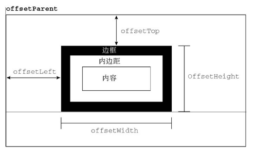
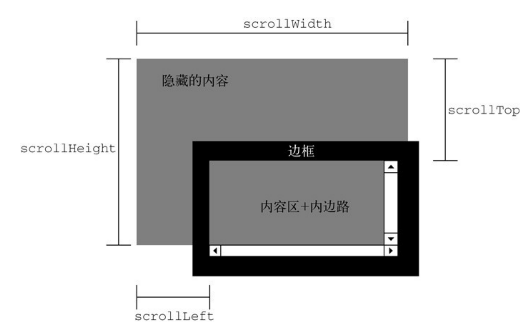

# 尺寸

## 偏移 offset

只读。

offsetWidth 包括滚动条，不包括伪类::before，包括 border

如果 display 是 none, width 和 height 返回 0

  
offsetParent:

元素本身已经被定位，那么去找已定位的父元素。  
元素本身没有被定位，那么去找已定位的父元素+父元素是 td 或者 table

已定位表示 position 样式属性的值等于 absolute、relative、fixed 之一



## client

不包括滚动条，不包括 border, margin。包括 padding


## 区别

offsetWidth = content + padding + border  
clientWidth = content + padding

## 滚动 scroll

没滚动条的情况下 scrollWidth 等于 clientWidth

有滚动条的情况下，父元素（被撑出滚动条的元素）scrollWidth\>clientWidth



scrollHeight 也就是被实际内容撑出来的高度

```css
.wrapper {
  height: 200px;
  overflow: auto;
  margin: 0;
}
.child {
  height: 300px;
  margin: 0;
}
```

```html
<div class="wrapper">
  <p class="content child">hello</p>
</div>
```

```js
document.querySelector(".wrapper").clientHeight; // 200
document.querySelector(".wrapper").scrollHeight; // 300
```

## getBoundingClientRect()

获取完整的尺寸信息。但是会忽略缩放。比如 windows 文本放大 125%，浏览器内获取到值实际上是 100%时候的

## scrollIntoView

见 [MDN](https://developer.mozilla.org/en-US/docs/Web/API/Element/scrollIntoView)
