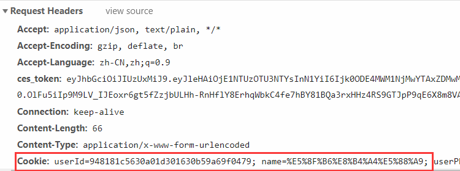

# 离线和存储

## 缓存

分为传统的浏览器缓存（通过 HTTP header）设置和 CacheStorage

传统缓存不能编程

CacheStorage 经常和 service worker()一起用，可以用 JS 进行增删改查  
缓存涉及内容较多，详细请查看[缓存](../network/40_cache.md)

### 缓存读取优先级

1.  Service Worker

2.  Memory Cache（内存中的缓存）

- 一旦关闭 Tab 页面，内存中的缓存也就被释放了。由浏览器自己决定放什么文件在 Memory Cache

3.  Disk Cache（存储在硬盘中的缓存）

4.  Push Cache

- HTTP/2 才存在

5.  网络请求

## 应用缓存(application cache)

### manifest file

描述文件中列出的都是需要下载的资源，准备离线时使用

使用 manifest 属性指定路径

```html
<html lang="en" manifest="./offline.manifest"></html>
```

## 数据存储

参考[浏览器存储](https://github.com/ljianshu/Blog/issues/25)  
大致上分为三类，都遵循[同源策略](./050_async.md#同源策略)：

- cookie
- Web Storage
- IndexedDB

## cookie

Cookie: key1=value1;key2=value2;

一般浏览器长度限制是 4095B，这里的长度指单个 key=value 的长度，不是总和

默认关闭浏览器以后失效，也可以自己指定 expires=GMT 时间

没有设置过期时间被称为 Session cookie/内存 cookie，存在浏览器内存中

设置过期时间后被称为 Persistent cookie，存在硬盘里



### 起因

HTTP 是无状态协议，不会记录之前的请求或者响应信息（比如用户获得一张网页之后关闭浏览器，然后再一次启动浏览器，再登录该网站，但是服务器并不知道客户关闭了一次浏览器）

后来为了方便，加入了 cookie。用 cookie 携带相关信息，用于服务器和客户端之间的传递

### 共享

跨域不共享。

不跨域的情况下会包含在请求中，一起发送给服务器

一级域名相同，只是二级域名不同，浏览器允许通过设置 document.domain 共享 Cookie

比如 百度是https://www.baidu.com/，贴吧是https://tieba.baidu.com/

```js
//hello=world可以在以baidu.com结尾的所有域名下显示
document.cookie = "hello=world;domain=.baidu.com"
```

::: tip
在知乎(https://www.zhihu.com/)设置上面这段话是没有用的，因为知乎和百度一级域名不同
:::
服务端可以返回

Set-Cookie: key=value; domain=.example.com; path=/

### js 中

document.cookie

key 不区分大小写，key 和 value 需要进行编码。

取值需要进行解码，赋值前要 encodeURIComponent 编码


赋值直接 document.cookie="key1=value1;key2=value2"

实际上是累加效果，并不是覆盖 document.cookie 原本的值


### 缺陷

- cookie 会在每一个请求头中都会被携带，这就导致了包括请求静态资源比如图片、CSS 等都存在，造成浪费
- 可能不够大，大小只有 4kb
- HTTP 下是明文（所以登录信息后台都会先加密再给前台），存在安全问题，如 XSS 攻击（可以用 HTTPS 协议，并指定`httpOnly`，禁止 JS 操作）

```http
Set-Cookie: hello=world; Secure; HttpOnly
```

服务器指定后，`document.cookie`无法读取到`hello=world`，也不能改写。但其他未指定 HttpOnly 的 key 不受影响

## web storage

只能存字符串。存在硬盘中

各个浏览器支持情况可以看<http://dev-test.nemikor.com/web-storage/support-test/>
会触发 `storage` 事件，但无法区分是 sessionStorage 还是 localStorage

### 共有属性/方法

- localStorage.clear()：清除所有内容

- getItem(key)，也可以直接 storage.key 来获取

- removeItem(key)

- setItem(key)，也可以直接 storage.key 赋值

### sessionStorage

只保持到窗口关闭。刷新页面不会失效  
即便是相同域名下的两个页面，只要它们不在同一个浏览器窗口中打开，那么它们的 sessionStorage 内容便无法共享

### localStorage

用户清除浏览器缓存后失效

隐私模式下关闭浏览器就被清除

### 对比


localStorage 只要在相同的协议、相同的主机名、相同的端口下，就能读取/修改到同一份 localStorage 数据。
sessionStorage 除此之外，还要求在同一窗口（也就是浏览器的标签页）下

## IndexedDB

Indexed Database API，事务型对象存储数据库，用于客户端存储大量结构化数据

除非手动清理，否则一直存在。没有大小限制

- 事务型：一个事务中，要么操作都成功，要么操作都失败。

例如 A 转账给 B，实际上拆分成两步，A 扣钱，B 加钱。

两个步骤不能拆分，只有都做了才算成功。有一个失败另一个也要失败。

不会出现一个成功一个失败的结果

- 对象存储数据库 NoSQL：存储对象，不是存储表

- 同源策略

- 异步操作，通过回调

```js
let request = window.indexedDB.open("admin") //创建/打开一个名为"admin"的数据库
request.onerror = (event) => {
  console.log(event)
}
request.onsuccess = (event) => {
  console.log(event)
}
```

- open(name, version)

不存在，则创建；已存在，直接打开

第二个参数用来指定数据库版本号，必须是整数。

如果再次 open 的时候版本号大于之前，会触发 upgradeneeded 事件

- onerror

event.target 指向 request

- onsuccess

打开后触发 success

event.target 指向 request

event.target.result 中指向数据库实例对象

- onupgradeneeded

- 实例方法

实例也就是 event.target.result

- createObjectStore(name, options)

```js
request.onupgradeneeded = function (event) {
  var db = event.target.result
  db.createObjectStore("customers", {
    keyPath: "passport_number",
  })
}
```

- options

keyPath:
设置索引是对象的 key，key 是唯一的。不能再调事务的 add 方法新增相同的 key。只能用 put 修改原有 key 的值。称为
inline key

autoIncrement：单独设置索引，也就是 key 和索引是分开的。称为 out-of-line key。

比如一个 JSON 数组，每个数据里面的 key 都是相同的，这个数据的每一项要创建唯一的索引值，就可以用 autoIncrement

- transaction(name, mode)

创建事务

`db.transaction("customers", "readwrite");`

表示可以读写的事务，事务名是 customers

mode 的默认值是 readonly

IndexedDB 中进行的大部分操作都是事务型的

在添加数据到对象存储之前，需要启动一个新的事务

```js
var request = window.indexedDB.open("my-database", 2);
request.onsuccess = function (event) {
  var db = event.target.result;
  var customerData = [{
      "passport_number": "6651"
      "name": "Tal"
}];
  var customerTransaction = db.transaction("customers", "readwrite");
  customerTransaction.onerror = function (event) {
    console.log("Error: ", event.target.error);
  };
  var customerStore = customerTransaction.objectStore("customers");
  for (var i = 0; i < customerData.length; i++) {
    customerStore.add(customerData[i]);
  }
};
```

### 存储对象的方法

存储对象指上面的 customerStore

方法有

新增 add

修改 put

获取 get

删除 delete(key)

清空 clear()

- 游标

用 get 获取数据必须要知道 key

用游标相当于是遍历。

openCursor(index): 打开具体的索引

另外也可以设置模糊查询

continue()表示前进到下一个（也就是 for 里面的计数器 i++）

advance()表示后退

```js
var objectStore = db.transaction("customers").objectStore("customers")
objectStore.openCursor().onsuccess = function (event) {
  var cursor = event.target.result
  if (cursor) {
    alert("Name for SSN " + cursor.key + " is " + cursor.value.name)
    //每次成功continue就会触发openCursor().onsuccess
    //即使获取到的cursor是falsy的值
    cursor.continue()
  } else {
    alert("No more entries!")
  }
}
```

- 设置索引范围

比如以字母 C 开头的所有记录的游标，不包括以 D 开始的记录

```js
exchangeIndex.openCursor(IDBKeyRange.bound("C", "D", false, true))
```

- 设置遍历方向

默认遍历升序，openCursor 传入第二个参数"prev"，则会从最后开始（也就是 for 循环的 i 从 length 开始）

exchangeStore.openCursor(null, "prev");

- 更新

```js
var cursor = event.target.result;
  if (!cursor) {
    return;
  }
  var customer = cursor.value;
  if (customer.first_name === "Archie") {
    //游标的方法更新
    customer.first_name = "Archer";
    cursor.update(customer);
  } else {
    //实例的方法更新
    customer.first_name = "Tom";
    customerStore.put(customer);
  }
  cursor.continue();
};
```
