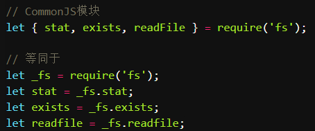

## 模块 modules

- 在模块的顶级作用域创建的变量，不会被自动添加到共享的全局作用域，它们只会在模块顶级作用域的内部存在

- 顶级作用域的 `this` 是 undefined（自动进入严格模式）

- 只有导出(export)的内容才能被外部访问

- 允许导入(import)其他模块

## export/import

- import 存在暂时性死区，不能在 import 之前使用对应的值，也不能重新赋值
  ::: tip
  注：来自同一个模块是可以互相影响的
  :::

```js
export var name = "Nicholas";
export function setName(newName) {
  name = newName;
}
```

```js
import { name, setName } from "./example.js";
console.log(name); // "Nicholas"
setName("Greg");
console.log(name); // "Greg"
name = "Nicholas"; // 报错
```

- import 一个模块 foo.js 的不同内容，foo.js 只会加载一次

```js
import { sum } from "./example.js";
import { multiply } from "./example.js";
```

example.js 只会被执行一次

- export 与 import 必须被用在其他语句或表达式的外部。不可以在代码块的内部

```js
function tryImport() {
  import flag from "./example.js"; // 语法错误
}
```

### 路径说明

不能没有"/"

- 以 / 为起始，表示从根目录开始解析

- 以 ./ 为起始，表示从当前目录开始解析

- 以 ../ 为起始，表示从父级目录开始解析

### 基本导入导出(花括号)

直接 export 一个函数/变量/类(class)

```js
export function add(a, b) {
  return a + b;
}
```

对应的 import

```js
import { add } from "./module.js";
```

### 完整导入/命名空间导入(namespace import)

把整个 JS 做为一个完整模块

```js
import * as module from "./module.js";
```

模块内的 export 出的所有值都成为 module 的属性

使用时变为 module.add

### 重命名导出 as

```js
function sum(num1, num2) {
  return num1 + num2;
}
export { sum as add };
```

```js
import { add } from "./example.js";
//也可以重命名为sum
import { add as sum } from "./example.js";
```

### 导出默认值 default(无花括号)

```js
export let color = "red";
export default function (num1, num2) {
  return num1 + num2;
}

import sum, { color } from "./example.js";
// 等价于
import { default as sum, color } from "example";
```

### 将 import 的内容再导出

在 index.js 内引入 example.js，又导出 example

```js
export { sum } from "./example.js";
```

完全导出

```js
export * from "./example.js";
```

### 无绑定的导入

只导入某个 js，不导入特定内容。比如 pollyfill

```js
import "./pollyfill.js";
```

如果 pollyfill 内的函数修改了原型，比如给数组增加自定义的 pushAll 方法，也是会生效的

```js
//pollyfill的内容，并没有export
Array.prototype.pushAll = function () {};
```

## html 内引入模块

设置 type="module"，默认总是异步的（defer）：立即下载，文档解析后执行

```html
<!-- 跨域 -->
<script type="module" src="./temp.js"></script>
```

::: warning
纯静态页面在 Chrome 引入`type="module"`会跨域，即使用`src`属性也不行。需要启一个服务器
:::

### 顺序

```html
<!--  first -->
<script type="module" src="module1.js"></script>
<!-- second -->
<script type="module">
  import { sum } from "./example.js";
  let result = sum(1, 2);
</script>
<!-- third -->
<script type="module" src="module2.js"></script>
```

1.  下载并解析 module1.js ；

2.  递归下载并解析在 module1.js 中使用 import 导入的资源；

3.  解析内联模块；

4.  递归下载并解析在内联模块中使用 import 导入的资源；

5.  下载并解析 module2.js；

6.  递归下载并解析在 module2.js 中使用 import 导入的资源

等到浏览器解析完`</html>`才会开始执行

1.  递归执行 module1.js 导入的资源；

2.  执行 module1.js ；

3.  递归执行内联模块导入的资源；

4.  执行内联模块；

5.  递归执行 module2.js 导入的资源；

6.  执行 module2.js

## ES module 和 CommonJS 区别

- CommonJS 是同步导入(require 引入，module.exports 导出)，ES6 是异步

- CommonJS 模块输出的是一个值的拷贝，导入的值改变了，导出的值也不会变；  
  ES6 模块输出的是一个值的引用，导入值会跟随导出值变化

- CommonJS 模块是运行时加载，ES6 模块是编译时输出接口

- ES6 输入的模块变量，只是一个符号链接，所以这个变量是只读的，对它进行重新赋值就会报错



整体加载 fs 模块（即加载 fs 的所有方法），生成一个对象（\_fs），然后再从这个对象上面读取
3 个方法

而 ES6 的 import 是编译时加载，只加载上面三个方法，不会加载模块本身

## AMD

异步模块。依赖前置

RequireJS 是对 AMD 规范的一个实现

模块必须采用 define()函数来定义

```js
//math.js
define(function () {
  var add = function (x, y) {
    console.log(x + y);
  };
  return {
    add: add,
  };
});
//加载
require(["math"], function (math) {
  math.add(1, 2);
});
//如果还依赖其他模块，define的第一个参数是数组，指明依赖的模块
define(["other"], function (other) {
  let sth = other.doSth();
  var add = function (x, y) {
    sth(x + y);
  };
  return {
    add: add,
  };
});
```

## UMD

Universal Module Definition —— 统一模块定义

AMD 和 CommonJS 的揉和，会先判断当前环境是否支持 CommonJS
规范，若否则再判断是否支持 AMD 规范

比如[jQuery](https://github.com/Aphasia2015/webLog/issues/12), jQuery 本身用了 IIFEs  
简单的 IIFEs

```js
var a = 2;
(function IIFE(global, param) {
  //传入window对象，命名为global
  var a = 3;
  console.log(a); // 3
  console.log(global.a); // 2
  console.log(param); //2
})(window, a);
console.log(a); // 2
```

```js
(function (global, factory) {
  if (typeof module === "object" && typeof module.exports === "object") {
    //CommonJS
    module.exports = global.document
      ? factory(global.document, true)
      : function (w) {
          //判断`document`对象是否存在，不存在就报错
          //...
        };
  } else {
    factory(global);
  }
})(typeof window !== "undefined" ? window : this, function (window, noGlobal) {
  //window对象不存在，则为this, 比如NodeJS下this应该传入的是全局对象`global`
  //...
  if (typeof define === "function" && define.amd) {
    //AMD
    define("jquery", [], function () {
      return jQuery;
    });
  }
  //...
  // 不支持 CommonJS，也不支持 AMD，则将 jQuery 暴露为全局变量
  // 由于 factory(global) 没有传入 noGlobal，所以 !noGlobal 为 true
  if (!noGlobal) {
    window.jQuery = window.$ = jQuery;
  }
  return jQuery;
});
```
