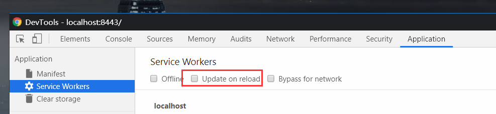
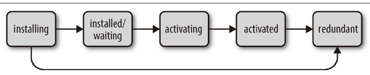

# Web Worker

只能服务于新建它的页面，不同页面之间不能共享同一个 Web Worker。

当页面关闭时，该页面新建的 Web Worker 也会随之关闭，不会常驻在浏览器中

由来见[起源](../nodejs/015_child_process.md#起源)

## PWA(Progressive web apps)

参考[PWA 开发实战](https://www.ituring.com.cn/book/2040)  
渐进式 Web 应用

本质是个 web app

- 不论有没有联网，都可以操作，并在下次有网状态时和服务器同步（即使退出了浏览器）

- 速度快

- 可以添加快捷方式，也可以推送通知

- 可以全屏，脱离浏览器的 UI 等等，具有和原生应用一样的功能

## Service Worker

PWA 实现的核心，语法仍然是 JS

service worker 是一个特殊的 web Worker

- 运行在浏览器背后的独立线程

  - 本质上充当 Web 应用程序与浏览器之间的代理服务器

  - 独立于浏览器之外，所以不能访问 DOM，也不会阻塞 JS 线程。也没有 window 对象

  - 后台进程：即便注册它的页面已经关闭，Service Worker 也不会停止；

    只有主动终结，或者浏览器回收，这个线程才会结束

  - 不是服务于某个特定页面的，而是服务于多个页面的。（按照同源策略）

  ::: warning
  单个应用只有一个 service worker。否则会造成冲突
  :::

- 必须 HTTPS(或者 localhost)。因为 Service Worker 中涉及到请求拦截，所以必须使用
  HTTPS 协议来保障安全。

- 完全异步，同步的 API 无法使用，比如 localStorage

- 只能够在页面开始加载之前控制页面

- 不能访问 cookie，因为不属于 HTTP

### 注册

调用 register()方法，成功后就会进行下载和安装

```js
if ("serviceWorker" in navigator) {
  navigator.serviceWorker
    .register("/serviceworker.js")
    .then(function (registration) {
      if (registration.installing) {
        console.log("Service worker installing")
      } else if (registration.waiting) {
        console.log("Service worker installed")
      } else if (registration.active) {
        console.log("Service worker active")
      }
    })
    .catch(function (err) {
      console.log("Service worker registration failed:", err)
    })
}
```

#### 调试

勾选 update on reload，让 service worker 激活最新的



#### scope

设置 serviceWorker 的作用域，默认是项目的根目录

也就是所有请求都会经过

也可以设置项目下的某一个子目录

```js
navigator.serviceWorker.register("/serviceworker.js", {
  scope: "/",
})
```

### 生命周期

见[MDN](https://developer.mozilla.org/en-US/docs/Web/API/Service_Worker_API)



1.  下载

- 第一次访问 service worker 控制的网站或页面时，service worker 会立刻被下载。之后每隔最迟 24 小时都会再下载一次。

2.  安装：可以监听 install 事件延长

- 当 service worker 下载的是新版本就会安装。失败了就会变成废弃(redundant)状态

3.  激活(activate)：可以监听 activate 事件延长

- 第一次安装后就会被激活。

- 如果有旧的，会处于 waiting 状态。

- 在当前激活的 service worker 控制的页面全部关闭之后，这个旧的 service worker 才会进入废弃状态，然后新的 service worker 才会安装。

- 一个应用始终只有一个激活的 service worker。

- 拥有各自的缓存，互不影响

注册或者安装过程中失败，或者被新的 service worker 代替，就会进入 redundant 状态。

已经激活的 service worker 不会再次安装

也就是在一个 service worker 的生命周期中，安装和激活事件都只会运行一次

#### 运行

浏览器没有让当前已注册的所有 service worker 一直保持运行的状态。

如果这样做，随着越来越多的网站注册 service worker，所有的 service worker
都必须保持一直运行，性能会受很大影响

当事件被触发时，对应 service worker 才会运行，事件处理完毕后终止运行

如果稍后发生了另一个事件，service worker 将会再次启动，并在完成后立即终止。

所以引入了 waitUntil 来延长生命周期，方便执行异步操作

### self

在 serviceworker.js 中指向 service worker 本身

在 HTML 中指向 window

```js
//监听fetch事件
self.addEventListener("fetch", (event) => {
  console.log(event)
})
```

### fetch 事件

被 service worker 控制的资源被请求到时，都会触发 fetch 事件

service worker 要处于激活状态

第一次 service worker 注册的时候页面已经开始加载了，还没有激活，不会触发 fetch

#### event.respondWith(内容)

返回自定义的响应内容。

只能在 Service Worker 的 fetch 事件中使用

内容是一个 Promise 对象，可以是一个 Response 、 network error 或者 Fetch 的方式 resolve

```js
//fetch替换图片src
self.addEventListener("fetch", (event) => {
  if (event.request.url.includes("/img/logo.png")) {
    event.respondWith(fetch("/img/logo-flipped.png"))
  }
})
//Response对象
event.respondWith(
  new Response(
    "Welcome to the Gotham Imperial Hotel.\n" +
      "There seems to be a problem with your connection.\n" +
      "We look forward to telling you about our hotel as soon as you go online."
  )
)
```

### install 事件

通常在 install 进行离线用的缓存

#### event.waitUntil(内容)

只能在 Service Worker 的 install 或者 activate 事件中使用

监听 install 的时候：

- 延长 install 的事件，内容是 Promise 对象，直到内容返回 resolve，service
  workder 才会安装。返回 reject Service Worker 便会失效

- 没返回之前 service worker 都会处于 installing 状态

监听 activate 同理，处于 waiting 状态

主要用在缓存。

所有依赖的核心 cache 被缓存之前都不会被安装

```js
self.addEventListener("install", function (event) {
  event.waitUntil(
    caches.open("gih-cache").then(function (cache) {
      return cache.add("/index-offline.html")
    })
  )
})
```

### activate 事件

通常用来进行缓存的增加和删除。

#### event.waitUntil(内容)

Service Worker 之间缓存不共享。

比较好的做法是新资源用 add 请求，不变的资源用 put 复制

#### demo

```js
var immutableRequests = [
  "/vendor/bootstrap/3.3.7/bootstrap.min.css",
  "/css/style-v355.css",
]
var mutableRequests = ["app-settings.json", "index.html"]
self.addEventListener("install", function (event) {
  event.waitUntil(
    caches.open("cache-v2").then(function (cache) {
      var newImmutableRequests = []
      return Promise.all(
        immutableRequests.map(function (url) {
          return caches.match(url).then(function (response) {
            if (response) {
              return cache.put(url, response)
            } else {
              //如果返回有误
              newImmutableRequests.push(url)
              return Promise.resolve()
            }
          })
        })
      ).then(function () {
        return caches.addAll(newImmutableRequests.concat(mutableRequests))
      })
    })
  )
})
```

### push 事件

服务器推送消息给客户端的时候，就会触发。

即使用户没有打开应用

### sync 事件

让操作在后台进行，再配合 postMessage 去操作 DOM

注册一个同步事件(叫'myFirstSync')，监听该同步事件的事件监听

这样一些操作逻辑就会在 Service Worker 上运行了。

比如关闭页面的时候仍然向服务器请求数据

```js
// Register your service worker:
navigator.serviceWorker.register("/sw.js")
// Then later, request a one-off sync:
navigator.serviceWorker.ready.then(function (swRegistration) {
  return swRegistration.sync.register("myFirstSync")
})

//在sw.js中
self.addEventListener("sync", function (event) {
  if (event.tag == "myFirstSync") {
    //doSomeStuff()返回Promise的reject或者resolve
    event.waitUntil(doSomeStuff())
  }
})
```

### message 事件

调用 postMessage()后触发

```js
//controller 获取控制当前页面的service worker
navigator.serviceWorker.controller.postMessage({
  arrival: "05/11/2022",
  nights: 3,
  guests: 2,
})
//监听message 事件来捕获
self.addEventListener("message", function (event) {
  console.log(event.data)
})
```

## 缓存(CacheStorage)

通过`caches`访问，如果不支持 Cache API ，也可以考虑放在 IndexedDB 中

cache 遵守同源策略，不能跨域

### open

打开并返回一个现有的缓存

如果缓存不存在，将新建一个并且返回

```js
caches.open(cacheName)返回的是一个promise对象
caches.open(cacheName).then(function(cache) {
      // Do something with your cache
    });
```

### match(request/URL, {options})

返回匹配的第一个值

找不到时返回 undefined，不会 reject

比如在 install 已经 add 的资源，在 fetch 中进行获取

```js
self.addEventListener("fetch", function (event) {
  event.respondWith(
    //如果获取失败，拿本地的缓存内容
    fetch(event.request).catch(function () {
      return caches.match("/index-offline.html")
    })
  )
})
// 在特定的缓存中寻找匹配的请求
caches.open("my-cache").then(function (cache) {
  return cache.match("logo.png")
})
```

#### options

- ignoreSearch: 默认 false。用来设置是否忽略 url 中的 query 部分。

如果是 `true` ，`http://foo.com/?value=bar` 中的 `?value=bar` 部分就会在匹配中被忽略

- ignoreMethod: 默认 false。如果为 true 在匹配时就不会验证 Request 对象的 http 方法(通常只允许是 GET 或 HEAD)

- ignoreVary: 默认 false。如果为 true 则匹配时不进行 VARY 匹配。

例如，如果一个 URL 匹配，此时无论 Response 对象是否包含 VARY 头部，都会认为是成功匹配

VARY: 用于内容缓存。

列出一个响应字段列表，告诉缓存服务器遇到同一个 URL
对应着不同版本文档的情况时，如何缓存和筛选合适的版本。更多内容见网络

### delete(request/URL, {options})

options 和 match 一样

删除匹配的缓存

比如删除所有缓存

### keys()

返回包含缓存 key 的数组

### 实例的方法

同样有 match, keys, delete

[MDN](https://developer.mozilla.org/en-US/docs/Web/API/Cache)

#### put(request/URL, response)

把内容添加到 cache 对象内。key 是 request/URL，value 是 response

如果原有的存在，会覆盖

会缓存 Response.status 是任意值

```js
caches.open("v1").then(function (cache) {
  cache.put(event.request, response)
})
```

#### add(request/URL)

等于先 fetch 再 add

不同点：只会缓存 Response.status 是 2xx 的值

#### addAll(URLs)

参数是个 url 的数组

```js
var CACHED_URLS = ["/index-offline.html", "/img/logo-header.png"]
cache.addAll(CACHED_URLS)
```

## 结合浏览器缓存

通过 fetch 请求的资源仍然遵循 HTTP 的缓存策略

比如第一次 fetch 了 main.css，如果 main.css 设置了强缓存，那么第二次 fetch 的时候还是从浏览器缓存读取

## 存储见 IndexedDB

## 做为可安装的应用

前提：HTTPS

1.  注册 service worker；

2.  创建 Web 应用清单文件(web app manifest): manifest.json

3.  在 Web 应用中，添加这个清单的链接

```html
<link rel="manifest" href="/manifest.json" />
```

### manifest.json

json 内必须包含 4 个属性

1.  name 与/或 short_name：最好两者都有

name 是全名，空间足够时显示完整名称，不够时显示 short_name（尽量少于 15 字符）

2.  start_url

点击图标进入的 url 地址

3.  icon：应用图标

一个数组，每个对象都有图片路径，图片类型和尺寸，尺寸不小于 144px 乘 144px。多个值是由手机自行决定合适的分辨率

4.  display：控制显示的格式

值有

- browser: 浏览器内打开的样子

- standalone: 不显示浏览器的地址栏

- fullscreen: 全屏，不显示浏览器的地址栏和电量等设备的状态栏

其他非必要属性：完整见[MDN](https://developer.mozilla.org/en-US/docs/Web/Manifest)

orientation：屏幕方向，横屏/竖屏/自动

scope：作用域，如果 url 跳到了作用域之外，那么 display 将会是以浏览器打开的样子

### demo

```json
{
  "short_name": "Gotham Imperial",
  "name": "Gotham Imperial Hotel",
  "description": "Book your next stay, manage reservations, and explore Gotham",
  "start_url": "/my-account?utm_source=pwa",
  "scope": "/",
  "display": "fullscreen",
  "icons": [
    {
      "src": "/img/app-icon-192.png",
      "type": "image/png",
      "sizes": "192x192"
    },
    {
      "src": "/img/app-icon-512.png",
      "type": "image/png",
      "sizes": "512x512"
    }
  ],
  "theme_color": "#242424",
  "background_color": "#242424"
}
```

## 通知推送

### Notification

配置和显示系统通知

在 Web Workers 里可用，也就是独立于浏览器

同样只能在 HTTPS 内使用。

遵循同源策略，在同一个域去的允许后，任意域下的都不需要再次请求授权

```js
function notifyMe() {
  // Let's check if the browser supports notifications
  if (!("Notification" in window)) {
    alert("This browser does not support desktop notification")
  } else if (Notification.permission === "granted") {
    // 判断通知是否允许
    // If it's okay let's create a notification
    var notification = new Notification("Hi there!")
  } else if (Notification.permission !== "denied") {
    // 请求允许通知
    Notification.requestPermission().then(function (permission) {
      // If the user accepts, let's create a notification
      if (permission === "granted") {
        var notification = new Notification("Hi there!")
      }
    })
  }
}
```

#### requestPermission

即使被拒绝也会 resolve

#### 兼容 PC 和移动

移动端通知是由操作系统做的，为了让用户在离开浏览器也可以交互(上面的 Notification"
in window 条件就不满足)，就放在 service worker 中

由 service worker 的 registration 对象进行

```js
var showNewReservationNotification = function () {
  navigator.serviceWorker.ready.then(function (registration) {
    registration.showNotification("Reservation Received", {
      body: "Hi there!",
      icon: "/img/reservation-gih.jpg",
      badge: "/img/icon-hotel.png",
      tag: "new-reservation",
    })
  })
}
var offerNotification = function () {
  if ("Notification" in window && "serviceWorker" in navigator) {
    Notification.requestPermission().then(function (permission) {
      if (permission === "granted") {
        showNewReservationNotification()
      }
    })
  }
}
```

#### showNotification(title, options)

在 service worker 中创建 Notification

和 new Notification 传入的参数一样

### Push

推送消息。但是为了避免开发者对用户的骚扰，推送会需要经过浏览器的提供商服务器

#### 加密

确保只能由该服务器向用户发送通知，服务器和浏览器的消息服务器之间会创建一个秘钥。

私钥在自己的服务器上，公钥在脚本中，发送的时候一起发送给消息服务器，消息服务器验证自己的服务器是否匹配

VAPID: 自愿的 Web 推送应用服务器身份证明（Voluntary Application Server
Identification for Web Push）

为了兼容旧版本，还需要用非标准的谷歌云消息（Google Cloud Messaging
GCM）。GCM 需要注册谷歌的 API

#### 库 web-push

使用 web-push 来生成一个公钥和一个私钥

#### 订阅 PushManager

```js
var subscribeOptions = {
  userVisibleOnly: true,
}
navigator.serviceWorker.ready
  .then(function (registration) {
    return registration.pushManager.subscribe(subscribeOptions)
  })
  .then(function (subscription) {
    console.log(subscription)
  })
```

### 通知+推送

1.  页面向用户请求授权；

2.  页面和中央消息服务器通信，要求服务器为这个用户创建一个新的订阅；

3.  消息服务器返回新的订阅详情对象作为响应；

4.  页面将订阅详情发送给服务器；

5.  服务器将订阅详情储存起来，以供将来使用；

6.  时间流逝，季节变化，需要发送新的通知；

7.  服务器使用订阅详情，通过消息服务器将消息发送给用户；

8.  消息服务器将消息转发给用户的浏览器；

9.  service worker 的 push 事件监听器收到消息；

10. service worker 显示通知，其中包含了消息内容。

## 工具

Chrome 扩展插件 Lighthouse

库 ProgressiveKITT

## 其他 demo

- [zhangxinxu/https-demo](https://github.com/zhangxinxu/https-demo)
