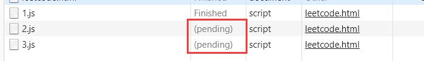

# HTML 内使用

## &lt;script&gt;

常用属性：`async`，`defer`，`src`，`crossorigin`

- 立即加载并执行指定的脚本，“立即”指的是读到 script 就加载并执行，script 之后的文档暂停
- 代码从上到下依次解释。
- 解释结束之前其余内容不会被浏览器加载。  
  ::: tip
  浏览器遇到`<body>`标签才会开始渲染(render)
  :::
- 遇到`</script>`的时候会认为是结束标签。如果代码要用到，则对这个字符串用`\`进行转义。
- 使用 src 加载外部文件后，如果`<script>`之间还有代码，会被忽略
- HTTP1.1 请求会带来额外的性能开销，所以下载单个 100kb 文件比下载 4 个 25kb 文件快。  
  [HTTP/2](https://www.zhihu.com/question/34074946)可以多路复用，此限制不存在

### async 和 defer

图片来自[参考](https://segmentfault.com/q/1010000000640869)  
蓝色线代表网络读取，红色线代表执行时间；绿色线代表 HTML 解析  


没有这两个属性，那么根据 script 出现的先后顺序解析代码。

只适用于 src，本地代码会被无视。

```html
<script src="./1.js"></script>
<script src="./2.js" defer></script>
<script src="./3.js" async></script>
```

```js
//1.js
console.log('1')
debugger

//2.js
console.log('defer')

//3.js
console.log('async')
```

当 1.js 处于断点的时候表现为
  
console.log 输出顺序:

```
1
defer
async
```

```html
<script src="./2.js" defer></script>
<script src="./3.js" async></script>
<script src="./1.js"></script>
```

当 1.js 处于断点的时候表现为  
  
console.log 输出顺序:

```
async
1
defer
```

和浏览器渲染是并行的

- defer:先下载，等浏览器解析到`</html>`标签后执行。理论上早于[DOMContentLoaded](#DOMContentLoaded)，但实际上不一定早于 DOM。defer 也按照顺序执行。

- async: 加载后就执行。执行顺序不定，谁先加载好谁就先执行

### DOMContentLoaded

```js
document.addEventListener('DOMContentLoaded', (e) => {
  console.log('DOMContentLoaded')
})
```

HTML document 加载和解析后触发。不会等待 style, img 加载

等于 jQuery 的`$(document).ready`。参考[官网](https://api.jquery.com/ready/)

加了 defer/async 的 script 可能在 DOMContentLoaded 之前或者之后

- 如果页面中同时存在 css 和 js，并且存在 js 在 css 后面，则 DOMContentLoaded 事件会在 css 加载完后才执行。
- 其他情况下，DOMContentLoaded 都不会等待 css 加载，并且 DOMContentLoaded 事件也不会等待图片、视频等其他资源加载

完全加载。script 不论是 defer 还是 async，肯定都在 load 之前执行。

### 踩坑

`document.body`无法触发`load`事件；但可以触发`DOMContentLoaded`  
原因见 stackoverflow: [Why doesn't document.addEventListener('load', function) work in a greasemonkey script?](https://stackoverflow.com/questions/16404380/why-doesnt-document-addeventlistenerload-function-work-in-a-greasemonkey-s)  
简而言之就是绑定事件的时机不对(WHEN the event is added and EXECUTED)  
需要改用`window`

```js
//不触发
document.body.addEventListener('load', function () {
  console.log('load')
})
//触发
window.addEventListener('load', function () {
  console.log('load')
})
```

### src 跨域

即 src 不受[同源策略](./027_async.md#同源策略)的限制

### crossorigin

参考[MDN](https://developer.mozilla.org/en-US/docs/Web/HTML/Attributes/crossorigin)  
在标签上设置 CORS，该属性可以用在`<audio>`、 ``等等具有`src`属性的标签上。  
如果脚本是放在 CDN 上的，推荐加上这个属性

```js
<script src="https://example.com/example-framework.js" crossorigin></script>
```

### type="module"

[ES module](./032_modules.md) 在 script 内可以通过`type="module"`直接使用

```html
<script type="module">
  import { Router } from "./1.js"
  const route = new Router;
</script>

<script type="module" src="./1.js">
```

::: warning
纯静态页面在 Chrome 引入`type="module"`会跨域，即使用`src`属性也不行。需要启一个服务器
:::

## src 与 href

src 用于替代这个元素，而 href 用于建立这个标签与外部资源之间的关系

### 值为空的情况

避免使用空的 src 属性可以缩减浏览器首屏渲染的时间，因为浏览器在渲染过程中会把 src 属性中的空内容进行加载，直至加载失败，  
那么就会影响 DOMContentLoaded 与 Loaded 事件之间的资源准备过程；拉长了首屏渲染所用的时间；
空的 `href` 属性对首屏渲染也有影响，但比较小

## doctype

分为 quirks mode 和 standands mode  
声明`<!DOCTYPE html>` 即为 standands mode
