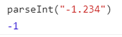
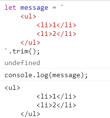

# 简单数据类型/基本类型

simple data types/primitive types

- undefined
- null
- Number
- String
- Boolean
- Symbol

## null

null 是个空对象指针

如果定义的变量将来要赋值成对象，那么声明的时候最好给 null

## undefined

void xxx

void 后面跟任意表达式都一样, 比如`void 0`

旧版本的浏览器`undefined`不是保留字，可以当做普通变量被赋值。void 的目的就是返回 undefined

## Boolean

### falsy

false, null, undefined, 0（+0，-0）, "", NaN

### 显式类型转换 Boolean()

显式类型转换可以看[转换规则总结](./019_transrule.md)第一张图

用 Boolean()的情况下（不是用==等操作符）


- string 类，除了""其他都是 true
- number 类，除了 0、-0 和 NaN 其他都是 true
- object 都是 true
- null， undefined 为 false
- symbol 是 true

## Number

IEEE-754–based numbers

所有数字都表示为 64 位的浮点数，实际操作基于 32 位整数


### 浮点数

内存是保存整数的两倍。

小数点后面有数字且不为 0 才会保存为浮点数，没有的话会转成整数

1.和 1.0 都会解析成 1

浮点数计算会存在误差。小数位最多 17 位

0.1 +0.2 = 0.30000000000000004

#### 科学计数法 e

3.12e7 也就是 3.12x10 的 7 次方

312e-7 也就是小数点后面 7 位数


### 范围

通过 MIN_VALUE, MAX_VALUE 查看


大于 max，显示为 Infinity。小于 min，显示为-Infinity


通过`isFinite()`判断，为 false 是 Infinity

### NaN

对 NaN 进行任何加减乘除都返回 NaN


通过`isNaN()`判断数据是不是 NaN，可以是任意数据类型

### 其他类型转 Number

#### 显式类型转换 Number()

显示类型转换可以看[转换规则总结](./019_transrule.md)第一张图

适用于任何数据类型。规则

- Boolean：true 变 1，false 变 0

- null：变 0

- undefined: 变 NaN

- string

      - 只有数字: 变数字，开头的0会被忽略。开头是"+"或者"-"看做符号位

  
  
   - 十六进制也转为对应的十进制。十六进制开头有加减号变成 NaN  
  
   - 空字符串变 0, ""和" "都是  
   - 其他都是 NaN  
  

- object: 根据 valueOf，进行上面规则转换。如果返回 NaN，再调 toString，进行上面规则转换

#### parseInt(值, 进制类型)

建议始终带上第 2 个参数

只适用于字符串 string

忽略字符串开头的空格，从第一个不是空格的字符串开始。

如果第一个字符串不是数字或者+或者-，返回 NaN

否则截取一直到后面不是数字的字符串为止，小数点也算





可以传入第 2 个参数，指定转换的进制


#### parseFloat()

只会转成十进制。没有第 2 个参数。

忽略第 2 个小数点


### Number.isInteger

判断是不是整型

```js
Number.isInteger(25) //true

Number.isInteger(25.0) //true

Number.isInteger(25.1) //false
```

## String

0 或者多个 16 位 Unicode 字符组成


字符串是不可变的。

如果定义一个变量，之后又用新的字符串赋值。那会销毁原本的字符串，再用新字符串填充这个变量

```js
var lang = 'Java'
lang = lang + 'Script'
```

先创建一个可以容纳 10 个字符的新字符串，然后填充 Java 和 Script，最后销毁原本的 Java 和 Script 两个字符串

### toString(基数)

`Number`、`Boolean`、`Object`、`String`、`Symbol`都有该方法。null 和 undefined 没有

可以指定转换后的进制。

执行结果一般和`String()`一样

默认就以 10 进制的方式输出。也就只有 Number 类会有差别


### 显式类型转换 String()

显式类型转换可以看[转换规则总结](./019_transrule.md)第一张图

将所有类型转成字符串。如果类型本身有 toString()方法，返回 toString 的值。

null 返回"nulll", undefined 返回"undefined"


### 识别子字符串

区分大小写，都返回布尔值

第二个参数设置索引。

#### includes

- ES5 实现

```js
function includes(str, start) {
  start = Number(start)
  if (isNaN(start) || start < 0) {
    start = 0
  }
  if (start + str.length > this.length) {
    return false
  }
  return this.indexOf(str, start) > -1
}
includes.apply('hello world', ['world', 4])
```

#### startsWith

- ES5 实现

```js
function startsWith(str, start) {
  start = Number(start)
  if (isNaN(start) || start < 0) {
    start = 0
  }
  if (start + str.length > this.length) {
    return false
  }
  return this.substring(start, start + str.length) == str
}
startsWith.apply('hello world', ['ello', '1']) //true
```

#### endsWith(string, length)

- ES5 实现

```js
function endsWidth(str, length) {
  length = Number(length)
  if (isNaN(length) || length < 0 || length > this.length) {
    length = this.length
  }
  return this.substring(length - str.length, length) == str
}
endsWidth.apply('hello world', ['world'])
```

### repeat()

将字符串重复指定次数。比如格式化的时候重复空格


### 模板字面量: 反引号`

Template Literals

#### 替换位\${}

略

#### 标签化模板（Tagged Templates）

待补充

#### trim()方法

去除空格，不去换行



## Symbol

```js
let privateName = Symbol('name')
let tmp = {}
tmp[privateName] = 'Emma'
```

### 共享同一个 symbol: Symbol.for

```js
let privateName1 = Symbol('name')
let privateName2 = Symbol('name')
privateName1 === privateName2 //false
```

```js
let privateName1 = Symbol.for('name')
let privateName2 = Symbol.for('name')
privateName1 === privateName2 //true
```
