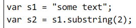
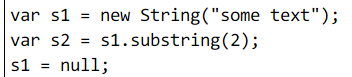
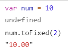
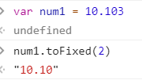
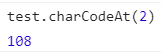
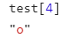
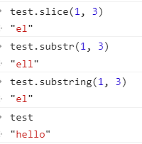
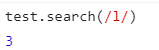
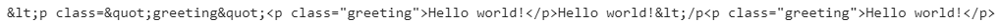

# 基本包装类型

primitive wrapper types  
对于`number`, `string`, `boolean`，为了方便基本操作，每创建一个基本类型，后台就会创建一个对应的基本包装类型的对象

所以 string 可以调用对象的方法

但不要自己去显式地 new 一个

比如



实际上调用`s1.substring`的后台会经过以下步骤

1. 创建 String 的一个实例
2. 调用方法
3. 销毁该实例。  
   上面的 substring 等价于



## Number 包装类型的方法

### toFixed()

返回指定小数位的字符串




### 返回指数

- toExponential()： 返回指数
- toPrecision: 可能返回 toFixed, 也可能返回 toExponential

## String 包装类型

### 属性 length

返回字符串的长度

### 字符方法 charAt, chatCodeAt, 方括号

返回指定位置的字符，或者编码





### 字符操作：concat

因为字符串本身就是不可以被修改的，就像字符`"1"`，不可能修改"1"本身  
所以任意字符操作总是返回一个**新字符串**

concat 拼接字符串。更多的时候还是用`+`比较方便

`str += "one" + "two"`

做了四件事情：

1. 创建一个临时字符串
2. 连接后的"onetwo"赋值给临时字符串
3. 临时字符串和 str 的值连接
4. 结果赋值给 str

可以改成: `str = str + "one" + "two"`

基础字符串放最左边，如果换成"one" +str，那么就会创建临时字符串

### 字符操作：slice, substring, substr

`slice(start, end)`

`substring(start, end)`

`substr(start. amount)`

传负数的时候,slice 和 substring 会不同



### 位置 indexOf, lasetIndexOf

与 Array 类似

### trim()

### 大小写转换

toLowerCase /toUpperCase

toLocaleLowerCase/ toLocaleUpperCase

### 正则相关: match, search, replace, split

match 和 exec()一样, search 返回的是第一个匹配的索引

`test = "hello"`




replace 用于替换，默认只替换第一个匹配。第二个参数可以是一个函数


```js
function htmlEscape(text) {
  return text.replace(/[<>"&]/g, (match, pos, originText) => {
    switch (match) {
      case '<':
        return '&lt;'
      case '"':
        return '&quot;'
      default:
        return originText
    }
  })
}
let result = htmlEscape('<p class="greeting">Hello world!</p>')
```



::: tip
split 参数也可以是正则
:::
