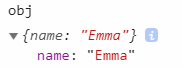

# 复杂类型/引用类型

complex data  
对象是引用类型的一个实例。都是通过构造函数（new）创造出来的

构造函数本身也是一个函数

## Object

```js
var foo = new Object() //通过构造函数创建

var test = {} //通过对象字面量创建（推荐）
```

优先用点表示法

点或者方括号的层次越多，也就是嵌套的内容越多，寻找的时候消耗性能越大

## 对象共有的属性/方法

每个 Object 实例都拥有的属性/方法：

### constructor

创建当前对象的函数, foo 的 constructor 是 Object()

### hasOwnproperty(key)

key 是个字符串，判断 key 是否存在当前实例，不包括继承


### isPrototypeOf(object)

对象是否存在于另一个对象的原型链上

如果实例内部的`[[Prototype]]`指向调用 isPrototypeOf 的对象，那么为 true

实例的`[[Prototype]]`指向原型对象

构造函数的 prototype 指向原型对象


### propertyIsEnumerable(key)

是否可枚举（即可以用在 key-in）


### toLocaleString()/toString()/valueOf()

- toLocaleString 会做一些本地化处理，比如国家不同显示不同的日期

- toString 返回字符串

- valueOf 返回原本对应的 string, number, boolean


## 对象转原始类型规则

对象在转换类型的时候，会调用内置的 `[[ToPrimitive]]`函数，对于该函数来说，算法逻辑一般来说如下：

- 如果已经是原始类型了，那就不需要转换了

- 转成字符串，先调用 toString 再调用 valueOf。

调用后如果返回值是基本类型，那么将基本类型转为对应的字符串（可以看[转换规则总结](./019_transrule.md)第一张图）

- 否则先 valueOf 再 toString，规则同上

- 如果都没有返回原始类型，就会报错

```js
let a = {
  valueOf() {
    return 0
  },
  toString() {
    return '1'
  },
  [Symbol.toPrimitive]() {
    return 2
  }
}
1 + a //3
```

### toString

- 单纯的一个对象返回的是"[object object]"  
  

- 数组：将每一项调用 toString()，然后用逗号分隔拼接  
  
  

- 函数：返回定义函数的表达式
- Date/RegExp: 返回字符串

### valueOf

返回对象本身

Date 返回毫秒数


## 遍历

### Object.keys(对象)

返回对象可枚举的 key，不包括继承，不包括 constructor

### Object.values/Object.entries

和[可迭代对象](./030_iterators.md)的用法类似

## 比较：Object.is(key1, key2)

进行===比较，不会出现类型转换

```js
Object.is(1, '1') //false
```

和===不同的地方有两处：

\+0 和-0，NaN 和 NaN

```js
;+0 === -0 //true

Object.is(+0, -0) //false

NaN === NaN //false

Object.is(NaN, NaN) //true
```

## 合并：Object.assign()

浅拷贝。如果是对象，只是拷贝引用

```js
let a = {
  name: 'Emma'
}
b = Object.assign({}, a)
```

## 解构

```js
let servant = {
  saber: 'Altria',
  lancer: ''
}
let { saber, archer = 'emiya' } = servant
console.log(saber) //"Altria"
console.log(archer) //"Emiya"
```

### 赋值给非同名

```js
let { saber: Saber, archer: Arhcer = 'Emiya' } = servant
console.log(Saber) //"Altria"
console.log(Arhcer) // "Emiya"
console.log(saber) //报错: saber is not defined
```

## instanceof 操作符

基本类型都会返回 false,因为他们都不是对象


## 防止篡改对象

严格模式下，设置防篡改后再修改都会报错

### 不可扩展 Object.preventExtensions

无法再新增属性，但是可以删除或者修改原有

```js
let obj = {
  name: 'Emma'
}
Object.preventExtensions(obj)
obj.value = 'hi'
```



#### 判断是否能扩展 Object.isExtensible(obj)

设置 preventExtensions 后返回 false

### 密封对象 Object.seal

无法再新增/删除属性，但是可以修改原有

#### 判断是否密封 Object.isSealed

设置 seal 以后返回 true，同时也成为不可扩展，isExtensible 返回 false

### 冻结对象 Object.freeze

不能修改、新增、删除

#### 判断是否冻结 ObjectisFrozen

freez 后返回 true，同时 isSealed 返回 true, isExtensible 返回 false

## 对象字面量语法扩展

### 属性初始化器

key 和 value 变量名一样时，可以省略简写

{name: name}变成{name}

### 方法简写

省略冒号和 function 关键字

方法简写能使用`super` ，而非简写的方法则不能
