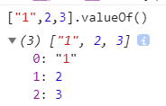

# Array

- 数组的每一项都可以保存任何类型的数据

- length 属性可以被手动修改

- 通常数组的实现是经过优化的，用数字索引访问数组的属性，比访问常规对象的属性快很多
- 数组继承`Array.prototype`中的属性，定义了一套丰富的数组操作方法。这些方法对"类数组对象"同样有效  
  所以不要用`in`关键字，会遍历继承的属性
- 数组是对象的一种，访问索引(索引的值是 0~2^32 - 1 范围内的非负整数)可以认为是特殊的属性名，那么访问不存在的值也只是返回`undefined`

```js
var a = ['hello']
a[-1] // undefined, 不会报错
```

## length

数组内肯定找不出一个值的索引会>=length。这个规则会出现两种特殊行为：

1. length 属性未指明时，随着数组的更新，length 会自动更新;
2. 明确指定 length 属性<当前长度，数组项会被删除

```js
var arr = [1, 2, 3, 4, 5]
arr.length = 3
console.log(arr) // [1,2,3]
```

## Array.isArray()

判断值是不是数组

```js
var arr = [1, 2]
arr instanceof Array //true
Array.isArray(arr) //true
```

## Array 的 toString()和 valueOf()

- toString 实际上调用的是数组里面每一项值的 toSting()方法，再用`,`拼接起来，返回一串字符串

```js
var arr = [5, '2', { x: 1 }]
arr.toString() //"5,2,[object Object]"
```

- valueOf 调用每一项的 valueOf()  
  

## 类数组

拥有 length 属性和索引。不能使用数组的方法。常见的有

arguments, DOM 相关的对象  
给 arguments.length 赋值无效，可以用索引改值

## 修改原本数组的方法

### delete

不会改变数组的长度，只不过对应索引的值变成了`undefined`

```js
var arr = [1, 2, 3, 4, 5]
delete arr[2]
console.log(arr[2]) // undefined
```

### 栈方法 pop/push

栈：后进先出

`pop`返回被删除的最后一项

`push`返回数组长度

```js
var tmp = []
tmp.push('hello') //1
tmp.pop() //"hello"
```

### 队列方法 shift/unshift

队列：先进先出

`shift`删除数组第一项并返回被删除的项

`unshift` 数组前端添加项，返回数组的长度

```js
var servant = ['Saber', 'Archer']
servant.shift() //"Saber"
servant.unshift('Lancer', 'Rider') //3
```

### 重排序 reverse/sort

`reverse`翻转数组顺序

`sort`不传参，把每一项都调用 toString()方法，根据字符串编码排序。最小的在最前面

```js
;[2, 11, 3].sort() //[11, 2, 3]
```


传参的情况下：必须是一个函数。函数接受两个参数，分别是相邻的值。

返回负数，表示第一个参数要在第二个参数的前面。返回 0，不变。返回正数第一个在第二个后面

### splice(index, amount, item1,..itemN)

默认删除，有第三个参数以后变成增加

index 指定从哪开始

amount 为 0，不删除。大于 0，删除

返回被删除的数组。

如果 amount 是 0，也就是删除的是`[]`，返回`[]`

### fill

用特定值填充数组中的一个或多个元素

- 只有一个参数：改变数组所有值为这个参数

```js
var arr = [2, 3, 4]
arr.fill(1) // arr变成[1, 1, 1]
```

- fill(params, start, end)

不包括 end(end**大于**start 才有效)，不写 end 一直到数组最后一项

```js
var arr = [4, 5, 6, 7]
arr.fill(666, 2) //arr变成[4, 5, 666, 666]

var arr2 = [4, 5, 6, 7]
arr2.fill(666, 2, 3) //arr变成[4, 5, 666, 7]
```

### copyWithin(start, index, end)

用数组内的值填充

复制从 index 开始的整个数组，依次填充 start 到 end 的位置

不包括 end, end 可以省略，省略后包括最后一项

比如下面复制的是[2,3,4,5,6], 从索引是 2（也就是值是 3 的地方开始）

```js
var arr = [1, 2, 3, 4, 5, 6]
arr.copyWithin(2, 1) //arr变成[1, 2, 2, 3, 4, 5]
```

## 不修改数组的方法

### concat

参数是数组，把每一项都复制到新数组。不是数组，就只是单纯 push

尽可能少用


### slice(start, end)：将类数组转成数组

不包括 end

不传 end，包括最后一项

### 位置方法 indexOf, lastIndexOf

查找是全等的，不会有类型转换。

查找 NaN 始终返回-1，认为 NaN 不等于 NaN。+0 等于-0

indexOf 从开头找起，lastIndexOf 从末尾

```js
var arr = [1, 2, 3]
arr.indexOf(2) //1
arr.indexOf('2') //-1
```

### 检索方法 find, findIndex

indexOf 只能查找特定的单个值，ES6 新增的属性可以进行检索，比如返回大于某个数的值

- 本质上也是遍历，find 返回值，findIndex 返回索引。

- 可以传递两个参数，第一个参数是函数，函数内有三个参数（值，索引，数组本身）；第二个是指定函数内部的 this

- 只返回第一个匹配的值

```js
const arr = [3, 6, 7, 9]
let obj = {
  getNum(value) {
    return value > 5
  }
}
let temp = arr.find((value, index, arr) => {
  return obj.getNum(value)
}, obj)
console.log(temp) //6
```

### 迭代: every, filter, forEach, map, some

- every: 每项内返回 true 才是 true,。遇到 false 就停止循环

`break`只能在循环里面用，不能在迭代里

```js
const arr = [1, 2, 3, 4]
function every() {
  let i = 0
  const result = arr.every((item, index, arr) => {
    i++
    return item > 1
  })
  console.log({
    i,
    result
  })
}
```


- some: 有一项返回 true 就是 true。有一项是 true 就停止循环

- filter: 把返回 true 的项组成一个数组

```js
const arr = [
  {
    id: 1,
    name: 'Saber'
  },
  {
    id: 2,
    name: 'Archer'
  },
  {
    id: 3,
    name: 'Rider'
  },
  {
    id: 4,
    name: 'Lancer'
  }
]
function filter() {
  let i = 0
  const result = arr.filter((item, index, arr) => {
    i++
    return item.id > 1
  })
  console.log({
    i,
    result
  })
}
```


- map: 所有返回值组成一个数组


- forEach: 没有返回值

```js
const arr = [1, 2, 3, 4]
let result = arr.forEach(item => {
  return item
})
console.log(result) //undefined
```

::: tip
迭代方法都需要传函数，否则报错
:::

```js
const arr = [1, 2, 3, 4]
arr.filter() //报错，TypeError: undefined is not a function
arr.map(1) //报错，TypeError: 1 is not a function
arr.forEach() //报错，TypeError: undefined is not a function
```

### 缩小方法: reduce, reduceRight

一般用来四则运算。同样需要传入一个函数

reduceRight 和 reduce 反向相反，从最后一项开始。

prev 是上一个 return 的值

```js
const arr = [1, 2, 3, 4]
function reduce() {
  const result = arr.reduce((prev, cur, index, arr) => {
    console.log(prev)
    return prev + cur
  })
  console.log({
    result
  })
}
```


### 比较 includes

与 String 的 includes 类似

采用全等，但 NaN 等于 NaN, +0 等于-0

### join(连接符)


:::tip  
尽可能用 join 代替+
:::

```js
var str = 'sth.',
  newStr,
  append = 100
while (append--) {
  newStr += str
}
//改用join
var arr = []
while (append--) {
  arr[append] = str
}
newStr = arr.join()
```

### flat

`arr.flat([depth])`: 根据指定的 depth 进行深度遍历，depth 默认是 1  
最常见的应用就是数组降维

```js
var test = [1, 2, [3, 4, [5, 6]], [7, 8]]
test.flat() //[1, 2, 3, 4, [5,6], 7, 8]
test.flat(2) //[1, 2, 3, 4, 5, 6, 7, 8]
```

还可以去掉空项

```js
var test = [1, 2, null, undefined, 0, '', , 8]
test.flat() //[1, 2, null, undefined, 0, "", 8]
```

### flatMap

类似 map 和 flat 深度为 1 的结合体  
flatMap 只会降维一层

```js
var test1 = [1, 2]
test1.flatMap(item => item * 2) // [2, 4], 与map一致
var test3 = [1, [2, 3]]
test3.flatMap(item => [item * 2]) // [2, NaN]
var test2 = [1, [2]]
test2.flatMap(item => [item * 2]) // [2, 4]
```

## 数组解构

类似对象解构

```js
let servantClass = ['saber', 'lancer']
let [first, second, third = 'rider'] = servantClass
console.log(first) //"saber"
console.log(second) // "lancer"
console.log(third) //"rider"
```

## new Array 和 Array.of

- new 的时候如果传入的值只有一个，是 Number 类型，会认为是 length

```js
let items = new Array(2)
console.log(items.length) // 2
console.log(items[0]) // undefined
console.log(items[1]) // undefined
```

- 传入其他认为是数组项

```js
let items = new Array('2')
console.log(items.length) // 1
console.log(items[0]) // "2"
console.log(items[1]) // undefined
```

- 传入多个值不论什么类型都认为是数组项

```js
let items = new Array(1, 3)
console.log(items.length) // 2
console.log(items[0]) // 1
console.log(items[1]) // 3
```

::: tip
Array.of 则不论是什么都认为是数组项
:::

```js
let items = Array.of(2)
console.log(items.length) // 1
console.log(items[0]) // 2
```

## Array.from(): 可迭代对象或者类数组对象转为数组

原本用`slice`

只要具有`Symbole.iterator`属性的值，也就是可迭代对象都可以转为数组

```js
var test = {
  0: 'a',
  1: 'b'
}
console.log(Array.from(test)) //[]
```

```js
var test2 = {
  0: 'a',
  1: 'b',
  length: 2
}

console.log(Array.from(test2)) //['a', 'b']
```

```js
var arrayLike = {
  0: 'a',
  1: 'b',
  length: 2,
  *[Symbol.iterator]() {
    yield this[1]
    yield this[0]
  }
}

console.log(Array.from(arrayLike)) // ['b', 'a']，优先级比length高
```

### 映射

传入第二个参数，值是函数。决定返回的内容

```js
function translate() {
  return Array.from(arguments, value => value + 1)
}
let numbers = translate(1, 2, 3)
console.log(numbers) // 2,3,4
```

### 传入 this

第三个值做为`this`

```js
let helper = {
  diff: 1,
  add(value) {
    return value + this.diff
  }
}
function translate() {
  return Array.from(arguments, helper.add, helper)
}
let numbers = translate(1, 2, 3)
console.log(numbers) // 2,3,4
```

## ArrayBuffer

[参考](https://sagittarius-rev.gitbooks.io/understanding-ecmascript-6-zh-ver/content/chapter_10.html)
ArrayBuffer 是 canvas 绘图的重要部分

## 数组去重

需要考虑 NaN，正负 0 的情况

- 两个 for/forEach

- 一个 for/forEach 配合 indexOf

- 先排序再一个 for，调用 sort()方法，比较相邻两个数

- filter 配合 indexOf

- Set 数据结构

## SharedArrayBuffer

参考[MDN](https://developer.mozilla.org/zh-CN/docs/Web/JavaScript/Reference/Global_Objects/SharedArrayBuffer)

## Atomics 对象

Atomics 对象提供了一组静态方法用来对 SharedArrayBuffer 对象进行原子操作  
Atomics 不是构造函数，因此不能使用 `new` 操作符调用，也不能将其当作函数直接调用
