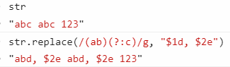
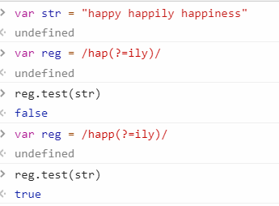

# RegExp

`/正则表达式/匹配模式`，第二条斜线后面可以跟一个或多个字母，修饰匹配模式的含义

test 方法：返回 true/false

exec: 返回匹配的数组

```js
var re = /cat/g
re.test('hello, cat')
```

exec 结果：


## 基本组成

参考掘金[正则表达式不要背](https://juejin.im/post/5cdcd42551882568651554e6)

分为字符和元字符。

- 字符通常是数字、字母

- 元字符通常就是特殊字符，比如\^(非),
  \|(或)。如果要匹配特殊字符本身，用反斜杠进行转义

比如上面匹配字符 cat，直接`/cat/`

## 常用的转义（非打印字符）

换行\\n: new line

换页\\f: from feed

回车\\r: return

空白\\s: space

制表\\t: tab

垂直制表\\v: vertical tab

回退\\b: backspace

## 多个字符

### 集合[]

`[]`表示集合，比如`[123]`，表示匹配 123 里面的任意一个数字


### 范围-

`-`表示范围，比如`[0-9]`，表示匹配 0\~9 里面的任意一个数字, [a-z]匹配小写字母

### 任意字符.

`.` 任意字符，除了换行和回车

### 数字\d

`\d` 单个数字，等价于[0-9]: digit

`\D` 非数字，等价于[\^0-9]: not digit

### 字符\w

`\w` 包括下划线在内的单个字符，等价于`[A-Za-z0-9_]` word

`\W` 非单字字符，等价于`[^A-Za-z0-9_]` not word，比如%

### 空白字符\s

`\s` 匹配空白字符，正则内的空白包括换行、换页、空格、tab

`\S` 非空白

## 循环与重复

同时匹配多个字符，比如 color 和 colour 要同时匹配，可以用?

### ? \* +

`?`表示同时匹配 0 或者一个，匹配上面 color 可以用`[colou?r]`

`u?`表示 u 要么没有，要么只有 1 个，两个就不通过

`*`表示 0 或者无数个。u 可以`>=`0 个

`+`表示至少一个


### 指定次数{}

比如匹配字符"a" 3 次，可以用`/a{3}/`

`{x}`: x 次

`{min, max}`： 介于 min 次到 max 次之间

`{min, }`: 至少 min 次

`{0, max}`： 至多 max 次


## 边界

`\b` 单词边界

`^x` 以 x 为开头。注意\^在集合[]的含义是非

`x$` 以 x 结尾


## 匹配模式 m i g

m 多行

i 忽略大小写

g 找到所有匹配

## 分组()

(表达式)，每个()内的内容做为一个表达式

## 回溯引用\number

`\1`表示引用第一个分组内的表达式，\\2 表示引用第二个

`\0`表示引用整个

### 替换\$number

比如将字符串 ab 都替换成 abcd

```js
str.replace(/(ab)/g, '$1cd') //这里的\$1等于ab
```

将字符串 abc 替换成 abd

```js
str.replace(/(ab)c/g, '$1d')
```

### 分组不被引用(?:regex)

可以避免内存浪费。分组仍然有效，但不会进行引用

下面`$2`不再引用分组(c)，所以直接被替换成`$2e`



### 前向查找(?=regex)

限制后缀，比如以"happ"开头，查找后面是 ily 的字符串

如果是过滤，可以用`?!regex`，表示后面不是 ily 的字符串



## 逻辑处理或和非

非：`[^regex]`和`!`

或：`|`

## 常用正则

- 只能输入正整数（不包括 0）

`/(^[1-9]\d*$)/.test(value)`

- 只能输入不超过两位小数的正实数（不包括 0）：

`/^(([1-9][0-9]*)|(([0]\.\d{1,2}|[1-9][0-9]*\.\d{1,2})))$/.test(value)`
