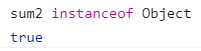
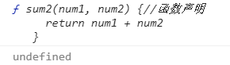
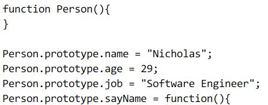
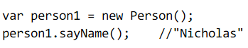
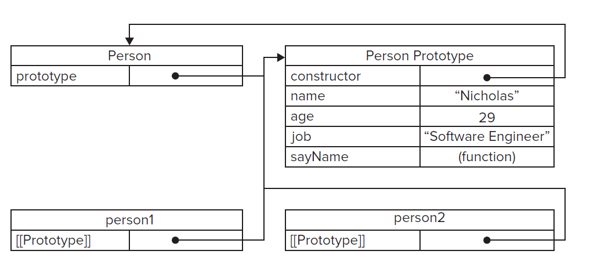
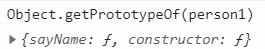

# Function

每个函数都是 `Function` 的实例。Function 本质上也是 Object

```js
console.log(sum2)
console.log(num3)
var sum = new Function('num1', 'num2', 'return num1 + num2') //不推荐
function sum2(num1, num2) {
  //函数声明
  return num1 + num2
}
var num3 = function(num1, num2) {
  //函数表达式
  return num1 + num2
}
```




解析器会先解析函数声明，而函数表达式只有解析到那一行代码执行了才会解释

所以函数声明具有变量提升

## 函数内部的两个特殊对象: arguments, this

函数调用会为形参提供实参的值。  
除了实参之外，还有一个值——本次调用的上下文——也就是`this`关键字的值

### arguments

ECMAScript 的参数在内部是用一个数组来表示的。通过`arguments`对象来访问  
`arguments`是指向**实参**的引用

arguments 不是 Array 的实例，是一个类数组对象，可以用 length 获取长度

顺序和形参一致，并且可以改变形参

### this

当函数被保存为一个对象的属性时，称之为方法。

方法被调用时, this 被绑定到该对象（全局的函数也可以看做是`window`的属性）

关于 this 的规范可以看从[ECMAScript 规范解读 this](https://github.com/mqyqingfeng/Blog/issues/7)，具体表现如下


```js
var length = 10
function fn() {
  console.log(this.length)
}
var obj = {
  length: 5,
  method: function(fn) {
    console.log(this.length)
    fn()
    arguments[0]() //this指向arguments, 即arguments.length
  }
}
obj.method(fn, '1', '2') // 5 10 3
```

## 函数都包含的属性: length, prototype

### length

length: 形参的个数

```js
function hello1(a, b, c) {}
hello1.length //3
```

### prototype

prototype 是函数特有的属性，普通对象不存在。  
prototype 是为了方便属性共享，减少内存消耗。  
具体来说就是不需要每个实例都去定义相同的内容

```js
function FactoryPerson() {}
FactoryPerson.prototype.name = 'Emma'
FactoryPerson.prototype.sayName = function() {
  console.log(this.name)
}
//FactoryPerson有`prototype`, person1没有
let person1 = new FactoryPerson()
```

所有实例方法的实际位置。比如`toString`,`valueOf`就存在于 prototype 上，通过各自对象的实例访问

只要创建一个新函数，该函数就会包含一个 prototype，指向该函数的原型对象

`FactoryPerson.prototype = 原型对象(prototype object)`

原型对象默认只会获得一个[constructor](#construcor)属性，其他方法都继承自 Object

### constructor

参考[用自己的方式（图）理解 constructor、prototype、**proto**和原型链](https://juejin.im/post/5cc99fdfe51d453b440236c3)  
对象的 constructor 指向创建该对象的函数（构造函数）

```js
var foo = new Object()
foo.constructor === Object //true
var test = {}
test.constructor === Object //true

function FactoryPerson() {}
var person1 = new FactoryPerson()
person1.constructor === FactoryPerson //true
```

`Function`是`Object`这类内置对象的构造函数  
`Function`也是内置对象，所以`Function`也是`Function`的构造函数

```js
function FactoryPerson() {}
//等价于FactoryPerson = new Function(); 即Function是普通函数的构造函数
FactoryPerson.constructor === Function //true
Function.constructor === Function //true
Object.constructor === Function //true
```

所有原型对象都会获得一个`constructor`属性，指向 prototype 所在的函数

`FactoryPerson.prototype.constructor = FactoryPerson`

```js
function FactoryPerson() {}
let person1 = new FactoryPerson()
let person2 = new FactoryPerson()
```

对象`person1`和`person2`的 constructor 指向的都是 FactoryPerson。  
同样为了节省内存，没有必要 person1 和 person2 都各自存储 constructor，用`prototype`来节省即可，就会出现以下关系  
找`person1.属性值`，如果没找到，那么往上找`FactoryPerson.prototype.属性值`  
因为 person1.constructor 等于`FactoryPerson`，所以  
 person1.constructor → FactoryPerson.prototype.constructor  
 `FactoryPerson.prototype.constructor等于FactoryPerson`

### 对象字面量创建 prototype

```js
function FactoryPerson() {}
FactoryPerson.prototype = {
  name: 'Emma',
  sayName() {
    console.log(this.name)
  }
}
//new的过程中指定了person1.__proto__ = FactoryPerson.prototype
let person1 = new FactoryPerson()
```

prototype 所在的函数是 Object 的实例，此时的 constructor 指向 Object

`person1.__proto__` 等于 FactoryPerson.prototype

FactoryPerson.prototype.constructor 等于 Object

如果想要原本的，在对象字面量内手动设置，就跟普通属性一样了

```js
FactoryPerson.prototype = {
  constructor: FactoryPerson,
  name: 'Emma',
  sayName() {
    console.log(this.name)
  }
}
```

::: warning
如果调换顺序，先创建实例 person1，再用对象字面量修改 prototype，那么 person1.\__proto_\_
不等于 FactoryPerson.prototype
:::

### 实例的[[Prototype]]

调用构造函数后创建的实例，实例内部会有一个指针，指向构造函数的原型对象。  
指针[[Prototype]]对外不可访问，通常浏览器表现为`__proto__`  
可以用 Object.getPrototypeOf 获取，避免直接操作`__proto__`

因为 FactoryPerson.prototype 指向原型对象，person1.**proto**指向原型对象  
所以
`FactoryPerson.prototype == person1.__proto__`

又因为 FactoryPerson.prototype.constructor 等于 FactoryPerson
所以`person1.__proto__.constructor`等于 FactoryPerson



原型对象除了 constructor 外，还包括后来添加的属性，比如 name, age



### Object.getPrototyoeOf(实例)

获取实例的`[[Prototype]]`



### 读取对象的属性

先在从实例本身找，找不到就去原型对象上找

### 总结

```js
function Person() {}
let person1 = new Person()
let person2 = new Person()
```

对于 person1 和 person2 来说

1. Person.prototype 储存共享属性/方法，即`person1.属性`不存在的时候，往上找`Person.prototype`
2. Person.prototype 叫原型对象
3. `constructor`储存构造函数，即 person1.constructor === Person
4. 为了节省内存，person1/person2 并没有实际声明`constructor`，就会往上找  
   person1.constructor → Person.prototype.constructor === Person
5. 实例有一个内部的`[[Prototype]]`，也指向原型对象  
   所以`Person.prototype === person1.__proto__`
6. 第 4 点中 Person.prototype.constructor === Person  
   所以`person1.__proto__.constructor === FactoryPerson`

对于 Person 来说

```js
person1.__proto__ === Person.prototype //true
Person.__proto__ === Function.prototype //true
Person.prototype.__proto__.constructor === Object // true
Person.prototype.__proto__.constructor.constructor === Function //true
```

## 自定义函数属性

函数既然是对象，同样可以拥有自定义属性。  
那么有时候就可以用属性来代替全局变量。最典型的应用就是阶乘

```js
function factorial(n) {
  if (n < 0) {
    return false
  }
  if (n < 2) {
    factorial[n] = n
    return n
  }
  if (!factorial[n]) {
    factorial[n] = factorial[n - 1] * n //存储到属性内
  }
  return factorial[n]
}
```

## 函数都有的方法: apply, call, bind

apply 两个参数，第一个指定`this`,第二个是所有参数集合。参数可以是类数组

call 多个参数，第一个指定`this`, 第二...第 N 个是分开的一个个参数

```js
function myMethod() {
  console.log('hello')
}
myMethod.call()
```

相当于调用`call`前面的方法。即`myMethod()`  
bind 会返回一个函数，需要手动调用。传参和 apply 一样

```js
function myMethod() {
  console.log('hello')
}
let o = {
  name: 'world'
}
let instance = myMethod.bind(o)
instance() //"hello"
```

### 手写 call

```js
Function.prototype.myCall = function(context) {
  //context就是obj
  context = context || window
  //这个时候的this指向myMethod
  context.fn = this
  //处理arguments，此时的arguments是两个，第一个是obj，第二个是"world"，去掉第一个参数
  let arry = [...arguments].slice(1)
  let result = context.fn(...arry)
  delete context.fn
  return result
}
function myMethod(params) {
  console.log(this.name) //"hello"
  console.log(params) //"world"
}
let obj = {
  name: 'hello'
}
myMethod.myCall(obj, 'world')
```

### 手写 apply

与 call 只是参数传递不同

```js
Function.prototype.myApply = function(context) {
  context = context || window
  context.fn = this
  //此时的arguments只有两个，第一个是obj，第二个是参数数组
  let result
  if (arguments[1]) {
    result = context.fn(...arguments[1])
  } else {
    result = context.fn()
  }
  delete context.fn
  return result
}
let obj = {
  hello: 'world',
  foo: 'bar'
}
function myMethod(value1, value2) {
  this.hello = value1 //'world2'
  this.foo = value2 //'bar2'
}
myMethod.myApply(obj, ['world2', 'bar2'])
```

### 手写 bind

基于 apply 实现，可以看[MDN](https://developer.mozilla.org/en-US/docs/Web/JavaScript/Reference/Global_Objects/Function/bind#Polyfill)

```js
Function.prototype.myBind = function(context) {
  var that = this
  if (typeof that != 'function') {
    //如果调用的不是函数，报错
    throw new Error('error')
  }
  let arr = [...arguments].slice(1) //此处的arguments是[o, ["1", "2"]]
  return function() {
    //此处的arguments是"hello"
    that.apply(context, arr.concat(...arguments))
  }
}
function myMethod(arr, value2) {
  // arr是["1", "2"]， value2是"hello"
}
let o = {
  name: 'world'
}
let instance = myMethod.myBind(o, ['1', '2'])
instance('hello')
```

## 参数按值传递

传递对象的时候，传递对象的引用的副本

```js
var obj = {
  value: 1
}
function foo(o) {
  o.value = 2
  console.log(o.value) //2
}
foo(obj)
console.log(obj.value) // 2
```

直接修改 o，并不会修改原值

```js
var obj = {
  value: 1
}
function foo(o) {
  o = 2
  console.log(o) //2
}
foo(obj)
console.log(obj.value) // 1
```

## 默认值

传入的值只能是 undefined 的时候赋值

`function endsWidth(str, length = 0) {}`

同样存在暂时性死区

存在默认值后不可以在函数内部声明`"use strict"`

## 剩余参数...

把多个独立的参数合并到一个数组中
::: tip
函数的**形参**只能有一个剩余参数，放在最后；  
不能在对象字面量的 setter 里面用：因为 setter 被限定只能使用单个参数
:::

```js
let object = {
  // 语法错误：不能在 setter 中使用剩余参数
  set name(...value) {
      // 一些操作
  }
};
```

## 扩展运算符

将一个数组分割，并将各个项作为分离的参数传给函数

```js
let values = [1, 5, 2, 10]
Math.max(...values, 8)
```

适用情景：

- 在函数参数、数组展开的场合，这种情况要求对象是可迭代的（iterable）
- 用于对象展开，也就是 {…obj} 形式，这种情况需要对象是可枚举的（enumerable）

## 箭头函数=>

- 没有 `this`、`super`、`arguments`

- 不能用 new 调用，没有原型
