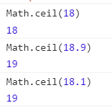
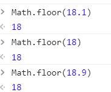
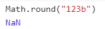

# Math

## 最大最小值：max/min

## 舍入：ceil, floor, round

ceil：向上取整





floor：向下

round：四舍五入

包含非数字都会是 NaN

## random

不包括 0 和 1 的随机数


## 幂运算

比如 5 的平方

可以用 pow 函数，也可以用`**`

```js
Math.pow(5, 2)
//等价于
5 ** 2
```

::: tip
\*\* 优先级低于一元运算符。
:::

```js
2 * 5 ** 2 //50
```

左边只能用++或者--的一元运算符，否则会产生歧义。

通过加括号进行区别

```js
let result = -5 ** 2; // 语法错误
(-5) ** 2              // 25
let num1 = 2;
++num1 ** 2            // 9
```
