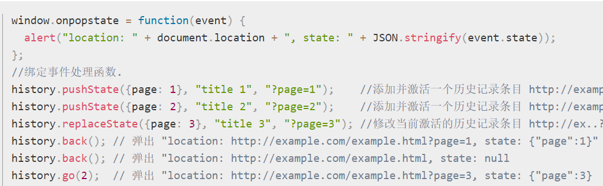

# BOM

浏览器对象模型：Browser Object Model

控制浏览器显示页面以外的部分。

## window

看做是浏览器对`global`对象的实现放在了 window 中

global 是 window 的子集

### open 和 close

close 只能关闭 windows.open 打开的页面，否则无效。浏览器会警告

### window.self/self

只读属性，指向 window 本身

## 延时

### setTimeout/clearTimeout

```js
var foo = function() {}
setTimeout(foo, 1000)
//取消调用foo
var timeoutID = setTimeout(foo, 1000)
clearTimeout(timeoutID)
```

### setInterval/clearInterval

尽可能用 setTimeOut 代替，setInterval 可能会提前进入下一次

更多内容见[单线程与异步编程](./027_async.md)

### 切换 tab 页

参考[setTimeout 的机制引起的 bug](https://segmentfault.com/q/1010000007524396)  
[How do browsers pause/change Javascript when tab or window is not active?](https://stackoverflow.com/questions/15871942/how-do-browsers-pause-change-javascript-when-tab-or-window-is-not-active)  
在非当前标签页 ，setTimeout 和 setInterval 如果间隔小于 1s，会停止执行。但大于 1s 的间隔下会继续执行  
requestAnimationFrame 因为本身执行间隔就小于 1s，所以切换到其他标签页的时候就会停止运行  
简单来说是浏览器为了提高性能

### 函数防抖与节流

某些函数不可以在没间断的情况下连续重复执行

比如 onresize 的时候进行大量的 DOM 计算，很容易引起崩溃

#### 简单版防抖

在触发事件后 n 秒再执行。不断触发以最后的一次为准

```js
let obj = {
  id: null,
  process() {
    clearTimeout(this.id)
    const that = this
    that.id = setTimeout(() => {
      that.realAction()
    }, 100)
  },
  realAction() {
    console.log(1)
  }
}
obj.process()
obj.process()
obj.process() //触发完事件100毫秒内，不再触发事件，才执行realAction
```

#### 节流

在一定时间内只执行一次函数。完整思路见[JavaScript 专题之跟着 underscore 学节流](https://github.com/mqyqingfeng/Blog/issues/26)  
两种方式，都采用闭包实现：

1. 利用时间戳
2. 利用 timeout，但不会 clearTimeout

```js
//方式1：第一次调用method，立刻执行。停止调用后不再执行
function throttleIns(method, wait) {
  let that = null,
    params = [],
    prev = 0
  return function() {
    that = this
    params = arguments
    const now = new Date().getTime()
    if (now - prev > wait) {
      method.apply(that, params)
      prev = now
    }
  }
}
//方式2: 第一次调用也会隔wait时间；最后一次method，隔一段时间以后仍然会执行
function throttle(method, wait) {
  let that = null,
    params = [],
    timeoutId = null
  return function() {
    that = this
    params = arguments
    if (!timeoutId) {
      timeoutId = setTimeout(function() {
        timeoutId = null
        method.apply(that, params)
      }, wait)
    }
  }
}
```

## location

既是 window 的属性，又是 document 的属性

document.location 等于 window.location

### replace(url)

改变浏览器的位置，但不会生成新纪录

假设一开始空白页，输入地址是百度，生成新纪录跳转到谷歌。按后退回到百度

不生成新纪录跳到谷歌，后退返回空白页

### reload()

重新加载当前页面

## history

### go()

history.go(-1)//后退一页

history.go(2)//前进 2 页

### back()

等于.go(-1)

### forward()

等于.go(1)

### 历史状态管理

#### hashchange

window 的事件（document 不触发），哈希值`#`改变后触发

hash 不会被包括在 HTTP 请求中。它是用来指导浏览器动作的，对服务器端完全无用，因此，改变 hash 不会重新加载页面

#### pushState

不加载新页面的情况下改变 url

history.pushState(state, title, url)

- state 是个对象。用于 onpopstate 接收

- title 目前所有浏览器都不生效，可以忽略。

- url 不能跨域

#### popstate 事件

只有访问其他页面再返回或者调方法才会触发 popstate



### replaceState

替换当前记录

## navigator

识别浏览器

### 属性 geolocation

地理位置。要求是 HTTPS

## screen
