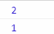

# 事件

JS 和 HTML 之间交互是通过事件实现的

监听事件就是一种观察者模式

元素本身的事件不会在 margin 触发，也就是只在 content, padding, border 上

也包括伪类（比如::after, before）

## 事件流

### 冒泡

从本身往上

### 事件处理程序

响应事件的函数，以"on"开头。比如 onclick

### addEventListener/removeEventListener(事件名,方法,options)

匿名函数无法用 remove，需要事先定义一个方法

```js
var handler = function() {
  console.log(1)
}
target.addEventListener('click', handler, { capture: true })
```

#### options

- capture

`false`表示冒泡阶段调用，true 是捕获阶段

推荐用 false

```html
<div class="wrapper">
  world
  <p class="content child">hello</p>
</div>
```

```js
const doc = document
let target = doc.querySelector('.wrapper')
let child = target.querySelector('.content')
target.addEventListener(
  'click',
  function(e) {
    console.log(1)
  },
  {
    capture: false
  }
)
child.addEventListener(
  'click',
  function(e) {
    console.log(2)
  },
  {
    capture: false
  }
)
```

点击的时候


如果父元素的 capture 是 true，那么


- once

为 true 值调用一次

- passive

为 true 时永远不会调 e.preventDefault()。如果写了 prevent 就会报错

### 事件对象 event

#### target/currentTarget/this

target 等于具体的元素

this 始终等于 currentTarget，等于 addEventListener 绑定的对象

#### preventDefault()

阻止默认

#### stopPropagation()

阻止冒泡/捕获

## 常用事件

最好都用 addEventListener 的 JS 绑定

### UI 事件

#### DOMContentLoaded/load/unload/beforeunload

- DOMContentLoaded:
  DOM 渲染完毕就触发，不管外部的 CSS、图片（jQuery 的\$(document).ready）

- document 的 onload: 页面完全加载后触发，包括 JS、图片等外部资源

- 图片 img 的 onload: 图片 src 加载后

- unload: 页面切换到另一个页面时触发。一般用来清除引用，避免内存泄漏。

可以标签上直接写 onload/onunload, 也可以用 addEventListener 监听"load"/"unload"

#### resize

不同浏览器实现不一样，有些等拖拽结束才触发，有些只要窗口变化 1 像素就会触发，导致拖拽过程中不断触发。

要避免在里面做大量计算

### 焦点事件: focus/blur, focusin/focusout

focus/blur 不会冒泡

focusin/focusout 会

focusin 和 focus 功能一样

focusout 和 blur 一样

### 鼠标事件

#### click/dblclick

mousedown+mouseup 等于 click，任何一个被取消都不会触发 click

#### mousedown/mouseup

鼠标专用，键盘不会触发

#### mouseenter/mouseleave

不冒泡。其他鼠标事件都会冒泡

触发一次以后，再移动到子元素，也不会进。

#### mouseover/mouseout

触发一次以后，再移动到子元素，也会进。

#### mousemove

鼠标移动的时候触发

#### 拖放

见红宝书 22.5 节

### 键盘事件：keydown/keypress/keyup

可以输入字符类的文字被按下时触发的 keypress（比如 a,b,空格,
123 等等，tab 等不会触发）

先 keydown 再 keypress

### contextmenu

### 手机端

#### touchstart/touchmove/touchend

都会冒泡

### 表单事件

#### input

`<input>`, `<select>`或者`<textarea>`的值改变的时候（不需要失焦）

## 事件委托

利用事件冒泡，绑定在父元素上

### 移除事件

如果某个 DOM 被移除，移除之前最好解绑事件，提高性能

## 模拟事件 CustomEvent

::: warning
createEvent 已经被废弃
:::

```js
var handler = function(e) {
  console.log(e)
}
target1.addEventListener('customhandler', handler)
const customEvent = new CustomEvent('customhandler', {
  detail: {
    hello: 'world'
  }
})
target1.dispatchEvent(customEvent) //dispatchEvent触发
```


## 自定义事件/观察者模式

某个对象（主体）发布事件，其他对象（观察者）可以观察这个对象

观察者通过订阅事件来观察主体

### demo

```js
function EventTarget() {
  this.handler = {}
}
EventTarget.prototype = {
  constructor: EventTarget,
  addHander(type, handler) {
    //增加事件
    if (typeof this.handler[type] == 'undefined') {
      this.handler[type] = []
    }
    this.handler[type].push(handler) //可能有很多方法，把方法做为数组
  },
  fire(event) {
    //触发事件，传入触发的事件名和参数
    if (!event.target) {
      //如果没有传入事件对象，把实例做为对象
      event.target = this
    }
    //事件方法做为数组存在
    const handlers = this.handler[event.type]
    if (handlers instanceof Array) {
      const length = handlers.length
      for (let k = 0; k < length; k++) {
        handlers[k](event)
      }
    }
  },
  removeHander(type, handler) {
    //删除事件
    const handlers = this.handler[type]
    if (handlers instanceof Array) {
      const length = handlers.length
      for (let k = 0; k < length; k++) {
        if (handlers[k] == handler) {
          this.handler[type].splice(k, 1)
          break
        }
      }
    }
  }
}
let event = new EventTarget()
function hello() {
  console.log('hi')
}
event.addHander('click', hello)
event.fire({
  type: 'click'
})
```
