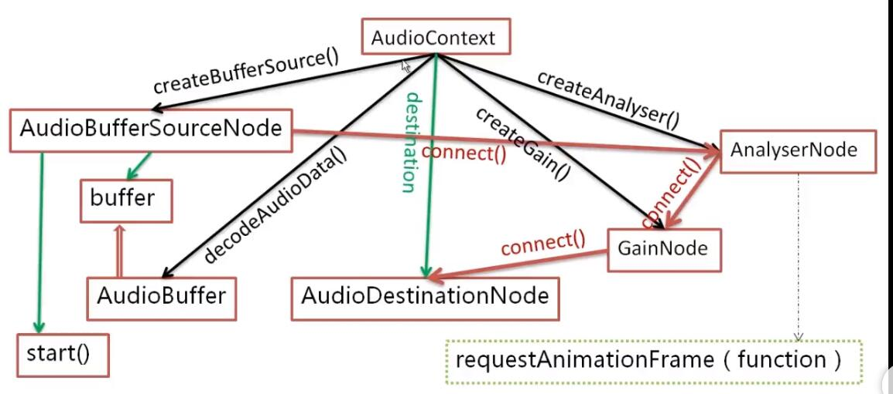

# HTML5 编程

## 跨域: 跨文档消息传送(cross-document messaging)

### postMessage

## 媒体元素 audio/video

### src/&lt;source&gt;

```html
<video src="xxx.mp4"></video>
```

等价于

```html
<video>
  <source src="xxx.mp4" type="video/mp4"></source>
</video>
```

## webAudio

参考慕课网课程：[HTML5 音乐可视化](https://www.imooc.com/learn/299)

### AudioContext

audio 的上下文对象。类似 Canvas 的`getContext`获取的对象

```js
//创建实例
const ac = new window.AudioContext()
```



#### 常用属性

- destination: `ac.destination`，值是`AudioDestinationNode`对象，相当于音频的硬件。  
  所有的`AudioNode`都直接/间接连接到这个对象
- currentTime: ac 从创建到当前持续的时间，单位是秒

#### 常用方法

- decodeAudioData: 异步解码音频文件中的 `ArrayBuffer`

```js
ac.decodeAudioData(data, buffer => {
  //do sth.
})
```

- createBufferSource: 用于创建一个`AudioBufferSourceNode`接口  
  该接口可以通过`AudioBuffer` 对象来播放音频数据
- createBuffer: `AudioBuffer`对象可以通过`createBuffer`来创建。或者通过`decodeAudioData`成功解码音轨后获取  
  createBuffer() 方法用于新建一个空白的 AudioBuffer 对象，以便用于填充数据，通过 AudioBufferSourceNode 播放
- createAnalyser: 创建一个`AnalyserNode`。用来获取音频时间和频率，实现可视化
- createGain: 创建一个`GainNode`，控制音量

### AudioBufferSourceNode

```js
const ac = new window.AudioContext()
const bufferSource = ac.createBufferSource()
```

`AudioBufferSourceNode`表示内存中的一段音频资源，音频数据存储在`AudioBuffer`中。  
常见属性：

- buffer: `bufferSource.buffer`。值就是`AudioBuffer`
  - duration: `bufferSource.buffer.duration`: 音频的时长
- loop: 是否循环，默认 false
- onended: 音频播放完毕后触发的事件
  常用方法：
- start(when, offset, duration): 播放
  - when: 什么时候开始播放。默认是 ac.currentTime，也就是立刻
  - offset: 第几秒开始。默认是 0，也就是开头
  - duration: 播放几秒。默认是 buffer.duration-offset, 也就是播放到歌曲结束

```js
//10s后开始播放
bufferSource.start(ac.currentTime + 10)
```

- stop(when): 结束
  - when: 默认是 ac.currentTime，也就是立刻

### GainNode

控制音量

```js
const gainNode = ac.createGain()
```

常见属性：

- gain: `ac.createGain().gain` 改变 gain 的`value`属性可以控制音量大小  
  value 值在 0~1 之间

播放音频并控制音量关健代码

```js
const audioContext = new window.AudioContext()
const gainNode = audioContext.createGain()
gainNode.connect(audioContext.destination)

//创建ArrayBuffer
const ac = audioContext
ac.decodeAudioData(data, buffer => {
  const bufferSource = ac.createBufferSource()
  bufferSource.buffer = buffer //音频资源赋值
  // bufferSource.connect(ac.destination);//连接到AudioDestinationNode，！此处直接连接无效
  bufferSource.connect(gainNode) //通过连接音量，间接连接到destination
  bufferSource.start() //开始播放
})

//调整音量
gainNode.gain.value = value
```

### AnalyserNode

音频分析对象。实现可视化的关健

```js
const ac = new window.AudioContext()
const analyserNode = ac.createAnalyser()
```

常用属性

- fftSize: 设置 FFT（FFT 详见[MDN](https://developer.mozilla.org/zh-CN/docs/Web/API/AnalyserNode)），大致上就是获取频域。  
  值是 2 的 N 次方（范围在 32~2048 之间）
- frequencyBinCount: 值是 fftSize 的一半，得到频域的个数

常用方法

- getByteFrequencyData(Uint8Array)：复制当前频域的值到`Uint8Array`数组中

[AnalyserNode 配合 canvas 食用](./034_animation.md)
